# LangGraph Workspace

Local LangGraph agent system for workspace artifact generation. Replicates the Kiro AI workspace architecture (skills, agents, orchestration, tools, steering) optimized for local LLMs with adaptive context management, model-specific prompt compilation, and empirical model profiling.

---

## Use Cases & Examples

### 1. Create a Skill (Workflow Definition)

Skills are on-demand capability files that define step-by-step agent behaviors with triggers, guardrails, and failure recovery.

```bash
# Create a debugging skill for Python applications
uv run python -m src.main run "Create a skill for debugging Python applications"

# Create a skill for database migration workflows
uv run python -m src.main run "Create a skill for managing PostgreSQL schema migrations"

# Create a skill for code review automation
uv run python -m src.main run "Create a skill for reviewing pull requests and suggesting improvements"
```

**What happens:**
1. Supervisor classifies intent → routes to `skill_creator` subgraph
2. Skill creator loads `skill-schema.md` steering via progressive disclosure
3. Checks existing skills for naming/scope overlap
4. Drafts YAML frontmatter + markdown body (Role & Tone, Workflow, Guardrails)
5. Validates required sections exist
6. Writes to `output/skills/<name>.md`

**Example output:** `output/skills/debug-python.md`
```markdown
---
name: debug-python
description: Use when debugging a failing Python application. Covers reproduction,
  isolation, root cause diagnosis, fix implementation, and regression test creation.
---

# Debug Python

## Role & Tone
Act as a senior Python engineer. Be systematic and methodical...

## Workflow
1. **Check Existing State** — Is there a stack trace or error message?
2. **Reproduce** — Identify minimal reproduction steps...
3. **Isolate** — Narrow to the failing module/function...
4. **Diagnose** — Identify root cause...
5. **Fix** — Apply targeted fix...
6. **Verify** — Run test suite, confirm fix...
7. **Document** — Add regression test...

## Guardrails
- NEVER modify code without reproducing the issue first
- NEVER skip test creation after a fix
...
```

---

### 2. Create an Agent (Persona Configuration)

Agents are JSON configs that compose a focused persona from steering, skills, tools, and file access restrictions.

```bash
# Create an agent for data pipeline management
uv run python -m src.main run "Create an agent for data pipeline management"

# Create a read-only documentation agent
uv run python -m src.main run "Create an agent that helps navigate and search project documentation"

# Create an infrastructure agent for Terraform and Kubernetes
uv run python -m src.main run "Create an agent for managing Terraform modules and Kubernetes manifests"
```

**What happens:**
1. Supervisor classifies intent → routes to `agent_creator` subgraph
2. Agent creator classifies agent type (read-only, development, infrastructure)
3. Selects tool preset and file access restrictions based on classification
4. Generates JSON config with steering references, skills, tools, and prompt
5. Validates JSON structure and tool consistency
6. Writes to `output/agents/<name>.json`

**Example output:** `output/agents/data-pipeline.json`
```json
{
  "name": "data-pipeline",
  "description": "Manages ETL pipelines, Airflow DAGs, and data quality checks",
  "prompt": "You are a data engineering specialist...",
  "tools": ["read", "write", "shell", "glob", "grep", "postgres"],
  "allowedTools": ["read", "glob", "grep"],
  "resources": [
    "file://pyproject.toml",
    "skill://../skills/backend-cron-feature.md",
    "skill://../skills/general-debug.md"
  ],
  "toolsSettings": {
    "write": {
      "allowedPaths": ["dags/", "pipelines/", "tests/"]
    },
    "shell": {
      "allowedCommands": ["airflow", "pytest", "python"]
    }
  }
}
```

---

### 3. Write Steering (Conventions & Patterns)

Steering docs are prescriptive references loaded into agent context at startup — technology choices, patterns, security rules, naming conventions.

```bash
# Write a steering doc for API naming conventions
uv run python -m src.main run "Write a steering doc for API naming conventions"

# Create a steering doc for error handling patterns
uv run python -m src.main run "Write a steering doc for error handling and retry patterns in distributed systems"

# Document database access patterns
uv run python -m src.main run "Create a steering convention for database query patterns and connection management"
```

**What happens:**
1. Supervisor classifies intent → routes to `steering_writer` subgraph
2. Steering writer determines category (conventions, security, orchestration, preferences)
3. Generates markdown following documentation conventions template
4. Includes Why This Exists, Rules, Examples, Anti-Patterns sections
5. Writes to `output/steering/<category>/<name>.md`

**Example output:** `output/steering/conventions/api-naming.md`
```markdown
# API Naming Conventions

## Why This Exists
Without standardized API naming, endpoints proliferate with inconsistent
casing, verb usage, and resource nesting...

## URL Structure
| Pattern | Example | When |
|---------|---------|------|
| Collection | GET /api/projects | List resources |
| Resource | GET /api/projects/:id | Single resource |
| Sub-resource | GET /api/projects/:id/members | Nested relationship |
| Action | POST /api/projects/:id/archive | Non-CRUD operations |

## Rules
- Use kebab-case for URL paths: `/api/user-profiles` not `/api/userProfiles`
- Use camelCase for JSON body fields: `{ "firstName": "..." }`
- Plural nouns for collections: `/projects` not `/project`
...

## Anti-Patterns
- ❌ Verbs in URL paths: `/api/getProjects` (use HTTP methods instead)
- ❌ Mixing casing: `/api/userProfiles/:id/work_history`
...
```

---

### 4. Build a Tool (LangGraph @tool Function)

Tools are Python functions exposed to agents for interacting with external systems (APIs, databases, shell commands).

```bash
# Build a tool for querying Elasticsearch
uv run python -m src.main run "Build a tool for querying Elasticsearch"

# Build a tool for sending Slack notifications
uv run python -m src.main run "Build a tool for sending messages to Slack channels"

# Build a tool for checking service health endpoints
uv run python -m src.main run "Build a tool for checking HTTP health endpoints and reporting status"
```

**What happens:**
1. Supervisor classifies intent → routes to `tool_builder` subgraph
2. Tool builder detects import requirements (HTTP client, DB driver, etc.)
3. Scaffolds Python file with `@tool` decorator, type hints, docstring
4. Validates syntax via `compile()`
5. Writes to `output/tools/<func_name>.py`

**Example output:** `output/tools/elasticsearch_query.py`
```python
"""Elasticsearch query tool for LangGraph agents."""

from __future__ import annotations

import os

import httpx
from langchain_core.tools import tool


@tool
async def elasticsearch_query(
    index: str,
    query: str,
    size: int = 10,
) -> dict:
    """Search an Elasticsearch index with a query string.

    Args:
        index: Elasticsearch index name to search.
        query: Query string (Lucene syntax).
        size: Maximum results to return (default 10, max 100).

    Returns:
        Dict with 'hits' array and 'total' count.
    """
    base_url = os.environ.get("ELASTICSEARCH_URL", "http://localhost:9200")
    size = min(size, 100)

    async with httpx.AsyncClient(timeout=10.0) as client:
        response = await client.post(
            f"{base_url}/{index}/_search",
            json={
                "query": {"query_string": {"query": query}},
                "size": size,
            },
        )
        response.raise_for_status()
        data = response.json()

    return {
        "total": data["hits"]["total"]["value"],
        "hits": [
            {"id": hit["_id"], "score": hit["_score"], "source": hit["_source"]}
            for hit in data["hits"]["hits"]
        ],
    }
```

---

### 5. Profile a Model (Calibration & Strategy Generation)

Profiling runs empirical tests against a model to determine its capabilities and generates optimized prompt strategies.

```bash
# Profile your default local model
uv run python -m src.main profile --model llama3.1:8b

# Profile a larger model
uv run python -m src.main profile --model qwen2.5:14b

# Profile with a specific provider
uv run python -m src.main profile --model gpt-4o --provider openai
```

**What happens:**
1. Sends 8 calibration prompts (reasoning, instruction following, JSON output, tool calling, etc.)
2. Scores responses deterministically (no LLM-as-judge — reproducible heuristics)
3. Maps scores to prompt strategies (CoT level, example count, format preferences)
4. Saves profile JSON to `config/model-profiles/<model>.json`
5. Generates human-readable steering doc at `steering-local/model-strategies/<model>.md`

**Example output:**
```
🔬 Calibrating llama3.1:8b...
   Running 8 calibration tasks...

✓ Calibration complete!
  Strength tier: medium
  Overall score: 6.5/10

  Scores:
    Reasoning:             6.5/10
    Instruction following: 7.0/10
    Structured output:     6.0/10
    Tool calling:          5.5/10
    Creativity:            7.5/10

  Strategies:
    CoT needed:      false
    JSON mode:       false
    Examples needed: 1
```

---

### 6. Manage RAG (Vector Knowledge Base)

Set up and manage a pgvector-based knowledge base for semantic retrieval of steering documents.

```bash
# Set up RAG infrastructure
uv run python -m src.main run "Setup RAG for the steering knowledge base"

# Ingest steering documents
uv run python -m src.main run "Ingest all steering documents into the vector database"

# Check RAG status
uv run python -m src.main run "Show RAG ingestion status and chunk statistics"
```

**What happens:**
1. Supervisor classifies intent → routes to `rag_manager` subgraph
2. RAG manager assesses whether RAG is warranted (collection size >= 20 docs)
3. Checks existing pgvector schema and chunk statistics
4. Creates migration SQL or reports current ingestion state
5. Validates retrieval quality with test queries
6. Produces migration/status output

---

### 7. Inspect Context Budget (Debugging)

Understand how token budget is allocated for a given model before running tasks.

```bash
# Show budget breakdown for a local model
uv run python -m src.main budget-report --model llama3.1:8b

# Show budget for a larger context model
uv run python -m src.main budget-report --model qwen2.5:14b

# See what gets disclosed for a specific query
uv run python -m src.main disclose --model llama3.1:8b --query "skill schema conventions"
```

**Example output (budget-report):**
```
Token Budget Report: llama3.1:8b (8192 tokens)
━━━━━━━━━━━━━━━━━━━━━━━━━━━━━━━━━━━━━━━━━━━━━
  System (5%):       409 tokens  [protected]
  Tools (12%):       983 tokens
  Retrieved (35%):  2,867 tokens
  History (25%):    2,048 tokens
  Scratchpad (13%): 1,064 tokens
  Current Turn (5%):  409 tokens  [protected]
  Reserve (5%):       409 tokens  [protected]
━━━━━━━━━━━━━━━━━━━━━━━━━━━━━━━━━━━━━━━━━━━━━
```

**Example output (disclose):**
```
Progressive Disclosure: "skill schema conventions"
Model: llama3.1:8b | Budget: 2,867 tokens (retrieved layer)

Loaded resources:
  [FULL]    steering/conventions/skill-schema.md     (2,140 tokens)
  [SUMMARY] steering/conventions/code-style.md       (320 tokens)
  [META]    steering/conventions/documentation.md    (12 tokens)

Total: 2,472 / 2,867 tokens used
Tier: Summary (8K-16K model)
```

---

### 8. List Tools & Providers

Inspect available tools for a task phase, or check configured providers and models.

```bash
# List tools available during skill creation
uv run python -m src.main tools --phase skill_create

# List all configured providers and their models
uv run python -m src.main providers

# Test provider connection
uv run python -m src.main provider-test --model llama3.1:8b
```

---

### 9. Server Mode (REST + WebSocket)

Run as a persistent server for integration with editors, UIs, or other systems.

```bash
# Start the server
uv run python -m src.main serve --port 8765
```

```bash
# Submit a task via REST
curl -X POST http://localhost:8765/api/run \
  -H "Content-Type: application/json" \
  -d '{"task": "Create a skill for testing React components"}'

# List available models
curl http://localhost:8765/api/models

# Health check
curl http://localhost:8765/api/health
```

```javascript
// WebSocket streaming (any WS client)
const ws = new WebSocket("ws://localhost:8765/ws");
ws.send(JSON.stringify({ task: "Create an agent for frontend development" }));
ws.onmessage = (event) => {
  const msg = JSON.parse(event.data);
  // { type: "status", content: "classifying..." }
  // { type: "status", content: "routing to agent_creator..." }
  // { type: "result", content: { status: "success", files_created: [...] } }
};
```

---

### 10. Chaining Tasks (Typical Workflow)

A realistic workflow combining multiple capabilities:

```bash
# 1. Profile your model first (so prompts are optimized)
uv run python -m src.main profile --model qwen2.5:14b

# 2. Create a steering doc defining your API patterns
uv run python -m src.main run "Write a steering doc for GraphQL resolver patterns with error handling"

# 3. Create a skill that references that steering
uv run python -m src.main run "Create a skill for scaffolding new GraphQL resolvers"

# 4. Create a tool the skill might use
uv run python -m src.main run "Build a tool for validating GraphQL schemas against a remote endpoint"

# 5. Create an agent that ties them all together
uv run python -m src.main run "Create an agent for GraphQL API development with access to the resolver skill and schema validation tool"
```

Each step produces artifacts in `output/` that reference each other — the agent config points to the skill, the skill references the steering doc, and the tool is available in the agent's tool set.

---

## Architecture

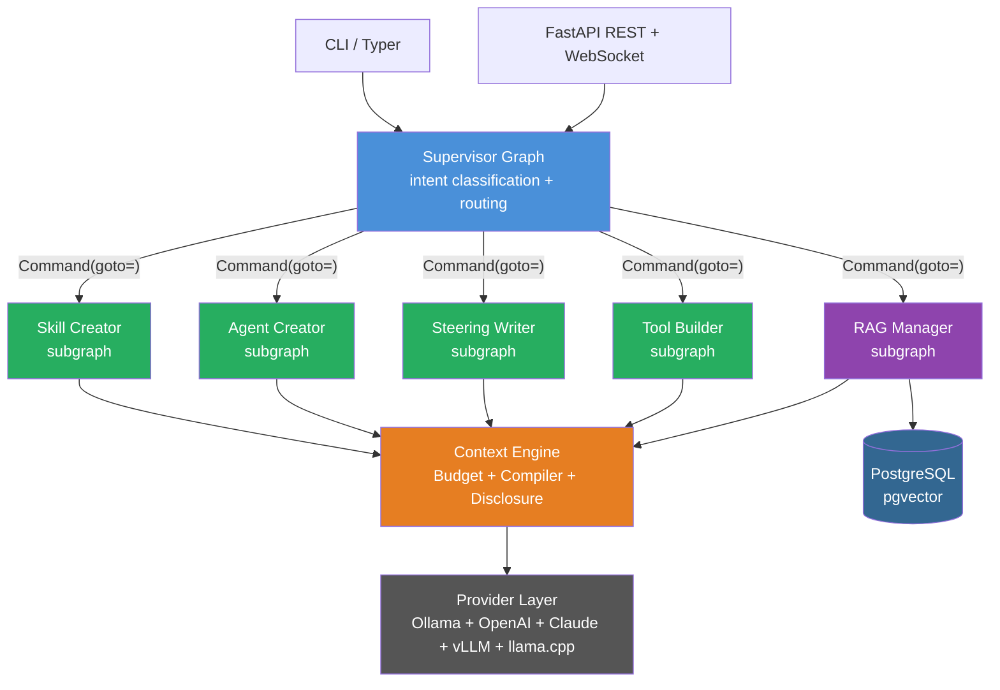

## Key Features

- **Multi-backend LLM support** — Ollama, OpenAI, Claude, vLLM, llama.cpp via pluggable providers
- **Adaptive context window** — 8K–32K for local models, configurable per-model (defaults to 8192 when unconfigured)
- **Model profiling** — empirical calibration sends test prompts on first use, generates reusable strategy profiles
- **Prompt compilation DSL** — abstract instructions compiled to model-optimized prompts at runtime (CoT, examples, format)
- **Progressive disclosure** — three-tier resource loading (metadata → summary → full) adapts to model capacity
- **Symlink + overlay** — reuses existing `~/workspace/ai/steering/` docs, local overrides take precedence
- **Pipeline contracts** — Pydantic models generated from JSON Schema for validated inter-agent communication
- **Phase-based tool activation** — only relevant tools exposed per task phase (reduces schema token cost by 71%)
- **Dual interface** — CLI (Typer) for one-off commands + server (FastAPI REST + WebSocket) for persistent sessions
- **Full tool mirror** — Python equivalents of all Kiro MCP tools (git, io, postgres, prometheus, jaeger, grafana, jira, linear, shell)
- **Security hardening** — shell commands tokenized and validated against structured allowlist (no shell=True), resource paths checked for traversal, calibration failures prevent profile persistence

---

## Setup

```bash
cd ~/workspace/ai/custom/langgraph
uv sync
cp .env.example .env  # Edit with your API keys and service URLs
```

### Prerequisites

- Python 3.12+
- [uv](https://docs.astral.sh/uv/) (package manager)
- [Ollama](https://ollama.com/) running locally (for local model inference)
- Optional: OpenAI/Anthropic API keys for external model access

### Pull a local model

```bash
ollama pull llama3.1:8b      # 8K context, good baseline
ollama pull qwen2.5:14b      # 32K context, strong local model
ollama pull tinyllama         # Tiny model for integration tests
```

### Ollama on Windows (for WSL2 development)

If you're running this project inside WSL2 but want GPU-accelerated inference, install Ollama on the **Windows host** and access it from WSL2 over the network.

#### Install Ollama on Windows

1. Download the installer from [ollama.com/download/windows](https://ollama.com/download/windows)
2. Run the installer — Ollama starts as a system tray application
3. Pull models from PowerShell or CMD:

```powershell
ollama pull llama3.1:8b
ollama pull qwen2.5:14b
ollama pull tinyllama
```

#### Configure Ollama to accept network connections

By default, Ollama binds to `127.0.0.1` (Windows host only). To expose it to WSL2:

1. Set the environment variable (System → Advanced → Environment Variables, or PowerShell):

```powershell
# PowerShell (persistent — requires Ollama restart)
[System.Environment]::SetEnvironmentVariable("OLLAMA_HOST", "0.0.0.0", "User")
```

2. Restart Ollama (right-click tray icon → Quit, then relaunch)
3. Verify from WSL2:

```bash
curl http://localhost:11434/api/tags
```

#### WSL2 network access

With **WSL2 mirrored networking** (Windows 11 22H2+), `localhost` in WSL2 reaches the Windows host automatically. If you're on an older build or using NAT mode:

```bash
# Find the Windows host IP from inside WSL2
export WINDOWS_HOST=$(ip route show default | awk '{print $3}')

# Set in your .env
echo "OLLAMA_BASE_URL=http://${WINDOWS_HOST}:11434" >> .env

# Or export directly
export OLLAMA_BASE_URL="http://${WINDOWS_HOST}:11434"
```

#### Windows Firewall

If WSL2 can't reach Ollama, add a firewall rule (run as Administrator):

```powershell
New-NetFirewallRule -DisplayName "Ollama WSL2" -Direction Inbound -Protocol TCP -LocalPort 11434 -Action Allow
```

#### GPU support (AMD Radeon / NVIDIA)

| GPU | Support | Notes |
|-----|---------|-------|
| NVIDIA (RTX 20xx+) | ✅ Full | Works out of the box with Ollama for Windows |
| AMD Radeon (RX 6000+) | ✅ ROCm | Ollama auto-detects AMD GPUs on Windows. Requires Adrenalin drivers 23.40+ |
| AMD Radeon (older) | ⚠️ Limited | Falls back to CPU. Vulkan support is experimental |
| Intel Arc | ⚠️ Experimental | Requires Ollama 0.4+ with IPEX-LLM backend |

Verify GPU is detected:

```bash
# From WSL2
curl http://localhost:11434/api/ps

# From Windows PowerShell
ollama ps
```

If models run on CPU despite having a supported GPU, ensure:
- Latest GPU drivers are installed (not just Windows Update defaults)
- Ollama is updated to the latest version
- No other process is holding the GPU (close GPU-heavy apps)

#### Recommended models by GPU VRAM

| VRAM | Recommended Models | Context |
|------|-------------------|---------|
| 4 GB | `tinyllama`, `phi-2` | 2K |
| 6 GB | `llama3.1:8b` (Q4), `mistral:7b` | 8K |
| 8 GB | `llama3.1:8b`, `qwen2.5:7b` | 8–32K |
| 12 GB | `qwen2.5:14b`, `deepseek-coder-v2:16b` | 16–32K |
| 16+ GB | `qwen2.5:14b` (full), `llama3.1:70b` (Q4) | 32K |

---

## Usage

### CLI Commands

```bash
# Run a task through the supervisor (classifies intent, routes to sub-agent)
uv run python -m src.main run "Create a skill for debugging Python applications"
uv run python -m src.main run "Create an agent for data pipeline management"
uv run python -m src.main run "Write a steering doc for API naming conventions"
uv run python -m src.main run "Build a tool for querying Elasticsearch"

# Test provider connection
uv run python -m src.main provider-test --model llama3.1:8b

# Show token budget allocation for a model
uv run python -m src.main budget-report --model qwen2.5:14b

# Profile a model (runs calibration, generates strategy profile)
uv run python -m src.main profile --model llama3.1:8b

# Show progressive disclosure for a query
uv run python -m src.main disclose --model qwen2.5:14b --query "skill schema conventions"

# List available tools for a task phase
uv run python -m src.main tools --phase skill_create

# List configured providers and models
uv run python -m src.main providers

# Start the server (REST + WebSocket)
uv run python -m src.main serve --port 8765
```

### Server API

```bash
# Health check
curl http://localhost:8765/api/health

# Run a task
curl -X POST http://localhost:8765/api/run \
  -H "Content-Type: application/json" \
  -d '{"task": "Create a skill for testing React components"}'

# List models
curl http://localhost:8765/api/models

# WebSocket streaming (connect with any WS client)
# Send: {"task": "Create a skill for debugging"}
# Receive: {"type": "status", "content": "classifying..."} → {"type": "result", ...}
```

---

## Model Profiling

The profiler runs 8 calibration tasks against a model and scores it on 5 axes:

| Axis | What it measures | Calibration task |
|------|-----------------|------------------|
| Reasoning | Multi-step logical thinking | "All but 9 die" problem with step-by-step |
| Instruction Following | Precision following complex instructions | "List exactly 3 P-languages, numbered" |
| Structured Output | JSON/XML format compliance | Generate valid JSON book object |
| Tool Calling | Correct function invocation format | "What is 15% of 2847?" with tool schema |
| Creativity | Engaging rewrites preserving meaning | Rewrite a bland sentence vividly |

### Profiling workflow

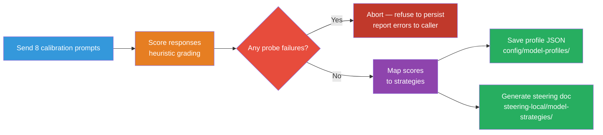

```bash
# 1. Run calibration (sends 8 prompts, scores responses)
uv run python -m src.main profile --model llama3.1:8b

# 2. Review the generated profile
cat config/model-profiles/llama3.1-8b.json

# 3. Read the human-friendly steering doc
cat steering-local/model-strategies/llama3.1-8b.md

# 4. Manually tweak if needed (profiles are editable JSON)
```

### Score → Strategy mapping

| Score Range | Classification | Prompt Strategy |
|-------------|---------------|-----------------|
| 0–4.9 | Weak | Full CoT scaffolding, 3 examples, compressed tool schemas |
| 5.0–7.4 | Medium | Light CoT, 1-2 examples, standard schemas |
| 7.5–10 | Strong | No CoT, 0 examples, JSON mode, full tool schemas |

### Generated profile example

```json
{
  "model_name": "llama3.1:8b",
  "provider": "ollama",
  "context_window": 8192,
  "scores": {
    "reasoning": 6.5,
    "instruction_following": 7.0,
    "structured_output": 6.0,
    "tool_calling": 5.5,
    "creativity": 7.5
  },
  "strategies": {
    "cot_needed": false,
    "json_mode": false,
    "xml_preferred": false,
    "max_tools_per_call": 8,
    "prompt_length_sweet_spot": 3276,
    "examples_needed": 1,
    "reasoning_scaffolding": "light"
  }
}
```

---

## Context Engineering

The system treats the context window as a structured runtime resource with explicit per-layer allocation — not an unlimited text dump.

### Token Budget Layers

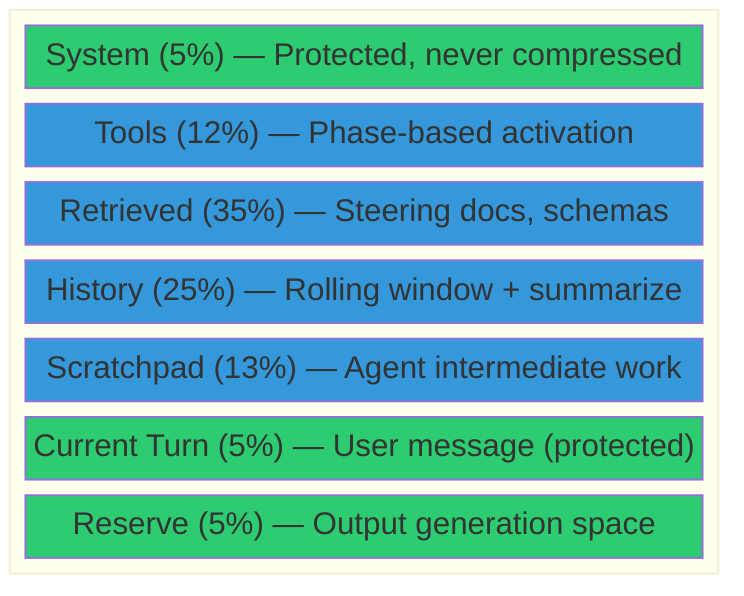

### Adaptive scaling

Budget allocations scale proportionally to the model's context window:

| Model | Context | Retrieved Layer | History Layer | Tools Layer |
|-------|---------|-----------------|---------------|-------------|
| TinyLlama | 2,048 | 717 tokens | 512 tokens | 245 tokens |
| Llama 3.1 8B | 8,192 | 2,831 tokens | 2,018 tokens | 973 tokens |
| Qwen 2.5 14B | 32,768 | 11,468 tokens | 8,192 tokens | 3,932 tokens |
| GPT-4o | 128,000 | 44,800 tokens | 32,000 tokens | 15,360 tokens |

### Compression strategies

When a layer exceeds its allocation:

| Layer | Strategy |
|-------|----------|
| History | Rolling window (keep last 4 turns) + abstractive summarization of older turns |
| Retrieved | Top-k by relevance score, fallback from full tier → summary tier |
| Scratchpad | Keep final results only, prune intermediate reasoning |
| Tools | Phase-based activation (only relevant tools), compress descriptions for weak models |

---

## Progressive Disclosure

Resources are loaded in three tiers, adapting to model capacity:

### Tier 1: Metadata (always loaded)
- File name, title, source (local override vs base)
- Token cost: ~5–10 tokens per resource
- Used for: relevance scoring, resource discovery

### Tier 2: Summary (loaded on relevance match)
- Title + first paragraph + section headings
- Token cost: ~100–500 tokens per resource
- Used for: 8K–16K models where full docs don't fit

### Tier 3: Full (loaded when budget allows)
- Complete document content
- Token cost: 1,000–5,000+ tokens per resource
- Used for: 32K+ models with sufficient budget

### Disclosure by context window

| Context Window | Max Tier | Behavior |
|---------------|----------|----------|
| < 8K | Metadata | Names and descriptions only |
| 8K–16K | Summary | Compressed versions of relevant docs |
| 16K–32K | Full | Top relevant docs loaded fully |
| 32K+ | Full (broad) | Multiple full docs loaded |

### Overlay resolution

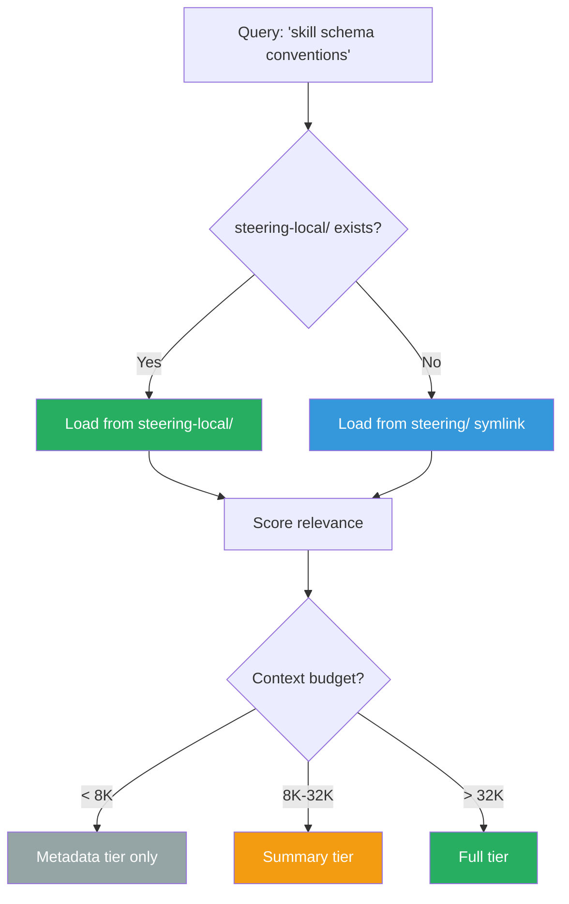

---

## Prompt Compiler

The compiler takes abstract instructions and produces model-optimized prompts:

```python
from src.context.compiler import PromptCompiler, OutputFormat
from src.profiler.profiles import load_profile

profile = load_profile("llama3.1:8b")

prompt = (PromptCompiler(profile)
    .system("You are a skill creator agent")
    .context_block("steering", schema_content, priority="high")
    .context_block("examples", existing_skills, priority="medium")
    .instruction("Create a debugging skill for Python applications")
    .examples(["example skill 1", "example skill 2"], max_count=3)
    .output_format(OutputFormat.MARKDOWN)
    .build())

# Result: CompiledPrompt with:
#   .messages          — LangChain messages ready for the LLM
#   .token_count       — Pre-counted total tokens
#   .strategy_applied  — Audit trail of what was adapted
#   .budget_breakdown  — Per-section token consumption
#   .blocks_included   — Which context blocks fit
#   .blocks_truncated  — Which were dropped for budget
```

### What the compiler adapts per model

| Decision | Weak Model | Medium Model | Strong Model |
|----------|-----------|--------------|--------------|
| CoT scaffolding | Full (5-step explicit) | Light ("outline your approach") | None |
| Few-shot examples | 3 examples | 1–2 examples | 0 examples |
| Output format markers | Verbose instructions | Standard | "Output ONLY valid JSON" |
| Context block priority | High only (budget tight) | High + medium | All blocks |
| Truncation | Aggressive | Moderate | Rarely needed |

---

## Inter-Agent Pipeline Contract

All sub-agents communicate through a validated JSON contract:

### PipelineInput (supervisor → sub-agent)

```json
{
  "task_type": "skill_create",
  "input": {
    "description": "Create a debugging skill for Python applications",
    "target_files": ["output/skills/"],
    "constraints": ["Must follow skill-schema.md", "Include failure recovery"],
    "upstream_decisions": [
      {
        "from_agent": "supervisor",
        "decisions": ["Classified as skill_create", "No overlap detected"]
      }
    ]
  }
}
```

### PipelineOutput (sub-agent → supervisor)

```json
{
  "task_type": "skill_create",
  "output": {
    "status": "success",
    "files_created": ["output/skills/debug-python.md"],
    "files_modified": [],
    "decisions_made": [
      "Created skill 'debug-python' with phased workflow",
      "Used write+validate environment scope",
      "Added failure recovery (max 3 retries)"
    ],
    "follow_up_suggestions": ["Register in a dev agent config"],
    "errors": [],
    "error_count": 0,
    "retry_context": {
      "attempts_made": 1,
      "max_attempts": 3,
      "strategies_tried": [],
      "should_escalate": false
    }
  }
}
```

### Orchestrator decision logic

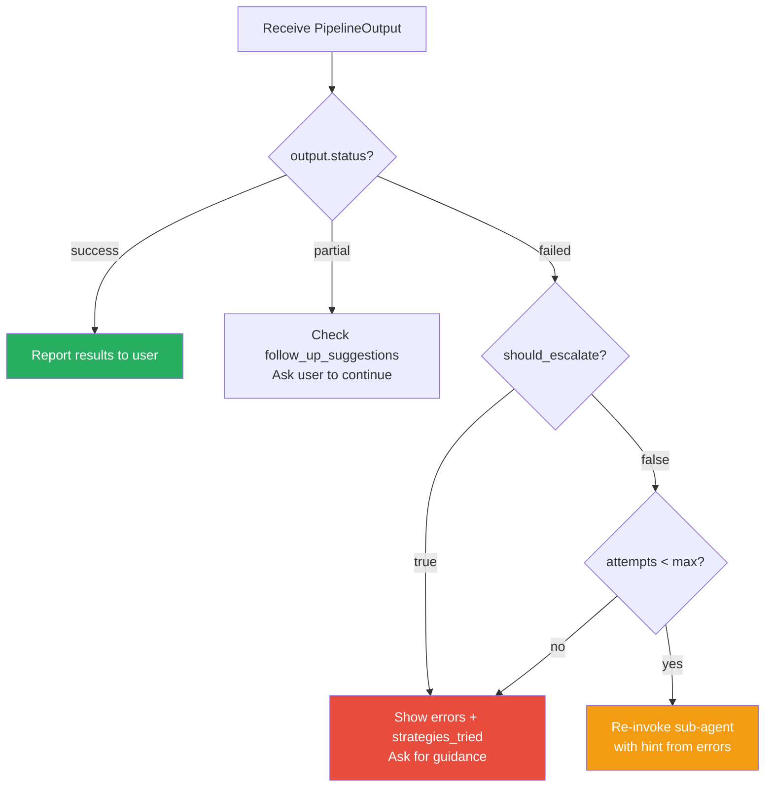

---

## Sub-Agent Graphs

Each sub-agent is a LangGraph subgraph with state isolation:

### Skill Creator (5 nodes)

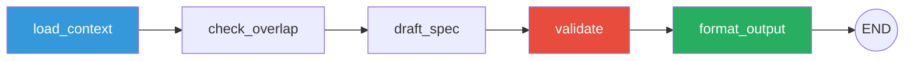

- Loads skill-schema steering via progressive disclosure
- Checks existing skills for naming/scope conflicts
- Generates YAML frontmatter + markdown body following Kiro schema
- Validates required sections (Role & Tone, Workflow, Guardrails)
- Writes to `output/skills/<name>.md`

### Agent Creator (5 nodes)

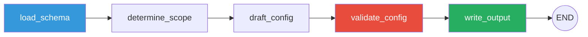

- Classifies agent type (read-only, development, infrastructure)
- Selects tool preset based on classification
- Generates JSON config with proper tools, allowedTools, hooks
- Validates JSON structure and tool consistency
- Writes to `output/agents/<name>.json`

### Steering Writer (4 nodes)

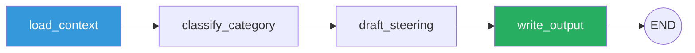

- Determines steering category (conventions, security, orchestration, preferences)
- Generates markdown following documentation conventions template
- Includes Why, Conventions, Rules, Anti-Patterns sections
- Writes to `output/steering/<category>/<name>.md`

### Tool Builder (4 nodes)

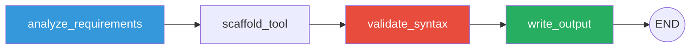

- Detects import requirements (HTTP, DB, shell)
- Generates Python file with `@tool` decorator, type hints, docstring
- Validates syntax via `compile()`
- Writes to `output/tools/<func_name>.py`

### RAG Manager (5 nodes)

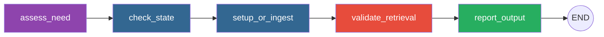

- Assesses whether RAG is warranted (collection size >= 20 docs)
- Checks existing pgvector schema and chunk stats
- Creates migration SQL or reports ingestion status
- Validates retrieval quality with test queries
- Produces migration file at `output/rag/001_create_steering_chunks.sql`

---

## Tool Registry

All Kiro MCP tools mirrored as LangGraph-compatible Python `@tool` functions:

| Domain | Tools | Env Vars |
|--------|-------|----------|
| **git** | `git_status`, `git_diff`, `git_log` | — (uses local git) |
| **io** | `read_json`, `write_json`, `read_file`, `write_file` | — |
| **postgres** | `postgres_query`, `postgres_seed` | `PGHOST`, `PGPORT`, `PGUSER`, `PGPASSWORD`, `PGDATABASE` |
| **prometheus** | `prometheus_query`, `prometheus_range_query`, `prometheus_metrics`, `prometheus_alerts` | `PROMETHEUS_URL`, `PROMETHEUS_AUTH_TOKEN` |
| **jaeger** | `jaeger_services`, `jaeger_search_traces`, `jaeger_get_trace`, `jaeger_analyze_bottlenecks` | `JAEGER_URL`, `JAEGER_AUTH_TOKEN` |
| **grafana** | `grafana_search_dashboards`, `grafana_query`, `grafana_annotations` | `GRAFANA_URL`, `GRAFANA_API_KEY` |
| **jira** | `jira_search_issues`, `jira_create_issue`, `jira_list_sprints` | `JIRA_BASE_URL`, `JIRA_EMAIL`, `JIRA_API_TOKEN` |
| **linear** | `linear_list_issues`, `linear_create_issue`, `linear_list_cycles` | `LINEAR_API_KEY` |
| **shell** | `run_command` (structured allowlist, shell=False) | — |

### Phase-based activation

Only relevant tools are loaded per task phase to save context tokens:

| Phase | Tools Loaded | Schema Tokens |
|-------|-------------|---------------|
| `skill_create` | read_file, write_file, read_json, git_status | ~500 |
| `agent_create` | read_file, write_file, read_json, write_json, git_status | ~600 |
| `tool_build` | read_file, write_file, run_command, git_status | ~550 |
| `observability` | prometheus_*, jaeger_*, grafana_* | ~1,200 |
| `full` | All 28 tools | ~3,500 |

Compressed schemas (name + short description only) save **71% tokens** vs full schemas — critical for weak local models with tight context budgets.

---

## Testing

```bash
# All tests (75 total: unit + integration)
make test

# Unit tests only (no external services needed)
make test-unit

# Integration tests (runs supervisor graph end-to-end)
make test-integration

# Lint
make lint

# Format
make format

# Generate Pydantic models from JSON schemas
make generate-models
```

### Test structure

```
tests/
├── conftest.py              # Shared fixtures (mock_provider, weak/strong profiles)
├── unit/
│   ├── test_budget.py       # Token budget allocation and overflow
│   ├── test_compiler.py     # Prompt compilation strategies
│   ├── test_disclosure.py   # Progressive disclosure + resource resolver
│   ├── test_tokenizer.py    # Token counting accuracy
│   ├── test_profiler.py     # Scorer + strategy selector
│   ├── test_models.py       # Pydantic model validation + round-trips
│   └── test_tools.py        # Tool registry + phase activation
└── integration/
    ├── test_supervisor_graph.py   # Full supervisor → sub-agent pipeline
    └── test_context_pipeline.py   # Budget + disclosure + compilation together
```

---

## Configuration

### `config/providers.yaml`

LLM backend configurations with per-model metadata. Models not listed here use the provider class's own constructor defaults (e.g., vLLM defaults to `context_window=32768`, `supports_tools=True`). Only explicitly configured values override those defaults.

```yaml
defaults:
  provider: ollama
  model: llama3.1:8b

providers:
  ollama:
    base_url: ${OLLAMA_BASE_URL:-http://localhost:11434}
    models:
      llama3.1:8b:
        context_window: 8192
        supports_tools: true
        supports_structured_output: true
      qwen2.5:14b:
        context_window: 32768
        supports_tools: true
        supports_structured_output: true
  openai:
    models:
      gpt-4o:
        context_window: 128000
        supports_tools: true
        supports_structured_output: true
```

### `config/budgets.yaml`

Token budget allocations per context layer:

```yaml
layers:
  system:
    type: protected
    percentage: 5
    min_tokens: 300
  retrieved:
    type: bounded
    percentage: 35
    min_tokens: 1000
  # ...

# Per-model context window caps (defaults to 8192 when not configured)
overrides:
  "llama3.1:8b":
    max_context: 8192      # Hard cap for local models
  "gpt-4o":
    max_context: null       # Uses provider-reported window (caller must supply it)
```

### `config/model-profiles/<model>.json`

Empirical calibration results (auto-generated, manually editable):

```bash
config/model-profiles/
├── llama3.1-8b.json
├── qwen2.5-14b.json
└── gpt-4o.json
```

---

## Directory Layout

```
~/workspace/ai/custom/langgraph/
├── pyproject.toml              # uv-managed deps (langgraph, langchain-*, fastapi, typer)
├── Makefile                    # All targets use `uv run`
├── .env.example                # Documented env vars for all providers/tools
├── steering/                   # → symlink to ~/workspace/ai/steering/
├── templates/                  # → symlink to ~/workspace/ai/templates/
├── steering-local/             # Local overrides take precedence
│   ├── model-strategies/       # Generated per-model steering docs
│   └── prompt-templates/       # Jinja2 model-family prompt templates
├── schemas/                    # JSON Schema source of truth
│   ├── pipeline-io.schema.json
│   ├── skill.schema.json
│   ├── agent.schema.json
│   ├── model-profile.schema.json
│   └── tool-result.schema.json
├── config/
│   ├── providers.yaml          # LLM backend configs
│   ├── budgets.yaml            # Token budget allocations
│   └── model-profiles/         # Calibration results (JSON)
├── src/
│   ├── main.py                 # Entry point
│   ├── cli.py                  # Typer CLI (8 commands)
│   ├── server.py               # FastAPI REST + WebSocket
│   ├── providers/              # LLM backend adapters
│   │   ├── base.py             # Abstract LLMProvider protocol
│   │   ├── ollama.py           # ChatOllama wrapper
│   │   ├── openai.py           # ChatOpenAI + tiktoken
│   │   ├── anthropic.py        # ChatAnthropic wrapper
│   │   ├── vllm.py             # OpenAI-compatible vLLM
│   │   ├── llamacpp.py         # Direct GGUF model loading (async via thread offload)
│   │   └── registry.py         # Factory: config + env → provider
│   ├── context/                # Context engineering engine
│   │   ├── budget.py           # Per-layer token allocation + overflow
│   │   ├── compiler.py         # DSL → model-optimized messages
│   │   ├── disclosure.py       # Three-tier progressive loading
│   │   ├── tokenizer.py        # Unified counting (tiktoken + approx)
│   │   └── assembly.py         # Orchestrates budget + disclosure + compilation
│   ├── profiler/               # Model calibration system
│   │   ├── calibrator.py       # 8-task probe battery
│   │   ├── scorer.py           # Deterministic heuristic grading
│   │   ├── strategy.py         # Score → prompt strategy mapping
│   │   └── profiles.py         # CRUD for profile JSON + steering docs
│   ├── graphs/                 # LangGraph state graphs
│   │   ├── state.py            # WorkspaceState + SubAgentState TypedDicts
│   │   ├── supervisor.py       # Supervisor: classify → route → finalize
│   │   ├── skill_creator.py    # Sub-agent: skill file generation
│   │   ├── agent_creator.py    # Sub-agent: agent JSON generation
│   │   ├── steering_writer.py  # Sub-agent: steering doc generation
│   │   └── tool_builder.py     # Sub-agent: tool scaffold generation
│   ├── tools/                  # LangGraph @tool implementations
│   │   ├── git.py, io.py, postgres.py, prometheus.py
│   │   ├── jaeger.py, grafana.py, jira.py, linear.py, shell.py
│   │   └── registry.py         # Phase-based activation + compression
│   ├── models/                 # Pydantic v2 models (from JSON Schema)
│   │   ├── pipeline.py         # PipelineInput, PipelineOutput
│   │   ├── profile.py          # ModelProfile, ModelScores, ModelStrategies
│   │   └── generate.py         # Schema → Pydantic code generation
│   └── resources/              # Steering resource management
│       └── resolver.py         # Symlink + overlay resolution with path containment
├── output/                     # Generated artifacts
│   ├── skills/                 # Created skill markdown files
│   ├── agents/                 # Created agent JSON configs
│   ├── steering/               # Created steering docs
│   └── tools/                  # Scaffolded tool Python files
└── tests/                      # 75 tests (unit + integration)
```

---

## Environment Variables

| Variable | Required | Purpose |
|----------|----------|---------|
| `LLM_PROVIDER` | No | Default provider (ollama, openai, anthropic, vllm). Default: ollama |
| `LLM_MODEL` | No | Default model identifier. Default: llama3.1:8b |
| `OLLAMA_BASE_URL` | No | Ollama server URL. Default: http://localhost:11434 |
| `OPENAI_API_KEY` | For OpenAI | OpenAI API key |
| `ANTHROPIC_API_KEY` | For Claude | Anthropic API key |
| `VLLM_BASE_URL` | For vLLM | vLLM server URL. Default: http://localhost:8000/v1 |
| `LLAMACPP_MODEL_PATH` | For llama.cpp | Path to GGUF model file |
| `PGHOST/PORT/USER/PASSWORD/DATABASE` | For postgres tools | Standard libpq connection vars |
| `PROMETHEUS_URL` | For prometheus tools | Prometheus server URL |
| `JAEGER_URL` | For jaeger tools | Jaeger Query URL |
| `GRAFANA_URL` + `GRAFANA_API_KEY` | For grafana tools | Grafana connection |
| `JIRA_BASE_URL` + `JIRA_EMAIL` + `JIRA_API_TOKEN` | For jira tools | Jira Cloud REST API |
| `LINEAR_API_KEY` | For linear tools | Linear GraphQL API |

---

## RAG with pgvector (Steering Knowledge Base)

### Why RAG Exists in This System

Progressive disclosure works well for small steering collections (5–20 docs), but degrades as the knowledge base grows:

| Steering Docs | Without RAG | With RAG |
|---------------|-------------|----------|
| 5–20 docs | Keyword relevance scoring is fast and accurate | Overkill — adds latency and complexity |
| 20–100 docs | Keyword matching misses semantic relationships | Embedding similarity finds conceptually related docs |
| 100+ docs | Scanning metadata exhausts the retrieved layer budget | Top-k retrieval stays O(1) regardless of collection size |
| Cross-domain queries | "How should auth work in my React app?" misses security + react steering | Embeddings capture cross-cutting relationships |

**Decision rule:** Add RAG when keyword-based progressive disclosure starts returning irrelevant results or missing relevant documents. The threshold is typically 20–30 steering docs or when queries span multiple domains.

### Where RAG Sits in the Workflow

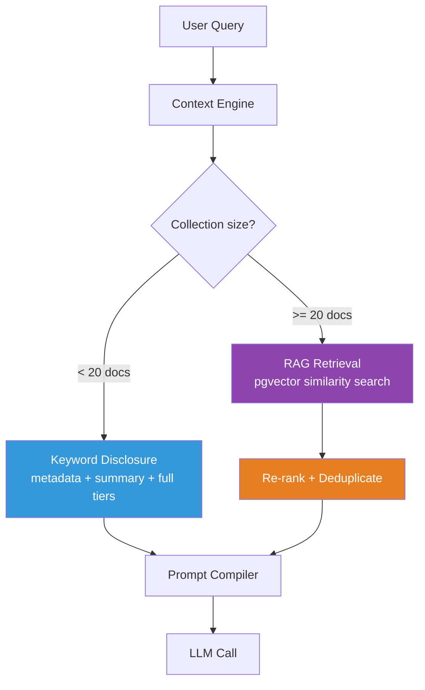

RAG replaces the relevance scoring step in progressive disclosure. The three-tier loading (metadata → summary → full) still applies — RAG just selects *which* documents to load, replacing keyword matching with semantic similarity.

### Architecture

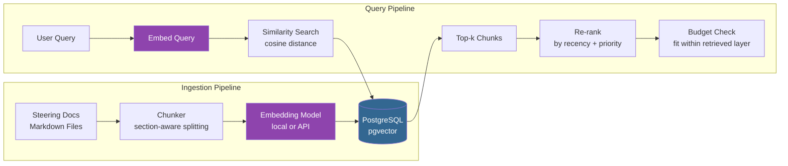

### Database Schema

```sql
-- Enable pgvector extension
CREATE EXTENSION IF NOT EXISTS vector;

-- Steering document chunks with embeddings
CREATE TABLE steering_chunks (
    id              UUID PRIMARY KEY DEFAULT gen_random_uuid(),
    -- Source tracking
    file_path       TEXT NOT NULL,          -- e.g., 'conventions/skill-schema.md'
    source          TEXT NOT NULL DEFAULT 'base',  -- 'base' or 'local' (overlay)
    chunk_index     INT NOT NULL,           -- Position within the document
    -- Content
    title           TEXT NOT NULL,           -- Section heading (for display)
    content         TEXT NOT NULL,           -- Chunk text
    token_count     INT NOT NULL,            -- Pre-counted tokens
    -- Metadata for filtering/re-ranking
    category        TEXT NOT NULL,           -- 'conventions', 'security', 'preferences', etc.
    priority        TEXT NOT NULL DEFAULT 'medium',  -- 'high', 'medium', 'low'
    last_modified   TIMESTAMPTZ NOT NULL DEFAULT NOW(),
    -- Embedding
    embedding       vector(384) NOT NULL,   -- all-MiniLM-L6-v2 produces 384-dim vectors
    -- Deduplication
    content_hash    TEXT NOT NULL,           -- SHA-256 of content for change detection
    UNIQUE(file_path, chunk_index)
);

-- Indexes for fast retrieval
CREATE INDEX idx_steering_embedding ON steering_chunks
    USING ivfflat (embedding vector_cosine_ops) WITH (lists = 20);
CREATE INDEX idx_steering_category ON steering_chunks (category);
CREATE INDEX idx_steering_source ON steering_chunks (source);
CREATE INDEX idx_steering_path ON steering_chunks (file_path);

-- Metadata table for tracking ingestion state
CREATE TABLE steering_ingestion_log (
    id              UUID PRIMARY KEY DEFAULT gen_random_uuid(),
    file_path       TEXT NOT NULL,
    content_hash    TEXT NOT NULL,
    chunks_created  INT NOT NULL,
    ingested_at     TIMESTAMPTZ NOT NULL DEFAULT NOW(),
    embedding_model TEXT NOT NULL,
    UNIQUE(file_path, content_hash)
);
```

### Why pgvector Over Dedicated Vector DBs

| Factor | pgvector | Pinecone/Weaviate/Qdrant |
|--------|----------|--------------------------|
| **Operational overhead** | Zero — you already run Postgres for tools | Separate service to deploy, monitor, scale |
| **Collection size** | Excellent up to ~1M vectors | Necessary above 10M+ vectors |
| **Hybrid queries** | Native SQL + vector in one query (filter by category, join with metadata) | Requires separate metadata filtering |
| **Cost** | Free (extension) | Per-vector pricing at scale |
| **Transactional guarantees** | Full ACID — ingestion is atomic | Eventually consistent |
| **Backup/restore** | Standard pg_dump includes vectors | Separate backup mechanism |
| **Local dev** | Same Postgres in your Tilt stack | Another container to configure |

**Decision:** pgvector is correct for this system. The steering knowledge base will never exceed 10K chunks (even at 500+ docs with 20 chunks each = 10K). pgvector handles this with sub-millisecond query times.

### Chunking Strategy

Steering docs are structured markdown with clear section boundaries. Use **section-aware chunking**, not fixed-size token windows:

```python
# Chunking rules for steering docs:
# 1. Split on ## headings (each section = one chunk)
# 2. If a section exceeds 500 tokens, split on paragraph boundaries
# 3. Always include the document title (# heading) as prefix context
# 4. Never split mid-paragraph or mid-code-block
# 5. Overlap: include the parent heading in each child chunk

# Example: steering/security/policies.md becomes:
# Chunk 0: "# Security Policies\n\n## Authentication\n\n..."  (section)
# Chunk 1: "# Security Policies\n\n## Authorization\n\n..."  (section)
# Chunk 2: "# Security Policies\n\n## Input Validation\n\n..." (section)
# Chunk 3: "# Security Policies\n\n## CORS Configuration\n\n..." (section)
```

**Why section-aware over fixed-window:**
- Preserves semantic completeness — a section about "CORS" stays together
- Prevents mid-thought splits that confuse retrieval
- Heading prefix gives the embedding model context about the document
- Matches how developers mentally organize documentation

### Embedding Model Selection

| Model | Dimensions | Local? | Quality | Speed | Recommendation |
|-------|-----------|--------|---------|-------|----------------|
| `all-MiniLM-L6-v2` | 384 | Yes (sentence-transformers) | Good | Fast (50ms/batch) | **Default for local** |
| `nomic-embed-text` | 768 | Yes (Ollama) | Better | Medium | Good local alternative |
| `text-embedding-3-small` | 1536 | No (OpenAI API) | Best | Fast (API) | If you have OpenAI key |
| `text-embedding-3-large` | 3072 | No (OpenAI API) | Best+ | Fast (API) | Overkill for this size |

**Default: `all-MiniLM-L6-v2`** via `sentence-transformers` — runs locally, no API key needed, 384 dimensions keeps storage small, quality is sufficient for technical documentation retrieval.

### Ingestion Pipeline

```python
# src/rag/ingest.py — Run after steering docs change

async def ingest_steering(
    directory: Path,
    source: str = "base",  # "base" or "local"
    embedding_model: str = "all-MiniLM-L6-v2",
    force: bool = False,
) -> IngestResult:
    """Ingest steering docs into pgvector.

    Idempotent: only re-ingests docs whose content_hash has changed.
    Set force=True to re-embed everything (e.g., after model change).
    """
    # 1. Scan directory for .md files
    # 2. For each file: compute content_hash
    # 3. Check steering_ingestion_log — skip unchanged files
    # 4. Chunk changed files (section-aware)
    # 5. Embed all new chunks (batch for efficiency)
    # 6. Upsert into steering_chunks (ON CONFLICT replace)
    # 7. Delete chunks for files that no longer exist
    # 8. Log ingestion in steering_ingestion_log
```

**Key properties:**
- **Idempotent** — running twice produces same result (content_hash change detection)
- **Incremental** — only re-processes changed files
- **Atomic** — uses a transaction so partial failures don't leave inconsistent state
- **Overlay-aware** — ingests both `steering/` (source=base) and `steering-local/` (source=local)

### Query Pipeline

```python
# src/rag/retrieve.py — Called by progressive disclosure engine

async def retrieve_relevant(
    query: str,
    *,
    max_tokens: int = 8000,      # Retrieved layer budget
    top_k: int = 10,              # Candidate pool (before budget trimming)
    category: str | None = None,  # Optional category filter
    min_similarity: float = 0.3,  # Cosine similarity threshold
) -> list[RetrievedChunk]:
    """Retrieve relevant steering chunks for a query.

    1. Embed the query
    2. Search pgvector for top-k similar chunks (filtered by category if set)
    3. Re-rank by: similarity * priority_weight * recency_boost
    4. Accumulate chunks until max_tokens budget is exhausted
    5. Return ordered chunks with metadata
    """
```

**Re-ranking factors:**
- **Similarity score** (0–1) — from pgvector cosine distance
- **Priority weight** — high=1.3x, medium=1.0x, low=0.7x
- **Recency boost** — docs modified in last 30 days get 1.1x
- **Source boost** — local overrides get 1.2x (user's customizations are more relevant)

### Integration with Context Engine

The RAG system slots into the existing progressive disclosure layer:

```python
# src/context/disclosure.py — Updated flow

class ProgressiveDisclosure:
    def load_for_task(self, query, context_window, max_tokens):
        # Decision: use RAG or keyword?
        if self._should_use_rag():
            return self._rag_retrieve(query, max_tokens)
        else:
            return self._keyword_retrieve(query, max_tokens)

    def _should_use_rag(self) -> bool:
        """Use RAG when collection exceeds keyword effectiveness."""
        total_docs = len(self._resolver.list_available())
        has_rag_db = self._check_pgvector_available()
        return total_docs >= 20 and has_rag_db
```

The three-tier system still applies after RAG retrieval:
- **Metadata tier**: chunk title + file_path (from pgvector result metadata)
- **Summary tier**: chunk content (already section-sized, ~200–500 tokens)
- **Full tier**: load the complete source file if budget allows and chunk relevance > 0.7

### When to Add RAG (Decision Checklist)

Add RAG to this system when **any** of these are true:

- [ ] Steering collection exceeds 20 documents
- [ ] Queries frequently span multiple categories (security + react + conventions)
- [ ] Keyword-based disclosure returns irrelevant documents (false positives)
- [ ] Keyword-based disclosure misses relevant documents (false negatives)
- [ ] You're adding domain-specific knowledge beyond the original steering set
- [ ] Multiple model profiles need different retrieval strategies (RAG can filter by model tier)

**Do NOT add RAG when:**
- Collection is small (< 20 docs) — keyword search is faster and simpler
- All queries are category-specific (user always specifies "conventions" or "security")
- The system is working well with progressive disclosure alone

### Testing RAG

```python
# tests/integration/test_rag.py

class TestRAGIngestion:
    def test_idempotent_ingestion(self):
        """Running ingestion twice produces same chunk count."""
        result1 = await ingest_steering(test_dir)
        result2 = await ingest_steering(test_dir)
        assert result2.chunks_created == 0  # No changes

    def test_incremental_update(self):
        """Modifying one file only re-ingests that file."""
        await ingest_steering(test_dir)
        modify_file(test_dir / "new.md")
        result = await ingest_steering(test_dir)
        assert result.files_processed == 1

    def test_deleted_file_removes_chunks(self):
        """Removing a file removes its chunks from the DB."""
        await ingest_steering(test_dir)
        delete_file(test_dir / "old.md")
        await ingest_steering(test_dir)
        chunks = await query_chunks(file_path="old.md")
        assert len(chunks) == 0

class TestRAGRetrieval:
    def test_relevant_query_returns_related_chunks(self):
        """Semantic search finds related content."""
        results = await retrieve_relevant("OAuth2 PKCE authentication flow")
        paths = [r.file_path for r in results]
        assert "security/policies.md" in paths

    def test_budget_respected(self):
        """Total tokens never exceed max_tokens."""
        results = await retrieve_relevant("any query", max_tokens=1000)
        total = sum(r.token_count for r in results)
        assert total <= 1000

    def test_category_filter(self):
        """Category filter restricts results."""
        results = await retrieve_relevant("patterns", category="conventions")
        assert all(r.category == "conventions" for r in results)

    def test_minimum_similarity_threshold(self):
        """Low-relevance chunks excluded."""
        results = await retrieve_relevant("quantum physics")  # Unrelated
        assert len(results) == 0 or all(r.similarity >= 0.3 for r in results)

class TestRAGMaintenance:
    def test_embedding_model_change_triggers_full_reingest(self):
        """Changing embedding model invalidates all chunks."""
        await ingest_steering(test_dir, embedding_model="model-a")
        result = await ingest_steering(test_dir, embedding_model="model-b", force=True)
        assert result.chunks_created > 0  # All re-embedded
```

### Maintenance Operations

```bash
# Ingest/update steering docs (run after any steering changes)
uv run python -m src.rag.ingest

# Force full re-ingestion (after embedding model change)
uv run python -m src.rag.ingest --force

# Show ingestion status
uv run python -m src.rag.status

# Query test (debug retrieval quality)
uv run python -m src.rag.query "OAuth2 authentication patterns" --top-k 5

# Vacuum stale chunks (files that no longer exist)
uv run python -m src.rag.vacuum
```

### Migration Path

The system is designed to work **without RAG initially** and add it incrementally:

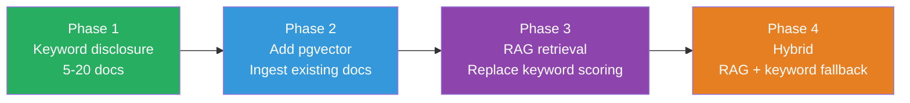

1. **Phase 1 (current)**: Keyword-based progressive disclosure — works now with no extra deps
2. **Phase 2**: Add pgvector extension to existing Postgres, run ingestion on steering docs
3. **Phase 3**: Route disclosure through RAG when collection >= 20 docs (automatic via `_should_use_rag()`)
4. **Phase 4**: Hybrid mode — RAG for semantic queries, keyword for exact-match lookups (file paths, config keys)

### File Structure (When RAG is Added)

```
src/rag/
├── __init__.py
├── ingest.py           # Ingestion pipeline (chunk → embed → upsert)
├── retrieve.py         # Query pipeline (embed → search → re-rank → budget)
├── chunker.py          # Section-aware markdown chunker
├── embeddings.py       # Embedding model adapter (local sentence-transformers or API)
├── models.py           # Pydantic models (RetrievedChunk, IngestResult, ChunkMetadata)
├── migrations/         # SQL migrations for pgvector schema
│   ├── 001_create_steering_chunks.sql
│   └── 002_add_ingestion_log.sql
├── status.py           # CLI: show ingestion status
├── query.py            # CLI: debug retrieval quality
└── vacuum.py           # CLI: remove stale chunks
```

### Cost Analysis

| Operation | Token Cost | Latency | When |
|-----------|-----------|---------|------|
| Keyword disclosure (current) | 0 (no inference) | < 5ms | Every prompt assembly |
| RAG embedding (query) | 0 (local model) | ~10ms | Every prompt assembly |
| RAG pgvector search | 0 | < 2ms (ivfflat index) | Every prompt assembly |
| RAG ingestion (embed chunks) | 0 (local model) | ~2s for 100 chunks | After steering changes |
| OpenAI embeddings (if used) | ~$0.02 per 1M tokens | ~50ms/batch | After steering changes |

**Net effect on token budget:** RAG *reduces* token consumption because it retrieves only the 2–3 most relevant chunks instead of loading 5+ documents via keyword matching. Typical savings: 30–50% of the retrieved layer budget.

---

## Design Decisions

| Decision | Why |
|----------|-----|
| **uv over pip** | Consistent with existing workspace scripts, faster, lockfile-based |
| **Symlinks for steering** | Single source of truth — edit once, used by both Kiro and LangGraph |
| **Local overlay for overrides** | Model-specific adaptations without polluting shared steering |
| **JSON Schema as source of truth** | Testable, language-agnostic, generates both Pydantic and prompt fragments |
| **Deterministic scorer (no LLM)** | Scoring must be reproducible and not depend on inference quality |
| **Phase-based tool activation** | Local models with 8K context can't afford 3,500 tokens of tool schemas |
| **Subgraphs with state isolation** | Prevents context contamination between sub-agents |
| **Command(goto=) routing** | Typed, auditable routing decisions visible in state history |
| **chars/4 token approximation for local models** | No tokenizer available for arbitrary Ollama models; accurate enough for budgeting |
| **shell=False + shlex tokenization** | Eliminates shell injection entirely; structured allowlist validates executable and args independently |
| **Path containment with symlink resolution** | Prevents directory traversal and absolute path injection even through symlinked roots |
| **Calibration failure = no persistence** | A single network error during profiling no longer produces a stored profile that understates the model |
| **asyncio.to_thread for llama.cpp** | Synchronous C++ inference must not block the shared event loop; queue-based streaming preserves incremental delivery |
| **Provider defaults respected when unconfigured** | Registry only overrides constructor args when model is explicitly listed in providers.yaml |
| **Conservative 8192 budget fallback** | Prevents budget guards from being bypassed for small-context local models with no config entry |

---

## Extending

### Add a new provider

1. Create `src/providers/<name>.py` implementing `LLMProvider` protocol
2. Register in `src/providers/registry.py` `_PROVIDERS` dict
3. Add model entries to `config/providers.yaml`
4. Run `uv run python -m src.main profile --model <new-model>`

### Add a new tool

1. Create `src/tools/<domain>.py` with `@tool`-decorated functions
2. Import in `src/tools/registry.py` and add to `ALL_TOOLS`
3. Assign to relevant phases in `PHASES` dict
4. Add env vars to `.env.example`

### Add a new sub-agent

1. Create `src/graphs/<name>.py` with a `build_<name>_graph()` function
2. Define nodes following the pattern: load → process → validate → output
3. Wire into supervisor in `src/graphs/supervisor.py`:
   - Add intent patterns to `_INTENT_PATTERNS`
   - Add route in `route_to_agent`
   - Register with `_subagent_wrapper(build_<name>_graph)`

### Add a new task type

1. Add to `TaskType` enum in `src/models/pipeline.py`
2. Add to `pipeline-io.schema.json` `task_type` enum
3. Add intent patterns in `src/graphs/supervisor.py`
4. Add tool phase in `src/tools/registry.py`
