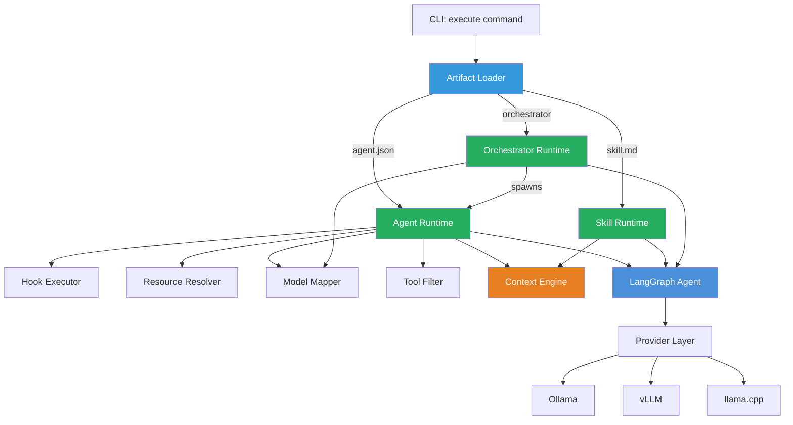
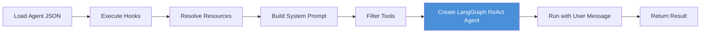
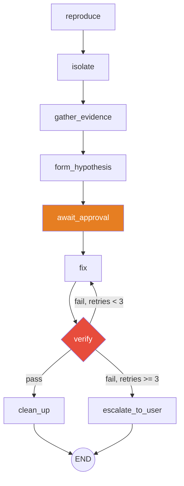

# Artifact Runtime — Design Document

## Why This Exists

This project generates Kiro-format artifacts (agents, skills, steering, tools) and currently only *creates* them. The missing piece is a **runtime** that *consumes* those same artifacts and executes them as LangGraph workflows using local models. This closes the loop: artifacts authored by Kiro (or by this system's creation sub-agents) become runnable pipelines locally.

---

## Goal

```bash
# Execute a single agent using its Kiro JSON config + local model
uv run python -m src.main execute --agent react-frontend "Add a new UserProfile component"

# Execute an orchestrator (multi-agent pipeline)
uv run python -m src.main execute --agent react-orchestrator "Build a complete settings page"

# Execute a skill directly
uv run python -m src.main execute --skill general-debug "The API returns 500 on /api/users"

# List available agents/skills from the workspace
uv run python -m src.main list-agents
uv run python -m src.main list-skills
```

---

## Architecture



---

## Module Layout

```
src/runtime/
├── __init__.py
├── loader.py           # Discover and parse artifacts from workspace paths
├── agent_runtime.py    # Single agent execution (JSON config → LangGraph graph)
├── skill_runtime.py    # Skill execution (MD workflow → phased LangGraph graph)
├── orchestrator.py     # Multi-agent pipelines from orchestrator configs
├── hooks.py            # agentSpawn hook execution + context injection
├── model_mapper.py     # Map Kiro model names → local model equivalents
├── tool_filter.py      # Apply allowedTools/toolsSettings constraints
└── state.py            # Runtime-specific state TypedDicts
```

---

## Artifact Loader (`loader.py`)

### Discovery Paths

Artifacts are resolved from the workspace root (`~/workspace/ai/`):

| Artifact Type | Path Pattern | Format |
|---------------|-------------|--------|
| Agents | `agents/*.json` | JSON |
| Skills | `skills/*.md` | YAML frontmatter + Markdown |
| Steering | `steering/**/*.md` | Markdown |
| MCP Servers | `mcp/mcp-scripts/servers/*.ts` | TypeScript (reference only) |

The loader also checks `output/` in the langgraph project for locally-generated artifacts.

### Resolution Order

1. `~/workspace/ai/agents/<name>.json` (primary workspace)
2. `output/agents/<name>.json` (locally generated)
3. Error if not found

### Parsed Structures

```python
@dataclass
class LoadedAgent:
    name: str
    description: str
    prompt: str
    tools: list[str]
    allowed_tools: list[str]
    tools_settings: dict
    resources: list[str]           # skill://, file:// URIs
    hooks: dict[str, list[dict]]   # agentSpawn, etc.
    mcp_servers: dict              # Reference only — mapped to local tools

@dataclass
class LoadedSkill:
    name: str
    description: str
    role_tone: str
    environment_scope: str         # write-only, write+validate, write+execute
    workflow_steps: list[WorkflowStep]
    failure_recovery: FailureRecovery
    guardrails: list[str]
    references: list[str]

@dataclass
class WorkflowStep:
    number: int
    name: str
    description: str
    is_approval_gate: bool         # "Await Approval" step → human interrupt
    commands: list[str]            # Commands to execute (write+validate/execute scope)

@dataclass
class FailureRecovery:
    max_retries: int
    steps: list[str]
```

---

## Model Mapper (`model_mapper.py`)

Kiro agent configs reference cloud models (`claude-opus-4.8`, `claude-haiku-4.5`, `gpt-4o`). The runtime maps these to local models based on capability tier.

### Mapping Strategy

```python
# Tier-based mapping from Kiro model references to local equivalents
MODEL_TIER_MAP = {
    "strong": [
        "claude-opus-*", "gpt-4o", "gpt-4-turbo", "claude-sonnet-*",
    ],
    "medium": [
        "claude-haiku-*", "gpt-4o-mini", "gpt-3.5-turbo",
    ],
    "fast": [
        "claude-haiku-4.5",  # When used for scaffolding (speed priority)
    ],
}
```

### Resolution

1. Check if user has model profiles (`config/model-profiles/`)
2. Map tier to the best profiled model:
   - `strong` → highest-scoring profiled model (or configured default)
   - `medium` → mid-range model
   - `fast` → smallest model with acceptable instruction-following
3. If no profiles exist, use the configured default for all tiers

### Config (`config/model-mapping.yaml`)

```yaml
# User overrides — maps Kiro model refs to local models
tiers:
  strong: qwen2.5:14b
  medium: llama3.1:8b
  fast: llama3.1:8b

# Direct overrides (takes precedence over tier mapping)
overrides:
  claude-opus-4.8: qwen2.5:14b
  claude-sonnet-5: qwen2.5:14b
  claude-haiku-4.5: llama3.1:8b
  gpt-4o: qwen2.5:14b
```

---

## Agent Runtime (`agent_runtime.py`)

Converts a `LoadedAgent` into a runnable LangGraph graph.

### Execution Flow



### System Prompt Construction

```python
def build_system_prompt(agent: LoadedAgent, hook_context: str, resources: list[str]) -> str:
    """Assemble system prompt from agent config + resolved resources.

    Layers (in order):
    1. Agent's `prompt` field (identity + behavior rules)
    2. Hook context (git status, branch, env info from agentSpawn)
    3. Resolved skill content (loaded via progressive disclosure)
    4. Resolved file:// resources (project files)
    5. Guardrails from skills (aggregated NEVER rules)
    """
```

### Tool Mapping

Kiro tool names map to LangGraph `@tool` functions:

| Kiro Tool | LangGraph Implementation |
|-----------|-------------------------|
| `read` | `src/tools/io.py::read_file` |
| `write` | `src/tools/io.py::write_file` |
| `shell` | `src/tools/shell.py::run_command` |
| `glob` | filesystem glob (new tool or shell-based) |
| `grep` | grep implementation (new tool or shell-based) |
| `code` | AST search (shell-based via `grep`/`ast-grep`) |
| `@git/git_status` | `src/tools/git.py::git_status` |
| `@io/read_json` | `src/tools/io.py::read_json` |
| `@io/write_json` | `src/tools/io.py::write_json` |

### Tool Filtering (allowedTools + toolsSettings)

```python
def filter_tools(
    agent: LoadedAgent,
    all_tools: dict[str, BaseTool],
) -> list[BaseTool]:
    """Apply agent's allowedTools and toolsSettings constraints.

    1. Start with agent.tools (full list of tools the agent knows about)
    2. Filter to agent.allowed_tools (subset that can actually be called)
    3. Apply toolsSettings constraints:
       - write.allowedPaths → wrap write_file with path validation
       - shell.allowedCommands → configure shell tool's allowlist
    """
```

### Human-in-the-Loop

When a skill's workflow contains "Await Approval" steps, the runtime uses LangGraph's interrupt mechanism:

```python
# If running interactively (CLI), prompt user
# If running via API, return with status "awaiting_approval"
```

---

## Skill Runtime (`skill_runtime.py`)

Converts a `LoadedSkill` into a phased LangGraph subgraph.

### Skill → Graph Compilation

Each workflow step becomes a LangGraph node:

```python
def compile_skill_graph(skill: LoadedSkill, provider: LLMProvider) -> CompiledStateGraph:
    """Compile a skill's workflow into a LangGraph graph.

    Nodes created:
    - One node per workflow step
    - Approval gates become interrupt nodes
    - Failure recovery becomes a conditional retry loop
    - Rollback becomes an error handler edge
    """
```

### Example: `general-debug` Skill → Graph



### Workflow Step Node Implementation

Each step node:
1. Loads relevant context via progressive disclosure
2. Constructs a prompt with the step's instructions + guardrails
3. Invokes the LLM with appropriate tools
4. Returns structured output for the next step

```python
def create_step_node(
    step: WorkflowStep,
    skill: LoadedSkill,
    provider: LLMProvider,
    tools: list[BaseTool],
) -> Callable:
    """Create a LangGraph node for a single workflow step.

    The node's system prompt includes:
    - The skill's Role & Tone
    - This step's specific instructions
    - The skill's Guardrails
    - Context from previous steps (in state)
    """
```

---

## Orchestrator Runtime (`orchestrator.py`)

Handles multi-agent configs (like `react-orchestrator.json`) that delegate to sub-agents.

### Detection

An agent is an orchestrator if:
- `toolsSettings.crew.availableAgents` exists, OR
- The prompt contains pipeline routing logic, OR
- `tools` includes `subagent`

### Execution Model

```python
def build_orchestrator_graph(
    orchestrator: LoadedAgent,
    available_agents: dict[str, LoadedAgent],
    model_mapper: ModelMapper,
) -> CompiledStateGraph:
    """Build a supervisor graph from an orchestrator agent config.

    1. Parse the orchestrator's prompt for intent classification rules
    2. Create a classify node using the orchestrator's prompt
    3. For each available sub-agent, create a sub-agent node
    4. Wire routing edges based on classification → sub-agent mapping
    5. Add finalize node that aggregates results
    """
```

### Sub-Agent Spawning

When the orchestrator routes to a sub-agent:
1. Model mapper selects the local model for that sub-agent's tier
2. The sub-agent's skills are loaded as its context
3. Pipeline input is constructed from the orchestrator's classification
4. Sub-agent runs as a nested LangGraph invocation
5. Pipeline output is returned to the orchestrator for aggregation

---

## Hook Executor (`hooks.py`)

Runs shell commands defined in `hooks.agentSpawn` before the agent starts.

```python
async def execute_hooks(
    hooks: dict[str, list[dict]],
    cwd: Path | None = None,
) -> dict[str, str]:
    """Execute agent hooks and return results as context strings.

    Each hook:
    - Runs with subprocess (shell=False, tokenized)
    - Has a timeout (from hook config, default 5000ms)
    - Captures stdout
    - Failures are logged but don't block execution

    Returns:
        {"git_status": "M src/...", "branch": "feat/...", ...}
    """
```

---

## Runtime State

```python
class RuntimeState(TypedDict):
    """State for artifact-driven agent execution."""

    # User interaction
    messages: Annotated[list[BaseMessage], add_messages]

    # Agent identity
    agent_name: str
    system_prompt: str

    # Loaded context
    hook_context: dict[str, str]
    resource_content: list[str]

    # Skill execution tracking (when running a skill)
    current_step: int
    step_results: dict[int, str]
    attempt_count: int

    # Tools available to this agent
    available_tools: list[str]

    # Pipeline I/O (for orchestrator sub-agents)
    pipeline_input: PipelineInput | None
    pipeline_output: PipelineOutput | None
```

---

## CLI Integration

New commands added to `src/cli.py`:

```python
@app.command()
def execute(
    agent: Optional[str] = typer.Option(None, help="Agent name to execute"),
    skill: Optional[str] = typer.Option(None, help="Skill name to execute"),
    task: str = typer.Argument(help="Task/message for the agent"),
    model: Optional[str] = typer.Option(None, help="Override model selection"),
    interactive: bool = typer.Option(True, help="Enable human-in-the-loop"),
):
    """Execute a Kiro artifact (agent or skill) using local models."""

@app.command("list-agents")
def list_agents():
    """List available agents from the workspace."""

@app.command("list-skills")
def list_skills():
    """List available skills from the workspace."""
```

---

## Resource Resolution

### URI Schemes

| URI | Resolution |
|-----|-----------|
| `skill://../skills/react-scaffold.md` | Load skill file, extract for context |
| `file://package.json` | Read file from CWD |
| `file://../steering/conventions/code-style.md` | Read steering doc |

### Progressive Disclosure for Resources

Resources are loaded using the existing context engine:
1. Skills referenced via `skill://` are loaded at summary tier (Role + Workflow headings)
2. If the current task matches a skill's trigger description, that skill is promoted to full tier
3. `file://` resources are loaded in full if they fit the budget, otherwise summarized

---

## Security Constraints Preserved

The runtime respects all Kiro security constraints:

| Constraint | Enforcement |
|-----------|------------|
| `allowedTools` | Only allowed tools are exposed to the LLM |
| `write.allowedPaths` | Write operations validated against glob patterns |
| `shell.allowedCommands` | Shell tool validates against allowlist (existing `src/tools/shell.py`) |
| Guardrails (from skills) | Injected into system prompt as hard constraints |
| Environment scope | `write-only` agents cannot execute commands |

---

## Implementation Priority

### Phase 1: Single Agent Execution (MVP)
1. `loader.py` — parse agent JSON and skill MD
2. `hooks.py` — execute agentSpawn hooks
3. `model_mapper.py` — tier-based model selection
4. `tool_filter.py` — apply allowedTools constraints
5. `agent_runtime.py` — build and run a ReAct agent graph
6. CLI `execute` command

### Phase 2: Skill Execution
7. `skill_runtime.py` — parse workflow steps into graph nodes
8. Human-in-the-loop interrupts for approval gates
9. Failure recovery loops

### Phase 3: Multi-Agent Orchestration
10. `orchestrator.py` — detect and build orchestrator graphs
11. Sub-agent spawning with model mapping
12. Pipeline I/O between stages

---

## Testing Strategy

```python
# Unit tests
tests/unit/test_loader.py          # Parsing agent JSON, skill MD
tests/unit/test_model_mapper.py    # Tier resolution, config loading
tests/unit/test_tool_filter.py     # AllowedTools, path constraints
tests/unit/test_hooks.py           # Hook execution, timeout handling

# Integration tests
tests/integration/test_agent_runtime.py       # Full agent execution with mock provider
tests/integration/test_skill_runtime.py       # Skill graph compilation + execution
tests/integration/test_orchestrator.py        # Multi-agent pipeline execution
```

---

## Anti-Patterns

- ❌ Executing all skills in full-tier regardless of relevance (token blowout)
- ❌ Ignoring `allowedTools` constraints (security regression)
- ❌ Running hooks with `shell=True` (injection risk — use existing tokenized shell)
- ❌ Hardcoding model names instead of using the mapper (defeats the purpose)
- ❌ Loading all agent resources eagerly (use progressive disclosure)
- ❌ Blocking on approval gates in non-interactive mode (hang forever)
- ❌ Spawning sub-agents without passing pipeline context (breaks contract)
