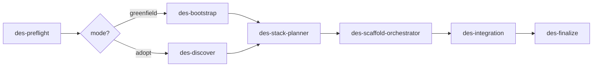

# dev-env-setup — Orchestration Contract

This is the single source of truth for how the `dev-env-setup` agents hand work to one
another. Agents load this doc **only when they need the schema** — prompts stay thin and
do not duplicate this content.

## Hard rule: JSON only

Worker and integration agents (`des-preflight`, `des-discover`, `des-bootstrap`,
`des-scaffold-service`, `des-integration`, `des-finalize`) return **only** a single JSON
object as their result. No prose, no markdown, no commentary before or after. The
interactive agent (`des-stack-planner`) is the sole exception: it converses with the user,
then writes `stack-plan.json` and returns the pipeline-output JSON.

Fan-in consumes **descriptors and lockfiles on disk**, never chat history. This keeps
hand-offs compact regardless of how many services exist.

## Directory layout produced

```
<workspace>/
├── .dev-env/
│   ├── stack-plan.json              # produced by des-stack-planner
│   ├── resolved-stack.lock.json     # shared resolved-version lockfile
│   └── mode.json                    # {"mode":"greenfield"|"adopt", ...} from preflight/discover
├── .tilt/
│   └── services/
│       └── <name>.json              # one descriptor per service (new or discovered)
├── Tiltfile                         # generated/merged by des-integration
├── nginx/
│   └── nginx.conf                   # generated/merged by des-integration
├── k8s/                             # shared/base manifests (telemetry, gateway, db, ...)
└── <service-name>/                  # one dir per scaffolded microservice
```

## Service descriptor schema — `.tilt/services/<name>.json`

Every scaffold agent (new service) and `des-discover` (existing service) writes exactly one
of these. `des-integration` reads all of them.

```json
{
  "schemaVersion": 1,
  "name": "orders-api",
  "role": "api",
  "origin": "scaffolded",
  "language": "node",
  "framework": "express",
  "buildContext": "./orders-api",
  "dockerfile": "./orders-api/Dockerfile",
  "image": "orders-api",
  "ports": [{ "name": "http", "container": 3000, "expose": true }],
  "health": { "path": "/healthz", "port": 3000 },
  "nginxRoute": { "pathPrefix": "/api/orders", "upstreamPort": 3000, "stripPrefix": true },
  "otlp": { "wired": true, "endpointEnv": "OTEL_EXPORTER_OTLP_ENDPOINT" },
  "dependsOn": ["postgres", "otel-collector"],
  "env": ["DATABASE_URL", "OTEL_EXPORTER_OTLP_ENDPOINT"],
  "tiltResourceLabels": ["api"],
  "notes": ""
}
```

Field reference:

| Field | Type | Meaning |
|-------|------|---------|
| `schemaVersion` | int | Always `1` for this contract. |
| `name` | string | Unique service/resource name (kebab-case). Also the Tilt resource name. |
| `role` | enum | `api` \| `socket-api` \| `web` \| `db` \| `cache` \| `broker` \| `worker` \| `cron` \| `telemetry` \| `gateway`. |
| `origin` | enum | `scaffolded` (new, this run) \| `discovered` (pre-existing, adopt mode) \| `base` (bootstrap-created). |
| `language` | string \| null | `go` \| `node` \| `python` \| null (infra-only). |
| `framework` | string \| null | e.g. `express`, `gin`, `next`, `react-vite`, `celery`. |
| `buildContext` | string \| null | Docker build context path, workspace-relative. null for pulled images. |
| `dockerfile` | string \| null | Path to Dockerfile. null for pulled images. |
| `image` | string | Local image name (built) or `repo:tag` (pulled, tag already resolved from "latest"). |
| `ports` | array | `{name, container, expose}` entries. |
| `health` | object \| null | `{path, port}` for readiness. null for infra without HTTP health. |
| `nginxRoute` | object \| null | `{pathPrefix, upstreamPort, stripPrefix}`. null for services not proxied. |
| `otlp` | object | `{wired: bool, endpointEnv}`. |
| `dependsOn` | array | Names of other services this one needs up first. |
| `env` | array | Env var names the service expects (values via k8s secret/env, never committed). |
| `tiltResourceLabels` | array | Labels for Tilt UI grouping. |
| `notes` | string | Free notes; not consumed programmatically. |

## Pipeline input (orchestrator → worker)

Each spawned worker receives a task description containing this JSON:

```json
{
  "task_type": "scaffold-service",
  "mode": "greenfield",
  "workspace": "/abs/path/to/workspace",
  "input": {
    "service": { "name": "orders-api", "role": "api", "language": "node", "framework": "express" },
    "constraints": ["pin exact versions", "non-root container", "OTLP wired"],
    "upstream_decisions": []
  }
}
```

`task_type` ∈ `preflight` | `discover` | `bootstrap` | `plan` | `scaffold-service` |
`integrate` | `finalize`.

## Pipeline output (worker → orchestrator)

Every worker returns exactly this shape:

```json
{
  "status": "success",
  "task_type": "scaffold-service",
  "files_created": ["orders-api/package.json", ".tilt/services/orders-api.json"],
  "files_modified": [],
  "decisions_made": ["resolved express to pinned version, wrote descriptor"],
  "descriptors_written": [".tilt/services/orders-api.json"],
  "follow_up_suggestions": [],
  "retry_context": { "attempts_made": 1, "strategies_tried": [], "should_escalate": false }
}
```

`status` ∈ `success` | `partial` | `failed`. On `failed` with `should_escalate: true`,
the orchestrator surfaces the error to the user rather than silently retrying.

## Resolution lockfile — `.dev-env/resolved-stack.lock.json`

Shared source of truth for every `"latest"` → concrete-version resolution. Written by the
first agent to resolve a given key; read by all others so parallel agents and re-runs do not
re-query registries and results stay deterministic.

```json
{
  "schemaVersion": 1,
  "resolvedAt": "2026-09-11T00:00:00Z",
  "resolutions": {
    "api.node.express": "4.21.2",
    "telemetry.jaeger.image": "jaegertracing/all-in-one:1.62.0",
    "database.postgres.vectorImage": "pgvector/pgvector:pg17"
  }
}
```

Resolution rule: if a key already exists in the lockfile, reuse it. Otherwise resolve the
newest secure/stable version, write the pinned value into both the project manifest and the
lockfile. **Never write the literal string `"latest"` into a project manifest.**

## Idempotency & resumability

Every agent checks for its own prior output before doing work:

- `des-discover` / `des-scaffold-service`: if `.tilt/services/<name>.json` already exists and
  matches the requested service, treat as done (no-op) unless a `force` flag is set.
- `des-bootstrap`: if the base (`Tiltfile` + telemetry manifests) already exists, skip.
- `des-integration`: regeneration is byte-stable — running twice on the same descriptor set
  yields identical output.

A re-run after one failed service must NOT re-scaffold the services that already succeeded.

## Mode semantics — `.dev-env/mode.json`

```json
{ "mode": "adopt", "existingTiltfile": true, "existingNginx": true, "existingTelemetry": true, "existingServices": ["users-api", "web"] }
```

- **greenfield**: no existing `Tiltfile`. `des-bootstrap` creates the base; all app services
  are `scaffolded`.
- **adopt**: an existing `Tiltfile`/projects were detected. `des-discover` back-fills
  descriptors for existing services (`origin: "discovered"`), the planner only asks about
  missing/added services, `des-integration` MERGES (never overwrites) shared config, and an
  existing telemetry stack is reused instead of duplicated.


