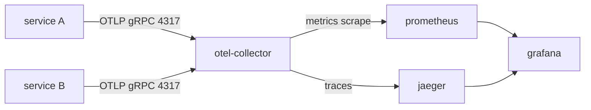

# dev-env-setup — Telemetry Conventions

Telemetry is **always present**. In greenfield, `des-bootstrap` deploys the full stack. In
adopt mode, an existing telemetry stack is reused (see detection below) rather than
duplicated.

## The stack



| Component | Role | Default ports |
|-----------|------|---------------|
| `otel-collector` (contrib) | Aggregator; OTLP receiver → exports traces to Jaeger, exposes Prometheus metrics | 4317 (gRPC), 4318 (HTTP), 8889 (prom exporter) |
| `jaeger` (all-in-one) | Trace backend + UI | 16686 (UI), OTLP in via collector |
| `prometheus` | Scrapes collector's `:8889` | 9090 |
| `grafana` | Dashboards; pre-provisioned datasources | 3000 (port-forward to avoid clashing app :3000) |

All images are pulled with versions resolved from `"latest"` and pinned into manifests +
`.dev-env/resolved-stack.lock.json`. All run as non-root.

## Service-side OTLP wiring

Every scaffolded service exports OTLP to the collector via a single env var:

```
OTEL_EXPORTER_OTLP_ENDPOINT=http://otel-collector:4317
OTEL_SERVICE_NAME=<service-name>
OTEL_RESOURCE_ATTRIBUTES=service.namespace=devenv,deployment.environment=local
```

- **Node**: `@opentelemetry/sdk-node` + `@opentelemetry/auto-instrumentations-node`, started
  before app code (e.g. `--import ./otel.js` / `-r ./otel`). Trace exporter
  `@opentelemetry/exporter-trace-otlp-grpc`.
- **Go**: `go.opentelemetry.io/otel` + `otlptracegrpc` exporter; framework instrumentation
  (e.g. `otelgin`).
- **Python/Celery**: `opentelemetry-sdk` + `opentelemetry-exporter-otlp` +
  `opentelemetry-instrumentation-celery`.

The descriptor records `otlp.wired: true` and `otlp.endpointEnv: "OTEL_EXPORTER_OTLP_ENDPOINT"`.

## Collector config essentials

- `receivers: otlp` (grpc `:4317`, http `:4318`).
- `exporters`: an OTLP/traces exporter to Jaeger's OTLP endpoint, plus a `prometheus`
  exporter on `:8889`.
- `service.pipelines`: `traces → [otlp→jaeger]`, `metrics → [prometheus]`.

## Grafana provisioning

Pre-provision datasources via mounted provisioning config (ConfigMap):

```yaml
apiVersion: 1
datasources:
  - name: Prometheus
    type: prometheus
    access: proxy
    url: http://prometheus:9090
    isDefault: true
  - name: Jaeger
    type: jaeger
    access: proxy
    url: http://jaeger:16686
```

Admin credentials come from a k8s Secret/env — never committed with a real value; the dev
default is a placeholder the user is told to change.

## Adopt-mode: reuse existing stack

Before deploying anything, check discovered descriptors and existing manifests for a
telemetry stack:

1. If a `role: "telemetry"` descriptor (or an obvious collector/jaeger/prometheus/grafana
   resource) already exists → **reuse it**. Point new services' `OTEL_EXPORTER_OTLP_ENDPOINT`
   at the existing collector service name/port.
2. If only part of the stack exists, add only the missing components, wired to what's there.
3. Only deploy the full stack when none is detected.

Record the decision in the pipeline output `decisions_made` (e.g.
`"reused existing otel-collector at otel-collector:4317"`).

## Anti-patterns

- ❌ Duplicating a telemetry stack that already exists in adopt mode.
- ❌ Committing real Grafana admin credentials.
- ❌ Hardcoding the collector endpoint in code instead of the `OTEL_EXPORTER_OTLP_ENDPOINT` env.
- ❌ Unpinned telemetry image tags.
