# .NET Architecture Patterns & Decisions

## Why This Exists

This document consolidates .NET architecture patterns, trade-off matrices, and decision frameworks into a single authoritative reference. It covers API communication, CQRS, EF Core vs Dapper, thread safety, resilience, clean architecture, DI, DDD, microservice structure, and more. Each pattern includes "when to use" AND "when NOT to use" — because real architecture is about trade-offs, not adoption.

Referenced by `efcore-antipattern-refactor`, `dapper-antipattern-refactor`, and `efcore-query-author` skills for .NET-specific context.

**Target:** .NET 9+ | **Last updated:** 2026-08-04

---

## How to Use This Document

For every pattern or technology, there is a ready answer for *"when would you NOT use this?"*

**Decision framework:**

1. **Clarify constraints** — scale, team size, timeline, existing systems
2. **State trade-offs explicitly** — what you gain, what you give up
3. **Make a decision and justify it** — don't hedge endlessly
4. **Acknowledge what could go wrong** — and how you'd detect it

---

## Table of Contents

- [.NET Architecture Patterns & Decisions](#net-architecture-patterns--decisions)
  - [why use?](#why-use)
  - [How to Use This Document](#how-to-use-this-document)
  - [Table of Contents](#table-of-contents)
  - [1. Why Not ASP.NET MVC — UI Coupling \& Framework Selection](#1-why-not-aspnet-mvc--ui-coupling--framework-selection)
    - [The Tight Coupling Problem](#the-tight-coupling-problem)
    - [SPA Pattern Advantages](#spa-pattern-advantages)
    - [Migration Path: MVC → API + SPA](#migration-path-mvc--api--spa)
    - [🎯 Key Insights](#-key-insights)
  - [2. API Communication Patterns](#2-api-communication-patterns)
    - [REST](#rest)
      - [HTTP Verbs Reference](#http-verbs-reference)
    - [gRPC](#grpc)
    - [GraphQL](#graphql)
    - [WebSocket / SignalR](#websocket--signalr)
    - [API Style Comparison](#api-style-comparison)
    - [API Style Decision Tree](#api-style-decision-tree)
    - [🎯 Key Insights](#-key-insights-1)
    - [Step 1 create you domain model with all the validation and behaviors not based off db](#step-1-create-you-domain-model-with-all-the-validation-and-behaviors-not-based-off-db)
    - [Step 2: Commands, Queries, and Validation (Contracts)](#step-2-commands-queries-and-validation-contracts)
    - [Step 3: Write Repository](#step-3-write-repository)
    - [Step 4: Command Handler](#step-4-command-handler)
    - [Step 5: Read Projections (Optional but recommended)](#step-5-read-projections-optional-but-recommended)
    - [Step 6: Query Handler (The Read Side)](#step-6-query-handler-the-read-side)
    - [Step 7: API Endpoints (Minimal APIs)](#step-7-api-endpoints-minimal-apis)
  - [3. CQRS — Command Query Responsibility Segregation](#3-cqrs--command-query-responsibility-segregation)
    - [The CQRS Spectrum](#the-cqrs-spectrum)
    - [CQRS Data Flow](#cqrs-data-flow)
    - [CQRS Architecture \& Development Lifecycle](#cqrs-architecture--development-lifecycle)
    - [Why this order works](#why-this-order-works)
    - [When to Use CQRS](#when-to-use-cqrs)
    - [When NOT to Use CQRS](#when-not-to-use-cqrs)
    - [Implementation Patterns](#implementation-patterns)
      - [MediatR-Based (CQRS-Lite)](#mediatr-based-cqrs-lite)
      - [Pipeline Behavior (Cross-Cutting)](#pipeline-behavior-cross-cutting)
      - [MediatR-Free CQRS (.NET 9+ — No Library Dependency)](#mediatr-free-cqrs-net-9--no-library-dependency)
    - [🎯 Key Insights](#-key-insights-2)
  - [4. EF Core vs Dapper](#4-ef-core-vs-dapper)
    - [Decision Criteria](#decision-criteria)
    - [ORM Decision Tree](#orm-decision-tree)
    - [EF Core Patterns](#ef-core-patterns)
    - [Dapper Patterns](#dapper-patterns)
    - [Hybrid Approach](#hybrid-approach)
    - [When NOT to Use EF Core](#when-not-to-use-ef-core)
    - [When NOT to Use Dapper](#when-not-to-use-dapper)
    - [🎯 Key Insights](#-key-insights-3)
  - [5. Thread Safety — Request Pipeline \& Service Lifetimes](#5-thread-safety--request-pipeline--service-lifetimes)
    - [DI Lifetime Thread Implications](#di-lifetime-thread-implications)
    - [Captive Dependency Problem](#captive-dependency-problem)
    - [DbContext Thread Safety](#dbcontext-thread-safety)
    - [HttpContext Access Pitfalls](#httpcontext-access-pitfalls)
    - [Async/Await Pitfalls](#asyncawait-pitfalls)
    - [ValueTask vs Task](#valuetask-vs-task)
    - [🎯 Key Insights](#-key-insights-4)
  - [6. Thread Safety — Background Processing \& Shared State](#6-thread-safety--background-processing--shared-state)
    - [Background Processing Patterns](#background-processing-patterns)
      - [Channel\<T\> — Producer/Consumer](#channelt--producerconsumer)
      - [Graceful Shutdown with CancellationToken](#graceful-shutdown-with-cancellationtoken)
    - [Shared State Primitives](#shared-state-primitives)
      - [lock — Simple Mutex (Sync Only)](#lock--simple-mutex-sync-only)
      - [SemaphoreSlim — Async Mutex \& Throttling](#semaphoreslim--async-mutex--throttling)
      - [ConcurrentDictionary — Thread-Safe but NOT Atomic Across Operations](#concurrentdictionary--thread-safe-but-not-atomic-across-operations)
      - [Interlocked — Lock-Free Atomic Operations](#interlocked--lock-free-atomic-operations)
    - [Immutable Patterns](#immutable-patterns)
    - [Anti-Patterns Summary](#anti-patterns-summary)
    - [🎯 Key Insights](#-key-insights-5)
  - [7. Resilience Patterns](#7-resilience-patterns)
    - [Why Resilience Matters](#why-resilience-matters)
    - [Polly v8 ResiliencePipeline](#polly-v8-resiliencepipeline)
      - [Circuit Breaker State Machine](#circuit-breaker-state-machine)
    - [Outbox Pattern \*\* NOTE, do not write directly to rabbit mq.  must have outbox pattern for fanout](#outbox-pattern--note-do-not-write-directly-to-rabbit-mq--must-have-outbox-pattern-for-fanout)
      - [Idempotency Keys](#idempotency-keys)
    - [Observability Stack](#observability-stack)
    - [🎯 Key Insights](#-key-insights-6)
  - [8. Clean Architecture vs Vertical Slice](#8-clean-architecture-vs-vertical-slice)
    - [Clean/Onion Architecture](#cleanonion-architecture)
    - [Vertical Slice Architecture](#vertical-slice-architecture)
    - [Architecture Comparison](#architecture-comparison)
    - [🎯 Key Insights](#-key-insights-7)
  - [9. Serverless — Azure Functions vs AWS Lambda](#9-serverless--azure-functions-vs-aws-lambda)
    - [Azure Functions](#azure-functions)
      - [Trigger Types](#trigger-types)
      - [Durable Functions (Stateful Orchestration)](#durable-functions-stateful-orchestration)
      - [Cold Start Mitigation](#cold-start-mitigation)
    - [AWS Lambda](#aws-lambda)
      - [Event Sources](#event-sources)
      - [Native AOT for Cold Start](#native-aot-for-cold-start)
      - [Lambda Powertools for .NET](#lambda-powertools-for-net)
      - [Step Functions (vs Durable Functions)](#step-functions-vs-durable-functions)
    - [Serverless Comparison](#serverless-comparison)
    - [When NOT to Use Serverless](#when-not-to-use-serverless)
    - [Compute Decision Tree](#compute-decision-tree)
    - [Container Alternatives Quick Reference](#container-alternatives-quick-reference)
    - [🎯 Key Insights](#-key-insights-8)
  - [10. Full-Stack Architectural Decision Tree](#10-full-stack-architectural-decision-tree)
    - [Monolith vs Modular Monolith vs Microservices](#monolith-vs-modular-monolith-vs-microservices)
    - [Data Layer Decisions](#data-layer-decisions)
      - [Caching Layer Decisions](#caching-layer-decisions)
    - [Messaging Patterns](#messaging-patterns)
    - [Multi-Tenancy Patterns](#multi-tenancy-patterns)
    - [Master Decision Matrix](#master-decision-matrix)
    - [🎯 Key Insights](#-key-insights-9)
  - [11. Dependency Injection \& Testability](#11-dependency-injection--testability)
    - [DI as Architecture Enabler](#di-as-architecture-enabler)
    - [DI Anti-Patterns](#di-anti-patterns)
    - [Testability by Design](#testability-by-design)
    - [Test Pyramid](#test-pyramid)
    - [Testcontainers vs EF InMemory](#testcontainers-vs-ef-inmemory)
    - [🎯 Key Insights](#-key-insights-10)
  - [12. Meta-Skills \& Quick Reference](#12-meta-skills--quick-reference)
    - [How to Answer Architecture Questions](#how-to-answer-architecture-questions)
    - [Common Scenarios \& Talking Points](#common-scenarios--talking-points)
      - ["Design an order processing system"](#design-an-order-processing-system)
      - ["How would you migrate this monolith?"](#how-would-you-migrate-this-monolith)
      - ["This system is slow under load"](#this-system-is-slow-under-load)
      - ["What's wrong with this design?" (code review question)](#whats-wrong-with-this-design-code-review-question)
    - [Master Pattern Reference Table](#master-pattern-reference-table)
    - [The "When Would You NOT Use This?" Drill](#the-when-would-you-not-use-this-drill)
  - [13. Domain-Driven Design \& Microservice Scope](#13-domain-driven-design--microservice-scope)
    - [What is DDD?](#what-is-ddd)
    - [Core DDD Concepts](#core-ddd-concepts)
    - [Bounded Context = Microservice Scope](#bounded-context--microservice-scope)
    - [Aggregate Design Rules](#aggregate-design-rules)
    - [🎯 Key Insights](#-key-insights-11)
  - [14. .NET Microservice Project Architecture](#14-net-microservice-project-architecture)
    - [Project Structure \& Libraries](#project-structure--libraries)
    - [Standard Library Stack per Service](#standard-library-stack-per-service)
    - [Request Lifecycle Workflow](#request-lifecycle-workflow)
  - [15. CRON / Scheduled Job Architecture](#15-cron--scheduled-job-architecture)
    - [Architecture Overview](#architecture-overview)
    - [CRON Expression Reference](#cron-expression-reference)
    - [Implementation Patterns](#implementation-patterns-1)
      - [Pattern 1: BackgroundService with Timer (Simple)](#pattern-1-backgroundservice-with-timer-simple)
      - [Pattern 2: Azure Functions Timer Trigger (Serverless)](#pattern-2-azure-functions-timer-trigger-serverless)
      - [Distributed Lock (Prevent Duplicate Execution)](#distributed-lock-prevent-duplicate-execution)
    - [Key Design Decisions for CRON Jobs](#key-design-decisions-for-cron-jobs)
  - [16. AI Architecture in .NET](#16-ai-architecture-in-net)
    - [Architecture Overview](#architecture-overview-1)
    - [RAG (Retrieval-Augmented Generation) Workflow](#rag-retrieval-augmented-generation-workflow)
    - [Semantic Kernel Implementation](#semantic-kernel-implementation)
    - [Function Calling (Tool Use)](#function-calling-tool-use)
    - [Key Architecture Decisions for AI](#key-architecture-decisions-for-ai)
  - [17. Decorator Pattern in .NET](#17-decorator-pattern-in-net)
    - [What is the Decorator Pattern?](#what-is-the-decorator-pattern)
    - [Implementation](#implementation)
      - [The Interface](#the-interface)
      - [The Core Implementation](#the-core-implementation)
      - [Decorator 1: Caching](#decorator-1-caching)
      - [Decorator 2: Logging](#decorator-2-logging)
    - [Registration (Manual)](#registration-manual)
    - [Registration (Scrutor — Cleaner)](#registration-scrutor--cleaner)
    - [When to Use Decorators](#when-to-use-decorators)
    - [When NOT to Use Decorators](#when-not-to-use-decorators)
    - [🎯 Key Insights](#-key-insights-12)
  - [18. CORS \& Security Walkthrough](#18-cors--security-walkthrough)
    - [What is CORS and Why Does It Exist?](#what-is-cors-and-why-does-it-exist)
    - [CORS in ASP.NET Core — Complete Setup](#cors-in-aspnet-core--complete-setup)
    - [CORS Rules You Must Know](#cors-rules-you-must-know)
    - [Common CORS Mistakes](#common-cors-mistakes)
    - [Security Concerns Beyond CORS](#security-concerns-beyond-cors)
      - [Authentication Flow (JWT Bearer)](#authentication-flow-jwt-bearer)
      - [Rate Limiting (.NET 7+)](#rate-limiting-net-7)
      - [Input Validation (Defense in Depth)](#input-validation-defense-in-depth)
      - [Security Headers](#security-headers)
      - [Secrets Management](#secrets-management)
    - [Security Checklist for .NET APIs](#security-checklist-for-net-apis)
    - [🎯 Key Insights](#-key-insights-13)

---

## 1. Why Not ASP.NET MVC — UI Coupling & Framework Selection

### The Tight Coupling Problem

ASP.NET MVC tightly couples your UI to your backend through Razor views, ViewModels, and server-side rendering. This creates real architectural liabilities:

| Problem | Impact |
|---------|--------|
| **Razor views depend on server models** | Frontend can't be developed, tested, or deployed independently |
| **No independent deployability** | UI change = full backend redeploy, even for a button color |
| **Monolithic team dependency** | Frontend devs need backend running locally, blocked by backend PRs |
| **Limited interactivity** | Complex client state requires awkward JS bolted onto server-rendered HTML |
| **No offline capability** | Every interaction requires a server round-trip |
| **SEO achieved at the cost of UX** | Server rendering is great for crawlers, poor for app-like experiences |
| **Testing** | Integration tests require the full server pipeline; can't unit test UI independently |
| **API reuse** | If you later need a mobile app or third-party integration, you have no API — just Razor actions |

**The fundamental issue:** MVC conflates "rendering HTML" with "business logic execution." When these concerns are separated, teams move faster and systems scale independently.

### SPA Pattern Advantages

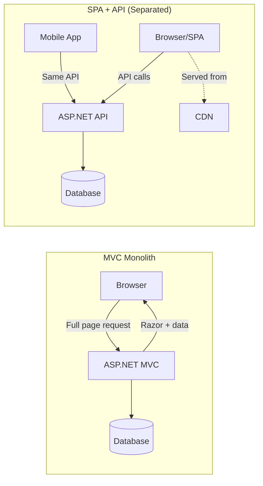

| Advantage | Why It Matters |
|-----------|---------------|
| **Independent deployment** | Ship frontend 10x/day without touching backend |
| **Team autonomy** | Frontend and backend teams work on separate repos, separate CI/CD |
| **CDN-served UI** | Static assets at the edge = sub-100ms first paint globally |
| **API-first design** | Mobile apps, third-party integrations, and partners get the same API |
| **Rich client state** | Complex UX (drag-drop, real-time collab, offline) without server round-trips |
| **Technology choice** | Frontend team picks React/Vue/Angular based on their expertise |
| **Caching** | API responses are independently cacheable; UI assets have infinite cache lifetime |


### Migration Path: MVC → API + SPA

Use the **Strangler Fig Pattern** — don't rewrite, gradually replace:

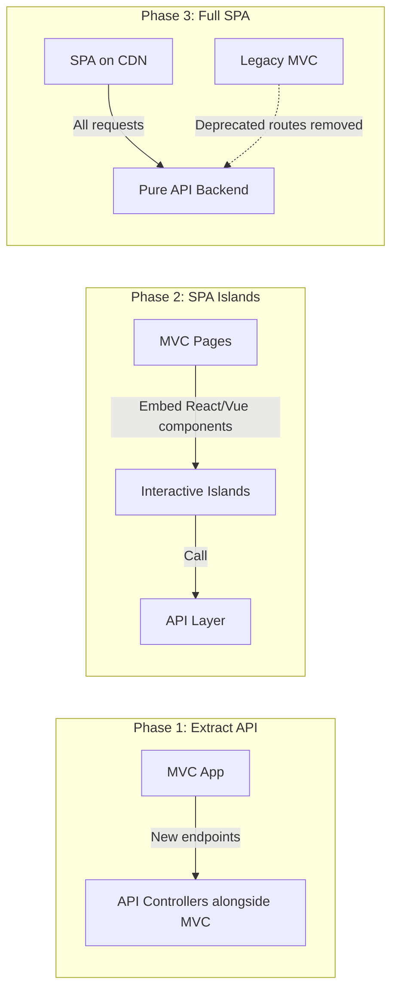

**Steps:**
1. Add API endpoints alongside existing MVC actions (same data, JSON response)
2. Embed SPA components into existing Razor pages ("islands" pattern)
3. Migrate page by page — new features go SPA-first
4. Eventually retire Razor views when all pages are migrated
5. Deploy frontend to CDN, backend becomes pure API

**Key insight:** This isn't a rewrite. You're adding a new frontend that consumes the same domain logic. The business rules don't change — only the delivery mechanism.

### 🎯 Key Insights

> **What matters here:**
> - You understand this is a **team topology and deployment** decision, not just a technology preference
> - You can articulate the *cost* of tight coupling (blocked releases, inability to scale teams independently)
> - You know when MVC is actually fine (and can defend it for the right use case)
> - You've migrated something before and know the strangler fig approach
> - You acknowledge that SPA adds complexity (two build systems, CORS, auth tokens vs cookies, SEO challenges)

---

## 2. API Communication Patterns

### REST

**When to use:** Public-facing APIs, CRUD operations, browser clients, when you need broad tooling/ecosystem support.

**Richardson Maturity Model:**

| Level | Description | Example |
|-------|-------------|---------|
| 0 | Single URI, single verb | `POST /api` with action in body |
| 1 | Multiple URIs (resources) | `POST /api/orders`, `POST /api/users` |
| 2 | HTTP verbs + status codes | `GET /orders/123` → 200, `DELETE /orders/123` → 204 |
| 3 | Hypermedia (HATEOAS) | Response includes links to next actions |

**Most production APIs stop at Level 2.** HATEOAS adds discovery at the cost of payload bloat and client complexity — worth it for truly public APIs (GitHub), rarely for internal.

#### HTTP Verbs Reference

| Verb | Purpose | Idempotent | Safe | Request Body | Typical Response |
|------|---------|-----------|------|-------------|-----------------|
| **GET** | Retrieve a resource or collection | ✅ Yes | ✅ Yes | No | 200 OK + body |
| **POST** | Create a new resource / trigger action | ❌ No | ❌ No | Yes | 201 Created + Location header |
| **PUT** | Replace entire resource (full update) | ✅ Yes | ❌ No | Yes (complete entity) | 200 OK or 204 No Content |
| **PATCH** | Partial update of a resource | ❌ No* | ❌ No | Yes (partial fields) | 200 OK or 204 No Content |
| **DELETE** | Remove a resource | ✅ Yes | ❌ No | Rarely | 204 No Content or 200 OK |
| **HEAD** | Same as GET but no response body | ✅ Yes | ✅ Yes | No | Headers only (check existence/cache) |
| **OPTIONS** | Describe available methods / CORS preflight | ✅ Yes | ✅ Yes | No | 204 + Allow header |

*PATCH can be made idempotent with proper design (JSON Merge Patch), but isn't guaranteed.

**Idempotent** = calling it N times produces the same result as calling it once. Critical for retry safety.
**Safe** = does not modify server state. Cacheable by intermediaries.

```csharp
// All verbs in Minimal APIs
var orders = app.MapGroup("/api/v1/orders");

orders.MapGet("/", GetAllOrders);                    // List
orders.MapGet("/{id:guid}", GetOrderById);           // Single resource
orders.MapPost("/", CreateOrder);                    // Create
orders.MapPut("/{id:guid}", ReplaceOrder);           // Full replace
orders.MapPatch("/{id:guid}", UpdateOrderPartial);   // Partial update
orders.MapDelete("/{id:guid}", DeleteOrder);         // Remove

// Common status code patterns

/*
returns headers : 

HTTP/1.1 201 Created
Location: /api/v1/orders/123
Content-Type: application/json; charset=utf-8

*/
static async Task<IResult> CreateOrder(CreateOrderRequest req, IOrderService svc, CancellationToken ct)
{
    var id = await svc.CreateAsync(req, ct);
    return TypedResults.Created($"/api/v1/orders/{id}", new { id }); // 201 + Location
}

static async Task<IResult> DeleteOrder(Guid id, IOrderService svc, CancellationToken ct)
{
    var found = await svc.DeleteAsync(id, ct);
    return found ? TypedResults.NoContent() : TypedResults.NotFound(); // 204 or 404
}
```

**Versioning strategies:**

| Strategy | Example | Trade-off |
|----------|---------|-----------|
| URL path | `/api/v2/orders` | Simple, clear, but breaks REST purist principles |
| Query string | `/api/orders?api-version=2` | Non-breaking URLs, cluttered params |
| Header | `Api-Version: 2` | Clean URLs, invisible in browser/logs |
| Media type | `Accept: application/vnd.myapp.v2+json` | Most RESTful, hardest to discover |

**Code: Minimal API endpoint (.NET 9)**

```csharp
// Program.cs — Minimal API with versioning and OpenAPI
var builder = WebApplication.CreateBuilder(args);
builder.Services.AddOpenApi();

var app = builder.Build();

var v1 = app.MapGroup("/api/v1/orders");

v1.MapGet("/", async (IOrderRepository repo, CancellationToken ct) =>
{
    var orders = await repo.GetAllAsync(ct);
    return TypedResults.Ok(orders);
})
.WithName("GetOrders")
.WithOpenApi();

v1.MapGet("/{id:guid}", async (Guid id, IOrderRepository repo, CancellationToken ct) => // crucial to pass cancellation token to repository for performance
// note parameter is typed guid: best practice
{
    var order = await repo.GetByIdAsync(id, ct);
    return order is null ? Results.NotFound() : Results.Ok(order);
})
.WithName("GetOrderById");

v1.MapPost("/", async (CreateOrderRequest request, IOrderService service, CancellationToken ct) =>
{
    var order = await service.CreateAsync(request, ct);
    return TypedResults.CreatedAtRoute("GetOrderById", new { id = order.Id }, order);
});

app.Run();

// Carter Pattern

//use Carter library for enterprise this is native version  : OrderEndpoints.cs
using Microsoft.AspNetCore.Builder;
using Microsoft.AspNetCore.Http;
using Microsoft.AspNetCore.Routing;

namespace YourApp.Endpoints;

public static class OrderEndpoints
{
    // The "this IEndpointRouteBuilder" makes it an extension method
    public static IEndpointRouteBuilder MapOrderEndpoints(this IEndpointRouteBuilder routes)
    {
        var v1 = routes.MapGroup("/api/v1/orders")
                       .WithTags("Orders");  //swagger grouping

        // Use method groups (passing the method name directly) for cleanliness
        v1.MapGet("/", GetOrdersAsync);
        v1.MapGet("/{id:guid}", GetOrderByIdAsync).WithName("GetOrderById");
        v1.MapPost("/", CreateOrderAsync);

        return routes;
    }

    // Handlers are kept private so they can't be called outside this file
    private static async Task<IResult> GetOrdersAsync(IOrderRepository repo, CancellationToken ct)
    {
        var orders = await repo.GetAllAsync(ct);
        return TypedResults.Ok(orders);
    }

    private static async Task<IResult> GetOrderByIdAsync(Guid id, IOrderRepository repo, CancellationToken ct)
    {
        var order = await repo.GetByIdAsync(id, ct);
        return order is null ? TypedResults.NotFound() : TypedResults.Ok(order);
    }

    private static async Task<IResult> CreateOrderAsync(CreateOrderRequest request, IOrderService service, CancellationToken ct)
    {
        var order = await service.CreateAsync(request, ct);
        return TypedResults.CreatedAtRoute(order, "GetOrderById", new { id = order.Id });
    }
}

// Program.cs
using YourApp.Endpoints;

var builder = WebApplication.CreateBuilder(args);
builder.Services.AddOpenApi();
// Add other services here...

var app = builder.Build();

// Call your extension method!
app.MapOrderEndpoints();

app.Run();
```

### gRPC

**When to use:** Service-to-service communication, high-throughput internal APIs, streaming data, polyglot microservices needing strong contracts.

**When NOT to use:** Browser clients (no native support without gRPC-Web proxy), simple CRUD where REST tooling is better, when you need human-readable payloads for debugging.

```protobuf
// Protos/orders.proto
syntax = "proto3";
option csharp_namespace = "OrderService.Grpc";

service OrderGrpc {
  rpc GetOrder (GetOrderRequest) returns (OrderResponse);
  rpc StreamOrders (StreamOrdersRequest) returns (stream OrderResponse); // Server streaming
  rpc CreateOrders (stream CreateOrderRequest) returns (BatchResult); // Client streaming
}

message GetOrderRequest { string id = 1; }
message OrderResponse {
  string id = 1;
  string customer_id = 2;
  double total = 3;
  string status = 4;
}
```

```csharp
// Server implementation
public class OrderGrpcService : OrderGrpc.OrderGrpcBase
{
    private readonly IOrderRepository _repo;

    public override async Task<OrderResponse> GetOrder(
        GetOrderRequest request, ServerCallContext context)
    {
        var order = await _repo.GetByIdAsync(
            Guid.Parse(request.Id), context.CancellationToken);

        return order is null
            ? throw new RpcException(new Status(StatusCode.NotFound, "Order not found"))
            : MapToResponse(order);
    }

    public override async Task StreamOrders(
        StreamOrdersRequest request,
        IServerStreamWriter<OrderResponse> responseStream,
        ServerCallContext context)
    {
        await foreach (var order in _repo.StreamAllAsync(context.CancellationToken))
        {
            await responseStream.WriteAsync(MapToResponse(order));
        }
    }
}
```

### GraphQL

**When to use:** Aggregating data from multiple services for a client, mobile apps with bandwidth constraints, when clients need flexible queries without backend changes.

**When NOT to use:** Simple CRUD (overkill), when you don't control the clients (REST is more universally understood), when caching at the HTTP layer matters (GraphQL typically uses POST).

```csharp
// Hot Chocolate GraphQL in .NET 9 .. Everything is a POST
// Program.cs
builder.Services
    .AddGraphQLServer()  //registers the core Hot Chocolate services, schemas, and execution engine into the ASP.NET Core Dependency Injection (DI) container.
    .AddQueryType<Query>() // look at a C# class named Query and expose all of its public methods as the root GraphQL queries (get)
    .AddMutationType<Mutation>() //registers a C# class named Mutation and exposes its methods as the root operations clients 
    // can use to create, update, or delete records. (like: post, put, delete)

    .AddFiltering() //adding this allows front-end clients to pass complex filter criteria (like eq, contains, gt) 
    // translates to .Where() | client: users(where: { age: { gt: 18 } }) { name }
    .AddSorting() // ex : users(order: { lastName: ASC }) { name }
    .AddProjections(); // allows only pulling some fields not always *

// Query.cs
public class Query
{
    [UseProjection] // Looks at the exact fields the GraphQL client asked for and appends a .Select()
    [UseFiltering] // Looks for a where argument in the GraphQL request and appends a .Where()
    [UseSorting] // Looks for an order argument and appends an .OrderBy()
    public IQueryable<Order> GetOrders([Service] AppDbContext db) => db.Orders;  // does not do a tolist, still a query
}

// Mutation.cs (create, update, delete)
public class Mutation
{
    public async Task<Order> CreateOrder(
        CreateOrderInput input,
        [Service] IOrderService service,
        CancellationToken ct)
    {
        return await service.CreateAsync(input, ct);
    }
}
```

### WebSocket / SignalR

**When to use:** Real-time bidirectional communication, live dashboards, chat, notifications, collaborative editing, live sports scores.

**When NOT to use:** Request/response patterns (REST is simpler), when you can poll every 30s (WebSocket overhead not justified), behind load balancers without sticky sessions or backplane configured.

```csharp
// SignalR Hub
public class OrderHub : Hub
{
    public async Task SubscribeToOrder(string orderId)
    {
        await Groups.AddToGroupAsync(Context.ConnectionId, $"order-{orderId}");
    }

    // Called by backend when order status changes
    public static async Task NotifyOrderUpdate(
        IHubContext<OrderHub> hubContext, string orderId, string newStatus)
    {
        await hubContext.Clients.Group($"order-{orderId}")
            .SendAsync("OrderStatusChanged", new { orderId, status = newStatus });
    }
}

// Program.cs — scaling with Redis backplane
builder.Services.AddSignalR()
    .AddStackExchangeRedis(builder.Configuration.GetConnectionString("Redis")!);
```

### API Style Comparison

| Criteria | REST | gRPC | GraphQL | SignalR/WebSocket |
|----------|------|------|---------|-------------------|
| **Payload format** | JSON (text) | Protobuf (binary) | JSON (text) | JSON/MessagePack |
| **Latency** | Moderate | Low (binary, HTTP/2) | Moderate | Lowest (persistent) |
| **Browser support** | Native | gRPC-Web only | Native (POST) | Native |
| **Streaming** | SSE only | Bi-directional | Subscriptions | Bi-directional |
| **Tooling** | Excellent (OpenAPI, Postman) | Good (protobuf tools) | Good (Playground, Banana Cake Pop) | Moderate |
| **Caching** | HTTP caching built-in | No HTTP caching | Difficult (POST-based) | N/A |
| **Contract** | OpenAPI (optional) | .proto (mandatory) | Schema (mandatory) | Loose (hub methods) |
| **Best for** | Public APIs, CRUD | Internal services | BFF, mobile clients | Real-time push |
| **Complexity** | Low | Medium | High | Medium |

### API Style Decision Tree

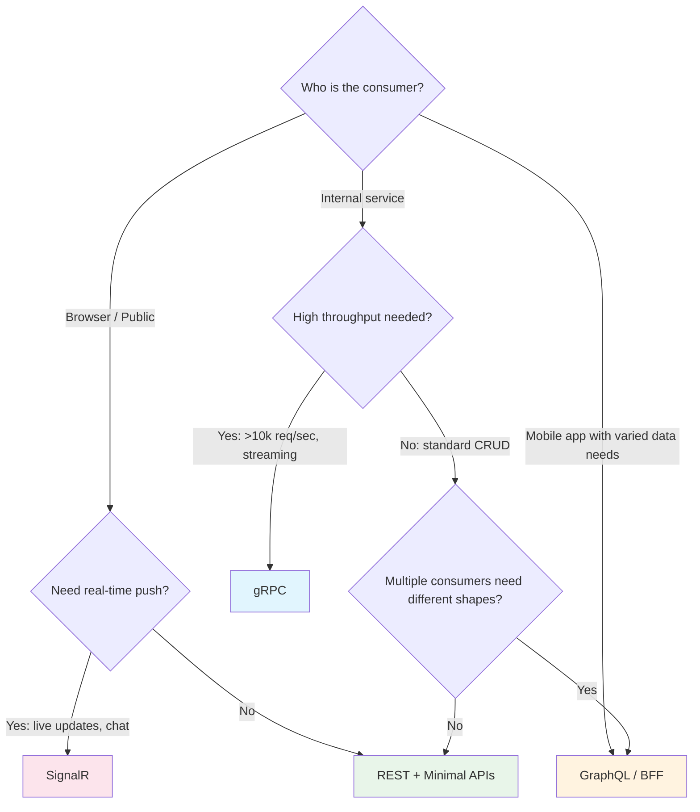

### 🎯 Key Insights

### Step 1 create you domain model with all the validation and behaviors not based off db 

```cs
using System;
using System.Collections.Generic;
using System.Linq;

namespace Domain.Aggregates;

public class Order
{
    // 1. Private setters: The outside world can read this data, 
    // but absolutely cannot change it directly (e.g., order.Status = "Shipped" is impossible).
    public Guid Id { get; private set; }
    public string CustomerId { get; private set; }
    public OrderStatus Status { get; private set; }
    public decimal Discount { get; private set; }

    // 2. Encapsulated collections: We back the list with a private field and 
    // expose it as a read-only collection. You can't do order.Items.Add() from the outside.
    private readonly List<OrderItem> _items = new();
    public IReadOnlyCollection<OrderItem> Items => _items.AsReadOnly();

    // 3. Computed properties: Calculated on the fly based on internal state.
    public decimal TotalAmount => _items.Sum(i => i.Price * i.Quantity) - Discount;

    // Constructor defines the ONLY way to create a valid initial order.
    public Order(Guid id, string customerId)
    {
        if (string.IsNullOrWhiteSpace(customerId))
            throw new ArgumentException("Customer ID is required.");

        Id = id;
        CustomerId = customerId;
        Status = OrderStatus.Draft;
    }

    // 4. Behavioral Methods: These enforce the business rules (Invariants).
    public void AddItem(string productId, decimal price, int quantity)
    {
        // Business Rule: You can't alter an order once it's paid.
        if (Status != OrderStatus.Draft)
            throw new InvalidOperationException("Cannot add items to an order that is no longer a draft.");

        // Business Rule: Valid quantities only.
        if (quantity <= 0)
            throw new ArgumentException("Quantity must be greater than zero.");

        var existingItem = _items.SingleOrDefault(i => i.ProductId == productId);
        if (existingItem != null)
        {
            existingItem.AddQuantity(quantity);
        }
        else
        {
            _items.Add(new OrderItem(productId, price, quantity));
        }
    }

    public void ApplyDiscount(decimal discountAmount)
    {
        // Business Rule: Discount cannot make the total negative.
        if (discountAmount > _items.Sum(i => i.Price * i.Quantity))
            throw new InvalidOperationException("Discount cannot exceed the subtotal.");

        Discount = discountAmount;
    }

    public void MarkAsPaid()
    {
        // Business Rule: Empty orders can't be paid for.
        if (!_items.Any())
            throw new InvalidOperationException("Cannot pay for an empty order.");

        Status = OrderStatus.Paid;
    }
}

// A simple enum for state management
public enum OrderStatus { Draft, Paid, Shipped, Cancelled }
```


### Step 2: Commands, Queries, and Validation (Contracts)

These are immutable data structures (using C# `record` types) that represent the intent of the user. They contain no business logic, only data.

```csharp
using MediatR;
using FluentValidation;

namespace Application.Orders;

// 1. The Command (Intent to change state)
public record PayOrderCommand(Guid OrderId) : IRequest<bool>;

// Validation for the Command
public class PayOrderCommandValidator : AbstractValidator<PayOrderCommand>
{
    public PayOrderCommandValidator()
    {
        RuleFor(x => x.OrderId).NotEmpty().WithMessage("Order ID is required.");
    }
}

// 2. The Query (Intent to read data)
public record GetOrderByIdQuery(Guid OrderId) : IRequest<OrderReadDto>;

// 3. The Read Model (Flattened data for the UI)
public record OrderReadDto(Guid Id, string CustomerId, string Status, decimal Total);

```

### Step 3: Write Repository

The repository's only job is to load the pure Domain Model from the database and save it back. It knows nothing about HTTP requests or MediatR.

```csharp
namespace Infrastructure.Repositories;

public interface IOrderRepository
{
    Task<Order?> GetByIdAsync(Guid id, CancellationToken ct);
    Task SaveChangesAsync(CancellationToken ct);
}

public class OrderWriteRepository : IOrderRepository
{
    private readonly AppDbContext _db;
    public OrderWriteRepository(AppDbContext db) => _db = db;

    public async Task<Order?> GetByIdAsync(Guid id, CancellationToken ct)
    {
        // Must include related entities so the aggregate is fully loaded
        return await _db.Orders
            .Include(o => o.Items) 
            .SingleOrDefaultAsync(o => o.Id == id, ct);
    }

    public async Task SaveChangesAsync(CancellationToken ct)
    {
        await _db.SaveChangesAsync(ct);
    }
}

```

### Step 4: Command Handler

The orchestrator. It receives the Command, loads the domain model, invokes the pure business logic, and persists the changes.

```csharp
namespace Application.Orders.Handlers;

public class PayOrderCommandHandler : IRequestHandler<PayOrderCommand, bool>
{
    private readonly IOrderRepository _repository;

    public PayOrderCommandHandler(IOrderRepository repository)
    {
        _repository = repository;
    }

    public async Task<bool> Handle(PayOrderCommand request, CancellationToken ct)
    {
        // 1. Load the aggregate
        var order = await _repository.GetByIdAsync(request.OrderId, ct);
        
        if (order is null)
            return false; // Or throw a NotFoundException

        // 2. Execute pure business logic (The Domain Model protects itself here)
        order.MarkAsPaid();

        // 3. Save the new state
        await _repository.SaveChangesAsync(ct);

        return true;
    }
}

```

### Step 5: Read Projections (Optional but recommended)

If you are strictly separating reads and writes, paying an order might trigger an event that updates a separate, lightning-fast NoSQL database (like Redis or DynamoDB) specifically built for the UI to read from.

```csharp
namespace Application.Orders.Events;

// An event published by MediatR after the write succeeds
public class OrderPaidEventHandler : INotificationHandler<OrderPaidEvent>
{
    private readonly IRedisCache _readDatabase;

    public async Task Handle(OrderPaidEvent notification, CancellationToken ct)
    {
        // Update the fast-read cache so the UI gets the new status instantly
        await _readDatabase.UpdateOrderStatusAsync(notification.OrderId, "Paid");
    }
}

```

### Step 6: Query Handler (The Read Side)

Because this is the Read side, we **do not** load the pure Domain Model. We bypass Entity Framework tracking entirely and use raw SQL (via Dapper) or EF Core Projections to query exactly what the UI needs, ensuring maximum performance.

```csharp
using Dapper;
using System.Data;

namespace Application.Orders.Handlers;

public class GetOrderByIdQueryHandler : IRequestHandler<GetOrderByIdQuery, OrderReadDto?>
{
    private readonly IDbConnection _dbConnection; // Dapper connection

    public GetOrderByIdQueryHandler(IDbConnection dbConnection)
    {
        _dbConnection = dbConnection;
    }

    public async Task<OrderReadDto?> Handle(GetOrderByIdQuery request, CancellationToken ct)
    {
        // Bypass the domain model entirely. Just query raw, flattened data.
        const string sql = @"
            SELECT 
                Id, 
                CustomerId, 
                Status, 
                (SELECT SUM(Price * Quantity) FROM OrderItems WHERE OrderId = @OrderId) as Total 
            FROM Orders 
            WHERE Id = @OrderId";

        return await _dbConnection.QuerySingleOrDefaultAsync<OrderReadDto>(
            sql, new { request.OrderId });
    }
}

```

### Step 7: API Endpoints (Minimal APIs)

The API layer acts as a thin shell. It accepts the HTTP request and hands it off to MediatR. It contains zero business logic and zero database logic.

```csharp
using MediatR;
using Microsoft.AspNetCore.Builder;
using Microsoft.AspNetCore.Http;
using Microsoft.AspNetCore.Routing;

namespace Api.Endpoints;

public static class OrderEndpoints
{
    public static void MapOrderEndpoints(this IEndpointRouteBuilder routes)
    {
        var v1 = routes.MapGroup("/api/v1/orders").WithTags("Orders");

        // GET: Execute the Query
        v1.MapGet("/{id:guid}", async (Guid id, IMediator mediator, CancellationToken ct) =>
        {
            var query = new GetOrderByIdQuery(id);
            var result = await mediator.Send(query, ct);
            
            return result is null ? Results.NotFound() : Results.Ok(result);
        });

        // POST: Execute the Command
        v1.MapPost("/{id:guid}/pay", async (Guid id, IMediator mediator, CancellationToken ct) =>
        {
            var command = new PayOrderCommand(id);
            var success = await mediator.Send(command, ct);
            
            return success ? Results.NoContent() : Results.NotFound();
        });
    }
}

```

> **What matters here:**
> - You pick API style based on **consumer needs**, not personal preference
> - You understand the operational cost of each (gRPC requires proto management, GraphQL requires schema governance, SignalR requires backplane for scale)
> - You can explain when REST's simplicity wins over gRPC's performance
> - You know that GraphQL isn't a replacement for REST — it's a **BFF pattern** that may still call REST/gRPC services behind it
> - For SignalR: you immediately mention scaling concerns (sticky sessions or Redis backplane)

---

## 3. CQRS — Command Query Responsibility Segregation

### The CQRS Spectrum

CQRS isn't binary — it's a spectrum. Most teams benefit from the lighter end without paying the cost of the full pattern.

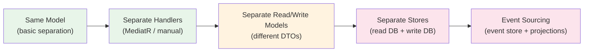

| Level | Complexity | When Appropriate |
|-------|-----------|-----------------|
| Same model, separate methods | Low | Any app — just organize read/write methods clearly |
| Separate handlers (MediatR) | Low-Medium | Medium apps, clear command/query separation in code |
| Separate read/write models | Medium | UI needs denormalized views, write model is normalized |
| Separate stores | High | Extreme read/write asymmetry (100:1 read ratio) |
| Event sourcing | Very High | Audit requirements, temporal queries, complex domain events |

### CQRS Data Flow

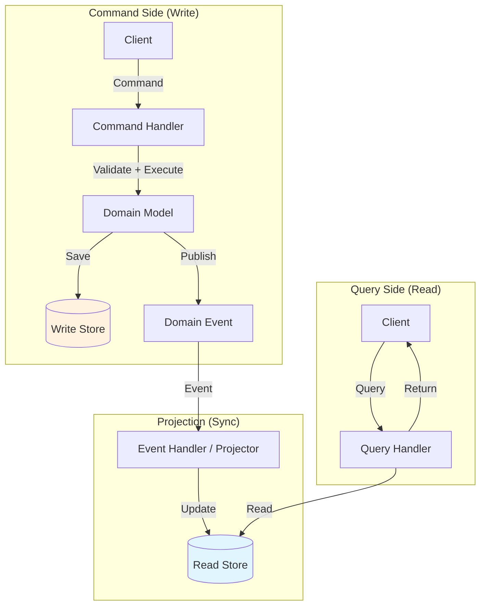

At its core, **CQRS (Command Query Responsibility Segregation)** is about splitting your system's architecture into two distinct halves: one optimized for writing data (Commands) and one optimized for reading data (Queries).

When building a CQRS API, developing in the right order prevents circular dependencies, and testing at the right boundaries ensures your business logic remains bulletproof.

Here is the breakdown of the standard pieces, ordered chronologically by how you should ideally build them.

### CQRS Architecture & Development Lifecycle


### Why this order works

Building from the **inside out** (Domain first, API last) ensures that your business rules are never dictated by your database schema or your HTTP routing.

By the time you reach step 7 to build your API endpoints, the controllers become incredibly "thin"—often just one or two lines of code that take a request, pass it to a Handler, and return the result.


### When to Use CQRS

| Signal | Why CQRS Helps |
|--------|---------------|
| Read/write ratio > 10:1 | Read models can be denormalized, cached, scaled independently |
| UI needs different shape than write model | Query-specific DTOs without polluting domain |
| Complex domain with rich business rules | Write side focuses on invariants, read side focuses on display |
| Multiple UIs need different views of same data | Each UI gets its own projected read model |
| Audit trail / temporal queries needed | Event sourcing variant captures full history |
| Performance: reads and writes need different scaling | Read replicas, materialized views |

### When NOT to Use CQRS

| Signal | Why CQRS Hurts |
|--------|---------------|
| Simple CRUD application | Adds layers of indirection for no benefit — a handler that just calls `SaveChanges()` is ceremony |
| Small team (1-3 devs) | Cognitive overhead of separate models exceeds the benefit |
| Low read/write asymmetry | If reads and writes are balanced, separate models just duplicate code |
| Strong consistency requirement everywhere | Eventual consistency between write and read stores adds complexity |
| Prototype / MVP phase | Premature structure — you'll change the domain model 5 times before it stabilizes |
| Team is unfamiliar | Pattern requires discipline; without it, you get a "distributed monolith" of handlers |

### Implementation Patterns

#### MediatR-Based (CQRS-Lite)

```csharp
// Command
public record CreateOrderCommand(string CustomerId, List<OrderLineDto> Lines)
    : IRequest<Result<Guid>>;

// Command Handler
public class CreateOrderHandler : IRequestHandler<CreateOrderCommand, Result<Guid>>
{
    private readonly AppDbContext _db;
    private readonly IPublisher _publisher;

    public CreateOrderHandler(AppDbContext db, IPublisher publisher)
    {
        _db = db;
        _publisher = publisher;
    }

    public async Task<Result<Guid>> Handle(CreateOrderCommand request, CancellationToken ct)
    {
        var order = Order.Create(request.CustomerId, request.Lines);

        _db.Orders.Add(order);
        await _db.SaveChangesAsync(ct);

        await _publisher.Publish(new OrderCreatedEvent(order.Id), ct);
        return Result.Success(order.Id);
    }
}

// Query
public record GetOrderQuery(Guid OrderId) : IRequest<OrderDetailDto?>;

// Query Handler — can use Dapper for performance
public class GetOrderHandler : IRequestHandler<GetOrderQuery, OrderDetailDto?>
{
    private readonly IDbConnection _connection;

    public GetOrderHandler(IDbConnection connection) => _connection = connection;

    public async Task<OrderDetailDto?> Handle(GetOrderQuery request, CancellationToken ct)
    {
        const string sql = """
            SELECT o.Id, o.CustomerId, o.Status, o.Total, o.CreatedAt
            FROM Orders o
            WHERE o.Id = @OrderId
            """;

        return await _connection.QuerySingleOrDefaultAsync<OrderDetailDto>(
            sql, new { request.OrderId });
    }
}
```

#### Pipeline Behavior (Cross-Cutting)

```csharp
// Validation behavior — runs before every command handler
public class ValidationBehavior<TRequest, TResponse> : IPipelineBehavior<TRequest, TResponse>
    where TRequest : IRequest<TResponse>
{
    private readonly IEnumerable<IValidator<TRequest>> _validators;

    public ValidationBehavior(IEnumerable<IValidator<TRequest>> validators)
        => _validators = validators;

    public async Task<TResponse> Handle(
        TRequest request, RequestHandlerDelegate<TResponse> next, CancellationToken ct)
    {
        var failures = _validators
            .Select(v => v.Validate(request))
            .SelectMany(result => result.Errors)
            .Where(f => f is not null)
            .ToList();

        if (failures.Count != 0)
            throw new ValidationException(failures);

        return await next();
    }
}
```

#### MediatR-Free CQRS (.NET 9+ — No Library Dependency)

```csharp
// Define contracts
public interface ICommand<TResult> { }
public interface IQuery<TResult> { }
public interface ICommandHandler<in TCommand, TResult> where TCommand : ICommand<TResult>
{
    Task<TResult> HandleAsync(TCommand command, CancellationToken ct);
}
public interface IQueryHandler<in TQuery, TResult> where TQuery : IQuery<TResult>
{
    Task<TResult> HandleAsync(TQuery query, CancellationToken ct);
}

// Register with DI — scan assembly
builder.Services.Scan(scan => scan
    .FromAssemblyOf<Program>()
    .AddClasses(c => c.AssignableTo(typeof(ICommandHandler<,>)))
    .AsImplementedInterfaces()
    .WithScopedLifetime());

// Dispatch in endpoint
app.MapPost("/api/orders", async (
    CreateOrderCommand command,
    ICommandHandler<CreateOrderCommand, Result<Guid>> handler,
    CancellationToken ct) =>
{
    var result = await handler.HandleAsync(command, ct);
    return result.IsSuccess
        ? Results.CreatedAtRoute("GetOrder", new { id = result.Value })
        : Results.BadRequest(result.Error);
});
```

### 🎯 Key Insights

> **What matters here:**
> - You know the spectrum — "CQRS" doesn't mean event sourcing, and you can articulate which level you'd choose and why
> - You can explain that MediatR is just a dispatcher — you don't need it for CQRS, it's a convenience
> - You understand eventual consistency implications of separate stores and can discuss mitigation (read-your-writes, optimistic UI)
> - The honest take: "For most CRUD apps, MediatR with handlers against the same database is plenty. Full CQRS with projections is for genuinely asymmetric workloads."
> - You mention that CQRS-lite is testable (handlers are pure functions given mocked dependencies)

---

## 4. EF Core vs Dapper

### Decision Criteria

| Criteria | EF Core | Dapper |
|----------|---------|--------|
| **Query speed (simple)** | ~2-5x slower (change tracking, materialization overhead) | Fastest — near raw ADO.NET |
| **Query speed (complex)** | Generated SQL can be suboptimal for complex joins | You write the SQL — as optimized as you make it |
| **Memory allocations** | Higher (proxy objects, change tracker, navigation fix-up) | Minimal (direct POCO mapping) |
| **Startup cost** | Model building, migration checks | Near zero |
| **Change tracking** | Built-in (Unit of Work pattern for free) | None — you manage state yourself |
| **Migrations** | Built-in schema management | None — use FluentMigrator, DbUp, or raw SQL |
| **Complex relationships** | Excellent (Include, ThenInclude, navigation properties) | Manual multi-mapping, multiple queries |
| **Stored procedures** | Supported but awkward | First-class support |
| **Compiled queries** | Yes (.NET 8+: EF.CompileAsyncQuery) | N/A (always raw SQL) |
| **LINQ support** | Full LINQ → SQL translation | None — raw SQL or string interpolation |
| **Learning curve** | Steeper (configurations, conventions, gotchas) | Very low (write SQL, get objects) |
| **Testability** | InMemory provider (imperfect) or Testcontainers | Mock IDbConnection or Testcontainers |

### ORM Decision Tree

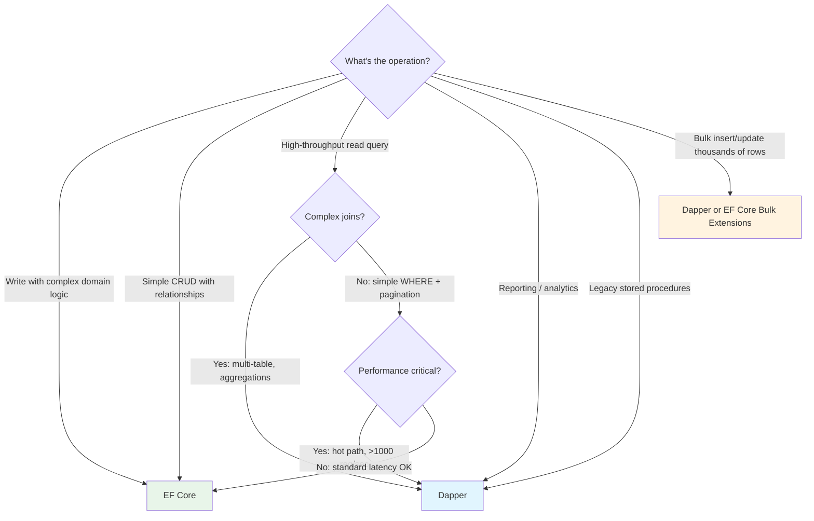

### EF Core Patterns

```csharp
// DbContext — scoped lifetime (one per request)
public class AppDbContext : DbContext
{
    public DbSet<Order> Orders => Set<Order>();
    public DbSet<OrderLine> OrderLines => Set<OrderLine>();

    protected override void OnModelCreating(ModelBuilder modelBuilder)
    {
        modelBuilder.ApplyConfigurationsFromAssembly(typeof(AppDbContext).Assembly);
        /*
typeof(AppDbContext).Assembly: This looks at the compiled project (the DLL) where your AppDbContext lives.

ApplyConfigurationsFromAssembly(...): This scans that entire DLL, looking for any class that implements IEntityTypeConfiguration<T>.

When it finds your OrderConfiguration, it automatically executes its Configure method.

The Problem It Solves: The "Fat" DbContext
When you use a Pure Domain Model (like the Order class we discussed earlier that has no [Table] or [Column] attributes), you have to tell Entity Framework how to map your C# properties to SQL columns using the "Fluent API".

Without this line of code, your DbContext quickly turns into an unmaintainable mess:

C#
// ❌ The BAD way: Storing all configurations in one giant file
protected override void OnModelCreating(ModelBuilder modelBuilder)
{
    // Order Configuration
    modelBuilder.Entity<Order>().ToTable("Orders");
    modelBuilder.Entity<Order>().HasKey(o => o.Id);
    modelBuilder.Entity<Order>().Property(o => o.Total).HasPrecision(18, 2);
    
    // OrderLine Configuration
    modelBuilder.Entity<OrderLine>().ToTable("OrderLines");
    modelBuilder.Entity<OrderLine>().HasOne(ol => ol.Order).WithMany(o => o.Items);

    // ... Imagine doing this for 50 other tables here. It becomes 1,000 lines long!
}

The Solution: IEntityTypeConfiguration<T>
To keep your code organized, EF Core allows you to extract the rules for a single entity into its own dedicated class by implementing IEntityTypeConfiguration<T>.

You create a separate file just for configuring the Order table:

C#
// OrderConfiguration.cs
using Microsoft.EntityFrameworkCore;
using Microsoft.EntityFrameworkCore.Metadata.Builders;

public class OrderConfiguration : IEntityTypeConfiguration<Order>
{
    public void Configure(EntityTypeBuilder<Order> builder)
    {
        builder.ToTable("Orders");
        builder.HasKey(o => o.Id);
        
        // This is how we tell EF Core to map our private _items list!
        builder.HasMany(o => o.Items)
               .WithOne()
               .HasForeignKey("OrderId"); 

        builder.Property(o => o.CustomerId).IsRequired().HasMaxLength(100);
    }
}
You can drop a new configuration file anywhere in your project, and EF Core will automatically find it and apply it
        */
    }
}

// Registration — ALWAYS scoped
builder.Services.AddDbContext<AppDbContext>(options =>
    options.UseNpgsql(builder.Configuration.GetConnectionString("Default"))); // uses postgres here

// ✅ Projection (SELECT only what you need — avoids loading entire entity graph)
public async Task<OrderSummaryDto?> GetOrderSummaryAsync(Guid id, CancellationToken ct)
{
    return await _db.Orders
        .Where(o => o.Id == id)
        .Select(o => new OrderSummaryDto
        {
            Id = o.Id,
            CustomerName = o.Customer.Name,
            Total = o.Lines.Sum(l => l.Price * l.Quantity),
            Status = o.Status.ToString(),
            ItemCount = o.Lines.Count
        })
        .FirstOrDefaultAsync(ct);
}

// ✅ Compiled query (.NET 8+) — eliminates expression tree compilation on each call
private static readonly Func<AppDbContext, Guid, CancellationToken, Task<Order?>> _getById =
    EF.CompileAsyncQuery((AppDbContext db, Guid id, CancellationToken ct) =>
        db.Orders.Include(o => o.Lines).FirstOrDefault(o => o.Id == id));

public Task<Order?> GetByIdCompiledAsync(Guid id, CancellationToken ct)
    => _getById(_db, id, ct);

// ❌ Anti-pattern: N+1 queries (loading related data in a loop)
var orders = await _db.Orders.ToListAsync(ct);
foreach (var order in orders)
{
    var lines = await _db.OrderLines.Where(l => l.OrderId == order.Id).ToListAsync(ct);
    // Each iteration = separate SQL query!
}

// ✅ Fix: eager load or project
var orders = await _db.Orders.Include(o => o.Lines).ToListAsync(ct);
```

### Dapper Patterns

```csharp
// Connection management — create per query, dispose immediately
public class OrderReadRepository
{
    private readonly string _connectionString;

    public OrderReadRepository(IConfiguration config)
        => _connectionString = config.GetConnectionString("ReadReplica")!;

    private NpgsqlConnection CreateConnection() => new(_connectionString);

    // Simple query
    public async Task<OrderDto?> GetByIdAsync(Guid id, CancellationToken ct)
    {
        const string sql = """
            SELECT id, customer_id AS CustomerId, status, total, created_at AS CreatedAt
            FROM orders
            WHERE id = @Id
            """;

        await using var conn = CreateConnection();
        return await conn.QuerySingleOrDefaultAsync<OrderDto>(
            new CommandDefinition(sql, new { Id = id }, cancellationToken: ct));
    }

    // Multi-mapping (joining related entities)
    public async Task<OrderWithLinesDto?> GetWithLinesAsync(Guid id, CancellationToken ct)
    {
        const string sql = """
            SELECT o.id, o.customer_id AS CustomerId, o.status, o.total,
                   l.id, l.product_name AS ProductName, l.quantity, l.price
            FROM orders o
            LEFT JOIN order_lines l ON l.order_id = o.id
            WHERE o.id = @Id
            """;

        await using var conn = CreateConnection();
        var orderDict = new Dictionary<Guid, OrderWithLinesDto>();

        await conn.QueryAsync<OrderWithLinesDto, OrderLineDto, OrderWithLinesDto>(
            new CommandDefinition(sql, new { Id = id }, cancellationToken: ct),
            (order, line) =>
            {
                if (!orderDict.TryGetValue(order.Id, out var entry))
                {
                    entry = order;
                    entry.Lines = [];
                    orderDict[order.Id] = entry;
                }
                if (line is not null) entry.Lines.Add(line);
                return entry;
            },
            splitOn: "id");

        return orderDict.Values.FirstOrDefault();
    }

    // Stored procedure
    public async Task<IEnumerable<SalesReportRow>> GetSalesReportAsync(
        DateOnly from, DateOnly to, CancellationToken ct)
    {
        await using var conn = CreateConnection();
        return await conn.QueryAsync<SalesReportRow>(
            new CommandDefinition(
                "sp_sales_report",
                new { FromDate = from, ToDate = to },
                commandType: CommandType.StoredProcedure,
                cancellationToken: ct));
    }
}
```

### Hybrid Approach

**Best of both worlds:** EF Core for writes (change tracking, migrations, domain integrity) + Dapper for reads (performance, flexibility).

```csharp
// Write side — EF Core (rich domain model, change tracking, Unit of Work)
public class OrderService
{
    private readonly AppDbContext _db;

    public async Task<Guid> CreateOrderAsync(CreateOrderCommand cmd, CancellationToken ct)
    {
        var order = Order.Create(cmd.CustomerId, cmd.Lines); // Domain logic in entity
        _db.Orders.Add(order);
        await _db.SaveChangesAsync(ct); // Unit of Work commits all changes
        return order.Id;
    }

    public async Task CancelOrderAsync(Guid orderId, CancellationToken ct)
    {
        var order = await _db.Orders.FindAsync([orderId], ct)
            ?? throw new NotFoundException(nameof(Order), orderId);

        order.Cancel(); // Domain method enforces business rules
        await _db.SaveChangesAsync(ct);
    }
}

// Read side — Dapper (fast, denormalized, optimized for UI needs)
public class OrderQueryService
{
    private readonly string _readConnectionString;

    public async Task<PagedResult<OrderListDto>> SearchAsync(
        OrderSearchFilter filter, CancellationToken ct)
    {
        const string sql = """
            SELECT o.id, o.status, o.total, c.name AS CustomerName, o.created_at
            FROM orders o
            JOIN customers c ON c.id = o.customer_id
            WHERE (@Status IS NULL OR o.status = @Status)
              AND (@CustomerId IS NULL OR o.customer_id = @CustomerId)
            ORDER BY o.created_at DESC
            OFFSET @Offset ROWS FETCH NEXT @PageSize ROWS ONLY;

            SELECT COUNT(*) FROM orders o
            WHERE (@Status IS NULL OR o.status = @Status)
              AND (@CustomerId IS NULL OR o.customer_id = @CustomerId);
            """;

        await using var conn = new NpgsqlConnection(_readConnectionString);
        using var multi = await conn.QueryMultipleAsync(
            new CommandDefinition(sql, filter, cancellationToken: ct));

        var items = (await multi.ReadAsync<OrderListDto>()).ToList();
        var total = await multi.ReadSingleAsync<int>();

        return new PagedResult<OrderListDto>(items, total, filter.Page, filter.PageSize);
    }
}
```

### When NOT to Use EF Core

| Scenario | Why |
|----------|-----|
| High-throughput read-heavy endpoints (>5000 req/sec) | Change tracking and expression compilation overhead adds up |
| Complex reporting queries with CTEs, window functions | LINQ can't express these cleanly — you'll fight the abstraction |
| Legacy database with stored procedures as the data contract | EF maps to tables, not procs |
| Bulk operations (10k+ rows) | EF tracks each entity individually — use Dapper or bulk extensions |
| Read replicas / separate read connection strings | EF's DbContext lifetime model makes this awkward |

### When NOT to Use Dapper

| Scenario | Why |
|----------|-----|
| Rapid prototyping with schema changes | No migrations — schema management is manual |
| Complex domain with deep navigation (Order → Lines → Product → Category) | Multi-mapping gets painful fast |
| Team has limited SQL expertise | EF's LINQ abstracts SQL — safer for junior devs |
| Need Unit of Work (atomic multi-entity saves) | You must manage transactions manually |
| Want schema-as-code (database from C# models) | EF migrations give you this for free |

### 🎯 Key Insights

> **What matters here:**
> - You don't treat this as religious ("always EF" or "always Dapper") — you have a decision framework
> - You can articulate the **hybrid pattern** and when it makes sense (most production systems end up here)
> - You know EF Core's gotchas: N+1, tracking overhead, generated SQL quality
> - You know Dapper's cost: no migrations, manual mapping for complex shapes, no change tracking
> - You mention compiled queries for EF Core hot paths as a middle ground before reaching for Dapper

---

## 5. Thread Safety — Request Pipeline & Service Lifetimes

### DI Lifetime Thread Implications

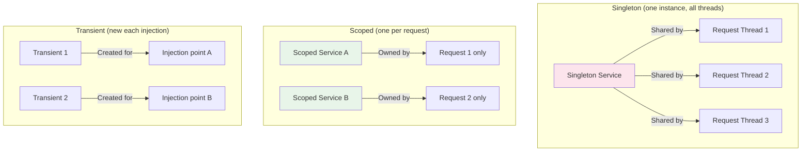

| Lifetime | Instance Count | Thread Safety Requirement | Use For |
|----------|---------------|--------------------------|---------|
| **Singleton** | 1 total | MUST be thread-safe (concurrent access from all request threads) | Caches, HttpClient factories, configuration, stateless services |
| **Scoped** | 1 per request/scope | Safe within a single request (one thread at a time) | DbContext, Unit of Work, current user context |
| **Transient** | 1 per injection | No thread concerns (never shared) | Lightweight stateless services, validators |

### Captive Dependency Problem

A **singleton** that injects a **scoped** service captures it forever — the scoped service never gets disposed, leaks memory, and becomes a shared mutable across threads.

```csharp
// ❌ CAPTIVE DEPENDENCY — singleton holds scoped DbContext forever
public class OrderCache  // Registered as Singleton
{
    private readonly AppDbContext _db; // Scoped! Captured and never disposed!

    public OrderCache(AppDbContext db) => _db = db;
    // _db is now shared across ALL concurrent requests — thread-unsafe + memory leak
}

// ✅ FIX: Use IServiceScopeFactory to create scopes on demand
public class OrderCache  // Registered as Singleton
{
    private readonly IServiceScopeFactory _scopeFactory;

    public OrderCache(IServiceScopeFactory scopeFactory) => _scopeFactory = scopeFactory;

    public async Task RefreshCacheAsync(CancellationToken ct)
    {
        using var scope = _scopeFactory.CreateScope();
        var db = scope.ServiceProvider.GetRequiredService<AppDbContext>();
        // db is properly scoped and will be disposed with the scope
        var orders = await db.Orders.ToListAsync(ct);
        // Update thread-safe cache...
    }
}
```

**The rule:** A service can only depend on services with an **equal or longer** lifetime:
- Singleton → can inject: Singleton only
- Scoped → can inject: Singleton, Scoped
- Transient → can inject: Singleton, Scoped, Transient

### DbContext Thread Safety

**DbContext is NOT thread-safe.** Concurrent access from multiple threads will corrupt internal state, cause data loss, or throw `InvalidOperationException`.

```csharp
// ❌ DANGEROUS: Parallel queries on same DbContext
var tasks = orderIds.Select(id => _db.Orders.FindAsync(id).AsTask());
var orders = await Task.WhenAll(tasks); // Multiple threads hit the same DbContext!

// ✅ FIX: Sequential async (single thread per await)
var orders = new List<Order>();
foreach (var id in orderIds)
{
    var order = await _db.Orders.FindAsync(id);
    if (order is not null) orders.Add(order);
}

// ✅ FIX: If you need true parallelism, create separate scopes
await Parallel.ForEachAsync(orderIds, async (id, ct) =>
{
    using var scope = _scopeFactory.CreateScope();
    var db = scope.ServiceProvider.GetRequiredService<AppDbContext>();
    var order = await db.Orders.FindAsync([id], ct);
    // Process independently...
});
```

### HttpContext Access Pitfalls

```csharp
// ❌ DANGEROUS: Accessing HttpContext from a background thread
public class ReportService // Singleton
{
    private readonly IHttpContextAccessor _accessor;

    public async Task GenerateReportAsync()
    {
        // HttpContext is null here if called from background service!
        var userId = _accessor.HttpContext?.User?.FindFirst("sub")?.Value;
        // Even if non-null, the request may have completed — data is stale/disposed
    }
}

// ✅ FIX: Capture what you need before leaving the request scope
public class ReportController : ControllerBase
{
    [HttpPost("reports")]
    public async Task<IActionResult> QueueReport([FromServices] IReportQueue queue)
    {
        var userId = User.FindFirst("sub")!.Value; // Capture NOW
        await queue.EnqueueAsync(new ReportJob(userId, DateTime.UtcNow));
        return Accepted();
    }
}
```

### Async/Await Pitfalls

```csharp
// ❌ DEADLOCK: .Result/.Wait() blocks the thread that async needs to resume on
public string GetData()
{
    // In ASP.NET (pre-Core) with SynchronizationContext, this deadlocks.
    // In ASP.NET Core (no SyncContext), it "works" but wastes a thread.
    var result = _httpClient.GetStringAsync("/api/data").Result; // NEVER DO THIS
    return result;
}

// ✅ FIX: Async all the way down
public async Task<string> GetDataAsync(CancellationToken ct)
{
    return await _httpClient.GetStringAsync("/api/data", ct);
}

// Library code: use ConfigureAwait(false) to avoid capturing context
public async Task<T> GetFromCacheOrFetchAsync<T>(string key, CancellationToken ct)
{
    var cached = await _cache.GetAsync(key, ct).ConfigureAwait(false);
    if (cached is not null) return Deserialize<T>(cached);

    var fresh = await _fetcher.FetchAsync<T>(key, ct).ConfigureAwait(false);
    await _cache.SetAsync(key, Serialize(fresh), ct).ConfigureAwait(false);
    return fresh;
}
```

### ValueTask vs Task

| | `Task<T>` | `ValueTask<T>` |
|--|-----------|----------------|
| **Allocation** | Always allocates (heap) | No allocation if completed synchronously |
| **Await count** | Can await multiple times | **Must await EXACTLY once** |
| **Can store/cache** | Yes | No — consume immediately |
| **Best for** | Most async methods | Hot-path methods that often complete synchronously (cache hits) |

```csharp
// ✅ ValueTask for cache-hit hot path
public ValueTask<Order?> GetOrderAsync(Guid id, CancellationToken ct)
{
    if (_cache.TryGetValue(id, out Order? cached))
        return ValueTask.FromResult(cached); // No allocation — synchronous path

    return new ValueTask<Order?>(GetFromDatabaseAsync(id, ct)); // Async fallback
}

// ❌ NEVER: consuming ValueTask multiple times
var vt = GetOrderAsync(id, ct);
var a = await vt;
var b = await vt; // UNDEFINED BEHAVIOR — may throw, return wrong data, or corrupt state
```

### 🎯 Key Insights

> **What matters here:**
> - You immediately identify the captive dependency problem when shown a registration
> - You know DbContext is not thread-safe and can explain WHY (internal state machine, change tracker)
> - You understand that ASP.NET Core has no SynchronizationContext — .Result won't deadlock but still wastes threads
> - You can explain when ConfigureAwait(false) matters (library code) vs when it doesn't (app code in ASP.NET Core)
> - You know ValueTask's one-read rule and when it's worth the complexity

---

## 6. Thread Safety — Background Processing & Shared State

### Background Processing Patterns

#### Channel\<T\> — Producer/Consumer

```csharp
// Bounded channel — backpressure when queue is full
public class OrderProcessingChannel
{
    private readonly Channel<OrderJob> _channel;

    public OrderProcessingChannel()
    {
        _channel = Channel.CreateBounded<OrderJob>(new BoundedChannelOptions(1000)
        {
            FullMode = BoundedChannelFullMode.Wait, // Producer blocks when full
            SingleReader = false,
            SingleWriter = false,
        });
    }

    public ChannelWriter<OrderJob> Writer => _channel.Writer;
    public ChannelReader<OrderJob> Reader => _channel.Reader;
}

// Producer (API endpoint enqueues work)
app.MapPost("/api/orders/process", async (
    OrderJob job,
    OrderProcessingChannel channel,
    CancellationToken ct) =>
{
    await channel.Writer.WriteAsync(job, ct);
    return Results.Accepted();
});

// Consumer (BackgroundService processes work)
public class OrderProcessorWorker : BackgroundService
{
    private readonly OrderProcessingChannel _channel;
    private readonly IServiceScopeFactory _scopeFactory;
    private readonly ILogger<OrderProcessorWorker> _logger;

    public OrderProcessorWorker(
        OrderProcessingChannel channel,
        IServiceScopeFactory scopeFactory,
        ILogger<OrderProcessorWorker> logger)
    {
        _channel = channel;
        _scopeFactory = scopeFactory;
        _logger = logger;
    }

    protected override async Task ExecuteAsync(CancellationToken stoppingToken)
    {
        _logger.LogInformation("Order processor started");

        await foreach (var job in _channel.Reader.ReadAllAsync(stoppingToken))
        {
            try
            {
                using var scope = _scopeFactory.CreateScope();
                var processor = scope.ServiceProvider.GetRequiredService<IOrderProcessor>();
                await processor.ProcessAsync(job, stoppingToken);
            }
            catch (Exception ex) when (ex is not OperationCanceledException)
            {
                _logger.LogError(ex, "Failed to process order {OrderId}", job.OrderId);
                // Dead-letter, retry, or alert — don't crash the worker
            }
        }

        _logger.LogInformation("Order processor shutting down gracefully");
    }
}

// Registration
builder.Services.AddSingleton<OrderProcessingChannel>();
builder.Services.AddHostedService<OrderProcessorWorker>();
```

#### Graceful Shutdown with CancellationToken

```csharp
public class GracefulWorker : BackgroundService
{
    protected override async Task ExecuteAsync(CancellationToken stoppingToken)
    {
        // stoppingToken fires when host calls StopAsync (SIGTERM, Ctrl+C)
        while (!stoppingToken.IsCancellationRequested)
        {
            try
            {
                await DoWorkAsync(stoppingToken);
                await Task.Delay(TimeSpan.FromSeconds(30), stoppingToken);
            }
            catch (OperationCanceledException) when (stoppingToken.IsCancellationRequested)
            {
                // Expected during shutdown — exit cleanly
                break;
            }
        }
    }
}

// If you need to complete in-flight work before shutdown:
public class DrainableWorker : BackgroundService
{
    private readonly IHostApplicationLifetime _lifetime;

    protected override async Task ExecuteAsync(CancellationToken stoppingToken)
    {
        stoppingToken.Register(() =>
        {
            // Signal channel writer to complete — no new items accepted
            _channel.Writer.TryComplete();
        });

        // ReadAllAsync will drain remaining items, then exit
        await foreach (var item in _channel.Reader.ReadAllAsync(CancellationToken.None))
        {
            await ProcessAsync(item);
        }
    }
}
```

### Shared State Primitives

| Primitive | Async-Safe | Use Case | Gotcha |
|-----------|-----------|----------|--------|
| `lock` | ❌ No | Simple mutual exclusion (short, sync-only) | Cannot await inside lock — deadlock risk |
| `SemaphoreSlim` | ✅ Yes | Async mutual exclusion, throttling | Must Dispose, must Release in finally |
| `ReaderWriterLockSlim` | ❌ No | Many readers, rare writers (config caches) | Not async-compatible, recursive lock risk |
| `Interlocked` | ✅ Yes | Atomic counter operations | Only for simple numeric/reference operations |
| `ConcurrentDictionary` | ✅ Yes | Thread-safe key-value access | NOT atomic across operations (check-then-act race) |
| `ImmutableList<T>` | ✅ Yes | Append-only collections shared across threads | Copy-on-write — allocation per mutation |
| `FrozenDictionary` (.NET 8+) | ✅ Yes | Read-heavy lookup tables populated once at startup | Immutable after creation — no updates |

#### lock — Simple Mutex (Sync Only)

```csharp
// ✅ Short, synchronous critical section
private readonly object _lock = new();
private int _activeConnections;

public void IncrementConnections()
{
    lock (_lock)
    {
        _activeConnections++;
    }
}

// ❌ NEVER await inside lock — compiler won't allow it, but old patterns break:
private readonly object _lock = new();
public async Task BadAsync()
{
    lock (_lock) // Compiler error: cannot await in lock body
    {
        await Task.Delay(100); // This would release the thread, breaking the lock!
    }
}
```

#### SemaphoreSlim — Async Mutex & Throttling

```csharp
// Async mutual exclusion (replaces lock when you need await)
private readonly SemaphoreSlim _semaphore = new(1, 1);

public async Task<T> GetOrCreateAsync(string key, Func<Task<T>> factory, CancellationToken ct)
{
    await _semaphore.WaitAsync(ct);
    try
    {
        var cached = _cache.Get<T>(key);
        if (cached is not null) return cached;

        var value = await factory();
        _cache.Set(key, value);
        return value;
    }
    finally
    {
        _semaphore.Release(); // ALWAYS in finally — even if exception thrown
    }
}

// Throttling — limit concurrent external API calls
private readonly SemaphoreSlim _throttle = new(10, 10); // Max 10 concurrent

public async Task<Response> CallExternalApiAsync(Request req, CancellationToken ct)
{
    await _throttle.WaitAsync(ct);
    try
    {
        return await _httpClient.PostAsJsonAsync("/api/process", req, ct);
    }
    finally
    {
        _throttle.Release();
    }
}
```

#### ConcurrentDictionary — Thread-Safe but NOT Atomic Across Operations

```csharp
private readonly ConcurrentDictionary<string, int> _counters = new();

// ✅ Atomic single operations
_counters.AddOrUpdate("orders", 1, (_, current) => current + 1);
_counters.TryGetValue("orders", out var count);

// ❌ NOT atomic: check-then-act (TOCTOU race condition)
if (!_counters.ContainsKey("orders"))  // Thread A checks
{
    _counters["orders"] = 1;            // Thread B may have added between check and set!
}

// ✅ FIX: Use GetOrAdd (atomic single operation)
var value = _counters.GetOrAdd("orders", 1);
```

#### Interlocked — Lock-Free Atomic Operations

```csharp
private long _requestCount;
private int _isProcessing; // 0 = idle, 1 = processing

// Atomic increment (no lock needed)
public void RecordRequest() => Interlocked.Increment(ref _requestCount);
public long GetRequestCount() => Interlocked.Read(ref _requestCount);

// Compare-and-swap (try to acquire processing flag)
public bool TryStartProcessing()
{
    return Interlocked.CompareExchange(ref _isProcessing, 1, 0) == 0;
    // Returns true only if _isProcessing was 0 (idle) and we set it to 1
}

public void FinishProcessing() => Interlocked.Exchange(ref _isProcessing, 0);
```

### Immutable Patterns

```csharp
// FrozenDictionary (.NET 8+) — optimized for read-heavy, populated once
private static readonly FrozenDictionary<string, decimal> TaxRates =
    new Dictionary<string, decimal>
    {
        ["US-CO"] = 0.029m,
        ["US-CA"] = 0.0725m,
        ["US-NY"] = 0.04m,
    }.ToFrozenDictionary();

// ImmutableList — append returns new list, original unchanged
private ImmutableList<AuditEntry> _auditLog = ImmutableList<AuditEntry>.Empty;

public void AppendAudit(AuditEntry entry)
{
    // Thread-safe: Interlocked swap of immutable reference
    ImmutableList<AuditEntry> original, updated;
    do
    {
        original = _auditLog;
        updated = original.Add(entry);
    }
    while (Interlocked.CompareExchange(ref _auditLog, updated, original) != original);
}

// AsyncLocal<T> — ambient context that flows with async calls
private static readonly AsyncLocal<string?> _correlationId = new();

public static string? CorrelationId
{
    get => _correlationId.Value;
    set => _correlationId.Value = value;
}

// Set in middleware, automatically flows through all async calls in that request
app.Use(async (context, next) =>
{
    CorrelationId = context.Request.Headers["X-Correlation-Id"].FirstOrDefault()
        ?? Guid.NewGuid().ToString();
    await next();
});
```

### Anti-Patterns Summary

| Anti-Pattern | Problem | Fix |
|-------------|---------|-----|
| Static mutable state in singleton | Concurrent thread access corrupts data | Use ConcurrentDictionary or immutable patterns |
| `lock` + `await` inside | Compiler error (or worse: Monitor.Enter/Exit across threads) | Use `SemaphoreSlim` |
| Shared DbContext across threads | Corrupted change tracker, data loss | Scoped lifetime, or IServiceScopeFactory |
| `Task.Run` in ASP.NET Core (fire-and-forget) | Work lost on app restart, no error handling | BackgroundService + Channel |
| Unbounded Channel/Queue | Memory exhaustion under load | BoundedChannel with backpressure |
| Blocking async code (.Result/.Wait) | Thread starvation under load | Async all the way down |

### 🎯 Key Insights

> **What matters here:**
> - You reach for `Channel<T>` as the first-class .NET producer/consumer primitive (not `BlockingCollection`)
> - You understand why `lock` can't be used with `await` and know the alternative (`SemaphoreSlim`)
> - You explain graceful shutdown: CancellationToken + draining in-flight work before exit
> - You know `ConcurrentDictionary` is thread-safe per-operation but NOT for compound operations
> - You mention `FrozenDictionary` for read-heavy lookups populated at startup — shows .NET 8+ awareness

---

## 7. Resilience Patterns

### Why Resilience Matters

A **slow** dependency is worse than a **dead** one:
- Dead service → immediate connection refused → error handler fires → return 503 in 5ms
- Slow service → threads block waiting → connection pool drains → YOUR service becomes slow → callers become slow → **cascade failure**


### Polly v8 ResiliencePipeline

Polly v8 uses a **pipeline-based architecture** where strategies compose into an ordered pipeline.

**Correct composition order:** (outer → inner)

```
Total Timeout → Retry → Circuit Breaker → Per-Try Timeout → [Your Call]
```

Why this order:
1. **Total Timeout** — caps entire operation including retries
2. **Retry** — retries failed attempts (triggers on timeout or circuit exceptions)
3. **Circuit Breaker** — stops calling a dead/slow service entirely
4. **Per-Try Timeout** — caps individual attempt duration

```csharp
// Program.cs — resilience pipeline on HttpClient via IHttpClientFactory
builder.Services.AddHttpClient("PaymentService", client =>
{
    client.BaseAddress = new Uri("https://payments.internal");
})
.AddResilienceHandler("payment-pipeline", builder =>
{
    // 1. Total timeout — entire operation (including retries) capped at 30s
    builder.AddTimeout(new TimeoutStrategyOptions
    {
        Timeout = TimeSpan.FromSeconds(30),
        Name = "TotalTimeout"
    });

    // 2. Retry — 3 attempts with exponential backoff + jitter
    builder.AddRetry(new HttpRetryStrategyOptions
    {
        MaxRetryAttempts = 3,
        BackoffType = DelayBackoffType.ExponentialWithJitter,
        UseJitter = true,
        Delay = TimeSpan.FromMilliseconds(500),
        ShouldHandle = new PredicateBuilder<HttpResponseMessage>()
            .Handle<HttpRequestException>()
            .Handle<TimeoutRejectedException>()
            .HandleResult(r => r.StatusCode >= System.Net.HttpStatusCode.InternalServerError)
    });

    // 3. Circuit breaker — stop calling after 50% failure rate in 10s window
    builder.AddCircuitBreaker(new CircuitBreakerStrategyOptions<HttpResponseMessage>
    {
        FailureRatio = 0.5,
        SamplingDuration = TimeSpan.FromSeconds(10),
        MinimumThroughput = 10,
        BreakDuration = TimeSpan.FromSeconds(30),
        ShouldHandle = new PredicateBuilder<HttpResponseMessage>()
            .Handle<HttpRequestException>()
            .Handle<TimeoutRejectedException>()
            .HandleResult(r => r.StatusCode >= System.Net.HttpStatusCode.InternalServerError)
    });

    // 4. Per-try timeout — individual attempt capped at 5s
    builder.AddTimeout(new TimeoutStrategyOptions
    {
        Timeout = TimeSpan.FromSeconds(5),
        Name = "PerTryTimeout"
    });
});


//checkoutservice.cs
public class CheckoutService
{
    private readonly IHttpClientFactory _factory;

    public CheckoutService(IHttpClientFactory factory)
    {
        _factory = factory;
    }

    public async Task ProcessPaymentAsync()
    {
        // THIS triggers your pipeline (retries, circuit breaker, etc.)
        var client = _factory.CreateClient("PaymentService"); 
        
        // This request is protected
        await client.PostAsync("/charge", null); 
    }
}

// to add to all reqs

builder.Services.ConfigureHttpClientDefaults(http =>
{
    // Now, EVERY HttpClient created by the factory will have this pipeline
    http.AddResilienceHandler("global-pipeline", pipelineBuilder =>
    {
        pipelineBuilder.AddTimeout(TimeSpan.FromSeconds(30));
        
        pipelineBuilder.AddRetry(new HttpRetryStrategyOptions
        {
            MaxRetryAttempts = 3,
            BackoffType = DelayBackoffType.ExponentialWithJitter,
            UseJitter = true
        });
        
        // ... circuit breakers, etc.
    });
});
```

#### Circuit Breaker State Machine

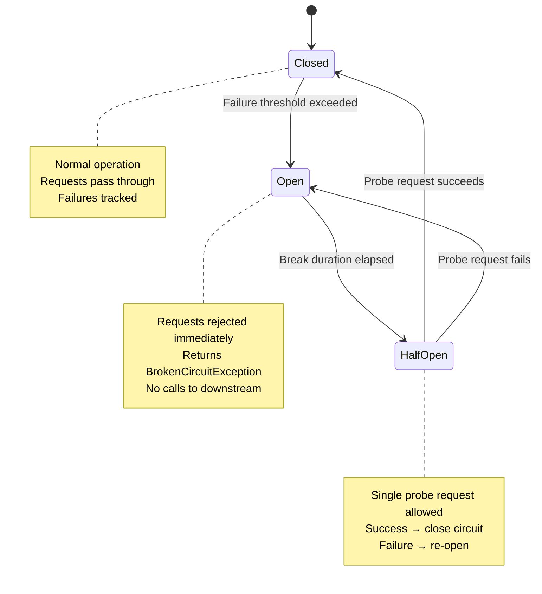

### Outbox Pattern ** NOTE, do not write directly to rabbit mq.  must have outbox pattern for fanout

**Problem:** You need to save to database AND publish an event. If you do them separately, one can succeed while the other fails — leaving your system in an inconsistent state.

**Solution:** Write the event to an outbox table in the **same database transaction** as your domain change. A separate process publishes from the outbox.

```csharp
// 1. Write domain change + outbox message in same transaction
public class OrderService
{
    private readonly AppDbContext _db;

    public async Task<Guid> CreateOrderAsync(CreateOrderCommand cmd, CancellationToken ct)
    {
        var order = Order.Create(cmd.CustomerId, cmd.Lines);

        _db.Orders.Add(order);
        _db.OutboxMessages.Add(new OutboxMessage
        {
            Id = Guid.NewGuid(),
            Type = nameof(OrderCreatedEvent),
            Payload = JsonSerializer.Serialize(new OrderCreatedEvent(order.Id, order.Total)),
            OccurredOn = DateTime.UtcNow,
            ProcessedOn = null
        });

        await _db.SaveChangesAsync(ct); // Single transaction — both succeed or both fail
        return order.Id;
    }
}

// 2. Background publisher reads outbox and publishes (with idempotency)
public class OutboxPublisher : BackgroundService
{
    protected override async Task ExecuteAsync(CancellationToken stoppingToken)
    {
        while (!stoppingToken.IsCancellationRequested)
        {
            using var scope = _scopeFactory.CreateScope();
            var db = scope.ServiceProvider.GetRequiredService<AppDbContext>();

            var pending = await db.OutboxMessages
                .Where(m => m.ProcessedOn == null)
                .OrderBy(m => m.OccurredOn)
                .Take(50)
                .ToListAsync(stoppingToken);

            foreach (var message in pending)
            {
                await _messageBus.PublishAsync(message.Type, message.Payload, stoppingToken);
                message.ProcessedOn = DateTime.UtcNow;
            }

            await db.SaveChangesAsync(stoppingToken);
            await Task.Delay(TimeSpan.FromSeconds(1), stoppingToken);
        }
    }
}
```

#### Idempotency Keys

Consumers will see duplicate messages (at-least-once delivery). Make processing idempotent:

```csharp
public class OrderCreatedHandler
{
    public async Task HandleAsync(OrderCreatedEvent evt, CancellationToken ct)
    {
        // Check if already processed (idempotency)
        var exists = await _db.ProcessedEvents
            .AnyAsync(e => e.EventId == evt.EventId, ct);

        if (exists) return; // Already handled — skip

        // Process...
        await _db.ProcessedEvents.AddAsync(new ProcessedEvent(evt.EventId), ct);
        await _db.SaveChangesAsync(ct);
    }
}
```

### Observability Stack

| Layer | Tool | Purpose |
|-------|------|---------|
| **Traces** | OpenTelemetry + Activity API | Distributed request tracing across services |
| **Metrics** | OpenTelemetry + Prometheus/OTLP | Request rates, latencies, error rates, business metrics |
| **Logs** | Serilog / MEL + OTLP | Structured, correlated log entries |
| **Health** | ASP.NET Health Checks | Liveness, readiness, startup probes for k8s |
| **Dashboards** | Grafana / Azure Monitor | Visualization and alerting |

```csharp
// .NET 9 — OpenTelemetry setup (or use .NET Aspire service defaults for one-liner)
builder.Services.AddOpenTelemetry()
    .ConfigureResource(r => r.AddService("OrderService"))
    .WithTracing(tracing => tracing
        .AddAspNetCoreInstrumentation()
        .AddHttpClientInstrumentation()
        .AddEntityFrameworkCoreInstrumentation()
        .AddSource("OrderService.Domain") // Custom ActivitySource
        .AddOtlpExporter())
    .WithMetrics(metrics => metrics
        .AddAspNetCoreInstrumentation()
        .AddHttpClientInstrumentation()
        .AddRuntimeInstrumentation()
        .AddMeter("OrderService.Business") // Custom metrics
        .AddOtlpExporter());

// Health checks
builder.Services.AddHealthChecks()
    .AddNpgSql(connectionString, name: "postgres", tags: ["ready"])
    .AddRedis(redisConnectionString, name: "redis", tags: ["ready"])
    .AddCheck("self", () => HealthCheckResult.Healthy(), tags: ["live"]);

app.MapHealthChecks("/health/live", new() { Predicate = r => r.Tags.Contains("live") });
app.MapHealthChecks("/health/ready", new() { Predicate = r => r.Tags.Contains("ready") });

// .NET Aspire service defaults (replaces all the above with one call)
builder.AddServiceDefaults(); // Configures OTel, health checks, service discovery
```

### 🎯 Key Insights

> **What matters here:**
> - You explain cascade failure: slow > dead, and WHY (thread pool exhaustion, backpressure propagation)
> - You know the correct Polly composition order and can explain why (total timeout must be outermost)
> - You reach for the **Outbox Pattern** when asked "how do you reliably publish events" — this is the production answer
> - You mention idempotency as a first-class concern, not an afterthought
> - You know .NET Aspire's `AddServiceDefaults()` as the modern one-liner for observability
> - You can distinguish liveness (is the process alive?) vs readiness (can it serve traffic?) probes

---

## 8. Clean Architecture vs Vertical Slice

### Clean/Onion Architecture

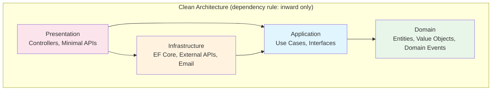

**Project structure:**

```
src/
├── MyApp.Domain/            # Zero dependencies — pure C#
│   ├── Entities/
│   ├── ValueObjects/
│   ├── Events/
│   └── Interfaces/          # Repository interfaces (not implementations)
├── MyApp.Application/       # References: Domain only
│   ├── Commands/
│   ├── Queries/
│   ├── Behaviors/           # Validation, logging pipeline
│   └── Interfaces/          # IEmailSender, IPaymentGateway
├── MyApp.Infrastructure/    # References: Application + Domain
│   ├── Persistence/         # EF Core DbContext, Repositories
│   ├── Services/            # Email, payment, external API clients
│   └── DependencyInjection.cs
└── MyApp.Api/               # References: Application + Infrastructure
    ├── Endpoints/
    ├── Middleware/
    └── Program.cs
```

**When it works:**
- Large teams (5+ devs) — clear ownership boundaries per layer
- Complex domain logic that changes independently of infrastructure
- Multiple presentation layers (API + Blazor + mobile BFF) consuming same Application layer
- Long-lived products where infrastructure will change (swap database, swap email provider)

**When it doesn't:**
- Small CRUD apps — 4 projects for a TODO list is absurd ceremony
- Rapid prototyping — the indirection slows initial velocity
- Simple domains — if most handlers are just "validate, save, return," the layers add no value
- Solo developer or pair — the overhead isn't justified by team coordination benefits

### Vertical Slice Architecture

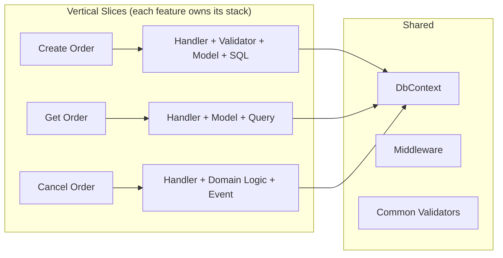

**Project structure:**

```
src/MyApp/
├── Features/
│   ├── Orders/
│   │   ├── CreateOrder.cs       # Command + Handler + Validator (all in one file)
│   │   ├── GetOrder.cs          # Query + Handler
│   │   ├── CancelOrder.cs       # Command + Handler + Domain logic
│   │   ├── OrderEndpoints.cs    # Route definitions for this feature
│   │   └── OrderModels.cs       # DTOs specific to orders
│   ├── Customers/
│   │   ├── CreateCustomer.cs
│   │   └── GetCustomer.cs
│   └── Reports/
│       └── SalesReport.cs
├── Common/
│   ├── Behaviors/               # Shared pipeline behaviors
│   ├── Middleware/
│   └── Extensions/
├── Infrastructure/
│   ├── AppDbContext.cs
│   └── ServiceRegistration.cs
└── Program.cs
```

**Example slice (single file = command + handler + validator):**

```csharp
// Features/Orders/CreateOrder.cs
public static class CreateOrder
{
    public record Command(string CustomerId, List<LineItem> Lines) : IRequest<Result<Guid>>;

    public record LineItem(string ProductId, int Quantity, decimal Price);

    public class Validator : AbstractValidator<Command>
    {
        public Validator()
        {
            RuleFor(x => x.CustomerId).NotEmpty();
            RuleFor(x => x.Lines).NotEmpty();
            RuleForEach(x => x.Lines).ChildRules(line =>
            {
                line.RuleFor(l => l.Quantity).GreaterThan(0);
                line.RuleFor(l => l.Price).GreaterThan(0);
            });
        }
    }

    public class Handler : IRequestHandler<Command, Result<Guid>>
    {
        private readonly AppDbContext _db;

        public Handler(AppDbContext db) => _db = db;

        public async Task<Result<Guid>> Handle(Command request, CancellationToken ct)
        {
            var order = new Order
            {
                CustomerId = request.CustomerId,
                Lines = request.Lines.Select(l => new OrderLine
                {
                    ProductId = l.ProductId,
                    Quantity = l.Quantity,
                    Price = l.Price
                }).ToList()
            };

            _db.Orders.Add(order);
            await _db.SaveChangesAsync(ct);
            return Result.Success(order.Id);
        }
    }
}
```

**When it works:**
- Rapid feature iteration — entire feature is one file/folder, easy to understand and modify
- Smaller teams — less coordination overhead, features don't step on each other
- Low cross-cutting between features — each slice is mostly independent
- CQRS-style apps — natural fit (each handler IS a slice)

**When it doesn't:**
- Heavy shared domain logic — 10 features all calling the same `OrderPricingService` creates coupling anyway
- Multiple UI consumers — without an Application layer, you duplicate logic across API + Blazor
- Team needs strong boundaries — slices can drift in style without layer enforcement

### Architecture Comparison

| Criteria | Clean Architecture | Vertical Slice |
|----------|-------------------|----------------|
| **Discoverability** | "Where's the order logic?" → search across 4 projects | "Where's create order?" → one file/folder |
| **New feature cost** | Create files in 4 layers + wire DI | Create one file with handler + validator |
| **Testing isolation** | Easy to test each layer independently | Easy to test each feature independently |
| **Coupling** | Low between layers, potentially high within a layer | Low between features, shared DB is the coupling |
| **Refactoring** | Change propagates across layers (interface → impl → handler → endpoint) | Change is local to the slice |
| **Team scaling** | Clear layer ownership | Clear feature ownership |
| **Consistency** | Enforced by project references and dependency rule | Must be enforced by convention/code review |
| **Ceremony** | High — many files for simple operations | Low — minimal boilerplate |
| **Best team size** | 5-15 developers | 2-8 developers |
| **Best domain** | Complex domain, multiple consumers | Feature-rich CRUD, single consumer |

### 🎯 Key Insights

> **What matters here:**
> - You've used both and can articulate trade-offs — not dogmatic about either
> - "A well-modularized monolith with vertical slices can outperform a microservices architecture that's really just a distributed monolith"
> - You know that Clean Architecture's value scales with team size and domain complexity
> - You can point out that many "Clean Architecture" projects are actually just CRUD with 4 extra projects of ceremony
> - You mention the **Modular Monolith** as the pragmatic middle ground (Clean Architecture structure, but deploy as one unit, split later if needed)

---

## 9. Serverless — Azure Functions vs AWS Lambda

### Azure Functions

**Runtime:** Isolated Worker Model (.NET 9) — runs in a separate process from the Functions host. The in-process model is deprecated.

#### Trigger Types

| Trigger | Use Case | Scaling Behavior |
|---------|----------|-----------------|
| **HTTP** | REST endpoints, webhooks | Scale to zero, per-request |
| **Timer** | Cron jobs, scheduled tasks | Single instance per schedule |
| **Queue (Storage)** | Background job processing | Scales with queue depth |
| **Service Bus** | Event-driven, ordered processing | Scales with message count |
| **Blob** | File processing on upload | Triggered per blob |
| **Event Grid** | Reactive event handling | Per-event |
| **Cosmos DB Change Feed** | Real-time data sync, projections | Per-partition lease |

#### Durable Functions (Stateful Orchestration)

```csharp
// Orchestrator — defines the workflow
[Function("ProcessOrderOrchestrator")]
public async Task<OrderResult> RunOrchestrator(
    [OrchestrationTrigger] TaskOrchestrationContext context)
{
    var orderId = context.GetInput<string>()!;

    // Fan-out: validate, charge, and notify in parallel
    var validateTask = context.CallActivityAsync<bool>("ValidateInventory", orderId);
    var chargeTask = context.CallActivityAsync<PaymentResult>("ChargePayment", orderId);

    await Task.WhenAll(validateTask, chargeTask);

    if (!validateTask.Result || !chargeTask.Result.Success)
    {
        await context.CallActivityAsync("CompensateOrder", orderId);
        return OrderResult.Failed;
    }

    // Human approval for orders > $10k
    var order = await context.CallActivityAsync<Order>("GetOrder", orderId);
    if (order.Total > 10_000)
    {
        var approved = await context.WaitForExternalEvent<bool>("ManagerApproval",
            timeout: TimeSpan.FromHours(24));
        if (!approved) return OrderResult.Rejected;
    }

    await context.CallActivityAsync("FulfillOrder", orderId);
    return OrderResult.Completed;
}

// Activity — single unit of work
[Function("ValidateInventory")]
public async Task<bool> ValidateInventory(
    [ActivityTrigger] string orderId, CancellationToken ct)
{
    // Check stock levels...
    return await _inventoryService.HasStockAsync(orderId, ct);
}
```

#### Cold Start Mitigation

| Plan | Cold Start | Cost | When to Use |
|------|-----------|------|-------------|
| **Consumption** | 2-10s (.NET) | Pay per execution only | Dev/test, low traffic |
| **Flex Consumption** | 1-3s (pre-provisioned instances) | Lower than Premium, usage-based | Production with variable traffic |
| **Premium (EP1+)** | <1s (always-warm instances) | Higher baseline | Latency-sensitive production |
| **Dedicated (App Service)** | None (always running) | Fixed monthly | Predictable high traffic |

**Tips:** Enable "Always Ready Instances" (min 1), use .NET 9 Native AOT for faster startup, keep dependencies minimal.

### AWS Lambda

**Runtime:** .NET 9 custom runtime with Native AOT. Managed runtime available for LTS versions.

#### Event Sources

| Event Source | Use Case | Scaling |
|-------------|----------|---------|
| **API Gateway** | REST/HTTP endpoints | Per-request concurrency |
| **SQS** | Queue processing, decoupling | Scales with queue depth |
| **SNS** | Fan-out notifications | Per-message |
| **EventBridge** | Event routing, scheduling | Per-event |
| **DynamoDB Streams** | Change data capture | Per-shard |
| **S3** | File processing | Per-object event |
| **Kinesis** | Real-time streaming | Per-shard |
| **Step Functions** | Complex orchestration | Per-execution |

#### Native AOT for Cold Start

```csharp
// .NET 9 Lambda with Native AOT — sub-second cold starts
// Program.cs
var builder = WebApplication.CreateSlimBuilder(args);

// AOT-compatible serialization
builder.Services.ConfigureHttpJsonOptions(options =>
{
    options.SerializerOptions.TypeInfoResolverChain.Insert(0, AppJsonSerializerContext.Default);
});

var app = builder.Build();

app.MapPost("/orders", async (CreateOrderRequest request, IOrderService service) =>
{
    var id = await service.CreateAsync(request);
    return Results.Created($"/orders/{id}", new { id });
});

app.Run();

// Source-generated serializer (required for AOT)
[JsonSerializable(typeof(CreateOrderRequest))]
[JsonSerializable(typeof(OrderResponse))]
internal partial class AppJsonSerializerContext : JsonSerializerContext { }
```

#### Lambda Powertools for .NET

```csharp
// Structured logging, tracing, metrics, idempotency — batteries included
[Logging(LogEvent = true)]
[Tracing(CaptureMode = TracingCaptureMode.ResponseAndError)]
[Metrics(Namespace = "OrderService")]
[Idempotent(IdempotencyKey = "/body/orderId")]
public async Task<APIGatewayProxyResponse> HandleAsync(
    APIGatewayProxyRequest request, ILambdaContext context)
{
    Logger.LogInformation("Processing order");
    Metrics.AddMetric("OrdersProcessed", 1, MetricUnit.Count);

    var order = JsonSerializer.Deserialize<CreateOrderRequest>(request.Body);
    var result = await _service.ProcessAsync(order!);

    return new APIGatewayProxyResponse
    {
        StatusCode = 201,
        Body = JsonSerializer.Serialize(result)
    };
}
```

#### Step Functions (vs Durable Functions)

| Feature | Azure Durable Functions | AWS Step Functions |
|---------|------------------------|-------------------|
| **Definition** | C# code (orchestrator function) | JSON/YAML state machine (ASL) |
| **Learning curve** | Lower (just C#) | Higher (new DSL to learn) |
| **Debugging** | Step through C# | Visual execution graph |
| **Cost** | Per function execution | Per state transition |
| **Max duration** | Unlimited (eternal orchestrations) | 1 year (Standard), 5 min (Express) |
| **Human interaction** | WaitForExternalEvent | Task token callbacks |
| **Compensation** | Manual in orchestrator code | Catch/Retry built into ASL |

### Serverless Comparison

| Criteria | Azure Functions | AWS Lambda |
|----------|----------------|------------|
| **Cold start (.NET 9)** | 2-10s (Consumption), <1s (Premium) | 1-3s (managed), <1s (Native AOT) |
| **Max execution time** | 5 min (Consumption), 10 min (Premium), unlimited (Dedicated) | 15 minutes |
| **Max memory** | 1.5 GB (Consumption), 14 GB (Premium) | 10 GB |
| **Pricing model** | Per execution + execution time | Per request + duration (per 1ms) |
| **Free tier** | 1M executions/month | 1M requests/month |
| **.NET 9 support** | Isolated worker model | Custom runtime / Native AOT |
| **Orchestration** | Durable Functions (C#-native) | Step Functions (JSON state machine) |
| **Local dev** | Azure Functions Core Tools + Azurite | SAM CLI / LocalStack |
| **Best ecosystem fit** | Azure Service Bus, Event Grid, Cosmos DB | SQS, EventBridge, DynamoDB |
| **Vendor lock-in** | Medium (trigger bindings are Azure-specific) | Medium (event source mappings are AWS-specific) |

### When NOT to Use Serverless

| Signal | Why Containers/PaaS Instead |
|--------|------------------------------|
| Long-running processes (>15 min) | Lambda hard limit; Functions need Premium plan |
| Sub-100ms latency requirement | Cold starts are unpredictable |
| High steady-state traffic (>1000 req/sec constant) | Containers are cheaper at sustained load |
| Complex local development | Emulating triggers/bindings locally is painful |
| Large deployment package (>250MB) | Lambda limits; slow cold starts |
| Need shared in-memory state | Serverless is stateless by design |
| WebSocket/long-lived connections | Not supported in pure serverless |
| Complex dependency injection | DI container startup adds to cold start |

### Compute Decision Tree

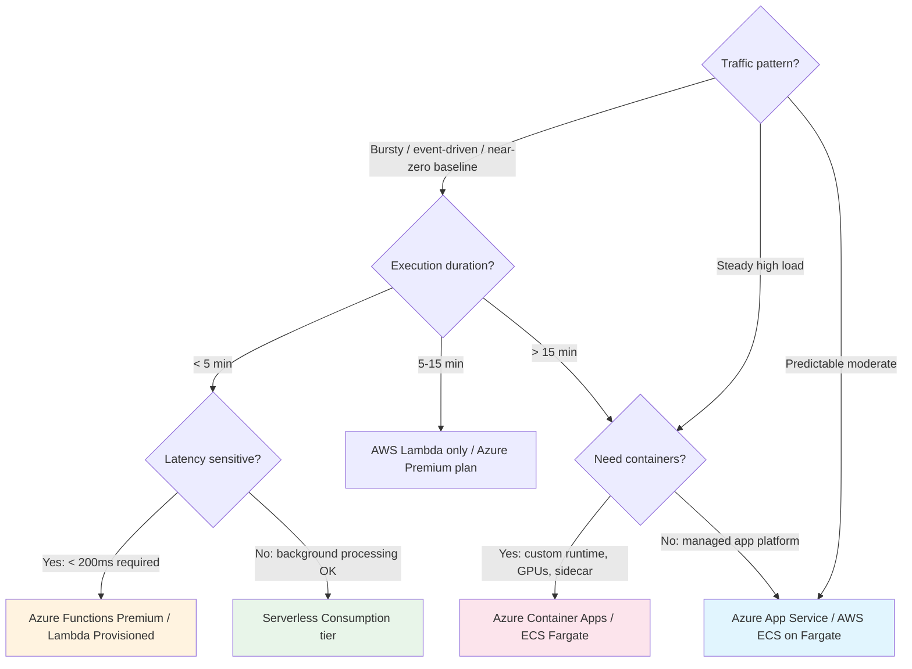

### Container Alternatives Quick Reference

| Service | Best For | Scaling | Cold Start |
|---------|----------|---------|-----------|
| **Azure Container Apps** | Microservices, event-driven containers, Dapr integration | KEDA-based autoscale, scale to zero | ~2-5s from zero |
| **Azure App Service** | Web apps, APIs, predictable traffic | Manual/auto (min 1 instance) | None (always running) |
| **AWS ECS Fargate** | Microservices, long-running tasks | Task-based scaling | ~30-60s (task launch) |
| **AWS App Runner** | Simple web apps, auto-scaling containers | Request-based, scale to zero | ~5-10s from zero |
| **AWS EKS** | Full Kubernetes control, complex orchestration | HPA/KEDA | None (pods always running) |

### 🎯 Key Insights

> **What matters here:**
> - You frame serverless as a **cost allocation decision** — not "serverless is modern"
> - You can calculate the crossover point: "At ~1M requests/day sustained, containers become cheaper"
> - You know the cold start problem and mitigation strategies (Native AOT, pre-warmed instances, Premium plans)
> - You choose between Azure/AWS based on **ecosystem fit**, not brand preference
> - You mention Durable Functions / Step Functions for orchestration (shows you've dealt with multi-step workflows)
> - You know when to NOT use serverless (WebSockets, long-running, steady-state) — this separates hype from experience

---

## 10. Full-Stack Architectural Decision Tree

### Monolith vs Modular Monolith vs Microservices

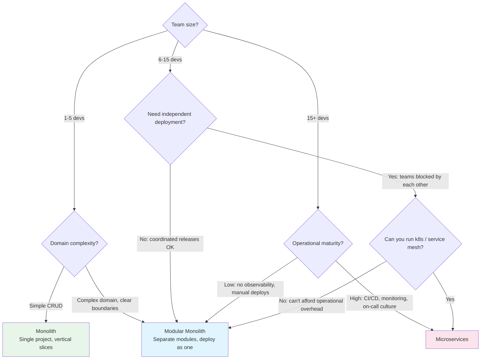

**Key insight:** The Modular Monolith is the correct default for most teams. It gives you Clean Architecture boundaries without the operational tax of distributed systems. You can extract services later when a module proves it needs independent scaling.

| Architecture | Deploy Complexity | Team Independence | Operational Cost | Data Consistency | Split Later? |
|-------------|-------------------|-------------------|------------------|-----------------|--------------|
| **Monolith** | Trivial (one artifact) | Low (shared codebase) | Very low | Strong (single DB) | Hard (big ball of mud) |
| **Modular Monolith** | Low (one artifact, module boundaries) | Moderate (module ownership) | Low | Strong (single DB, module boundaries) | Easy (modules are pre-extracted) |
| **Microservices** | High (N services × CI/CD) | High (own repos, own schedules) | Very high (observability, networking, resilience) | Eventual (distributed transactions) | N/A (already split) |

### Data Layer Decisions

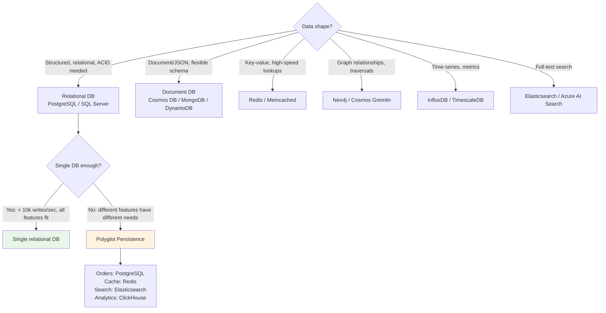

#### Caching Layer Decisions

| Layer | Tool | Latency | Use When |
|-------|------|---------|----------|
| **L1: In-process** | `IMemoryCache`, `FrozenDictionary` | <1ms | Config, feature flags, static reference data |
| **L2: Distributed** | Redis / Valkey | 1-5ms | Session state, computed results, rate limiting |
| **L3: HTTP** | Response caching, CDN | 0ms (client-side) | Public GET responses, static assets |
| **L4: Database** | Materialized views, read replicas | 5-20ms | Heavy aggregation queries, reporting |

### Messaging Patterns

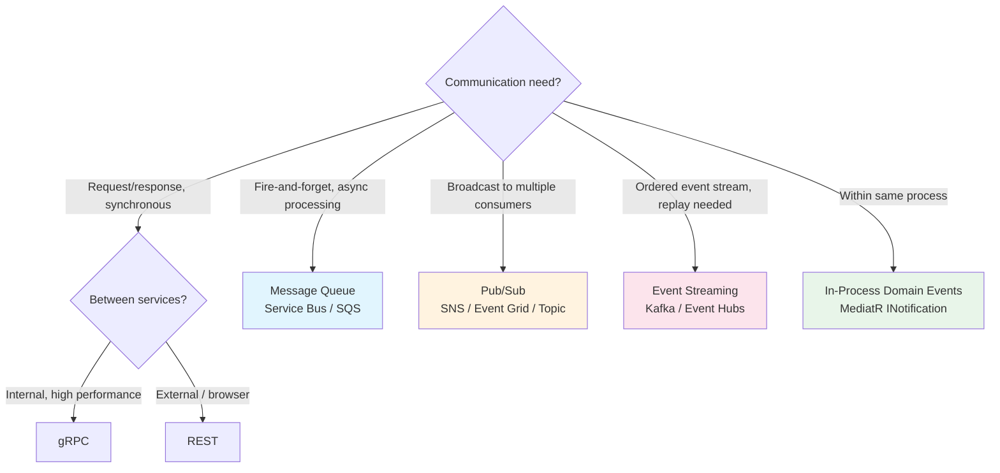

| Pattern | Tool (Azure) | Tool (AWS) | Guarantees | Use Case |
|---------|-------------|------------|-----------|----------|
| **Point-to-point queue** | Service Bus Queue | SQS | At-least-once, ordered (sessions) | Background jobs, command processing |
| **Pub/Sub (fan-out)** | Service Bus Topic | SNS + SQS | At-least-once, multiple subscribers | Event notifications, decoupled services |
| **Event streaming** | Event Hubs | Kinesis / MSK | Ordered per partition, replay | Real-time analytics, audit log, CDC |
| **Event routing** | Event Grid | EventBridge | At-least-once, filtered routing | Reactive integration, webhooks |
| **In-process events** | MediatR INotification | MediatR INotification | Synchronous, same transaction | Domain events within a bounded context |

**Decision factors:**
- **Need replay?** → Event streaming (Kafka/Event Hubs)
- **Need ordering?** → Queue with sessions/FIFO or event streaming
- **Need fan-out?** → Pub/Sub topics
- **Same service?** → In-process domain events (no network hop)
- **Need exactly-once?** → Not possible. Design for at-least-once + idempotency.

### Multi-Tenancy Patterns

| Pattern | Isolation | Cost | Complexity | When to Use |
|---------|-----------|------|-----------|-------------|
| **Shared DB + Row Filter** | Low (logical) | Lowest | Low | SaaS with many small tenants, cost-sensitive |
| **Schema per Tenant** | Moderate | Moderate | Moderate | Compliance needs, moderate tenant count |
| **DB per Tenant** | Maximum | Highest | High | Enterprise SaaS, strict data residency, regulatory |

```csharp
// Row-level filter with EF Core global query filter
public class AppDbContext : DbContext
{
    private readonly ITenantProvider _tenant;

    public AppDbContext(DbContextOptions options, ITenantProvider tenant)
        : base(options) => _tenant = tenant;

    protected override void OnModelCreating(ModelBuilder modelBuilder)
    {
        // Every query automatically filtered by TenantId
        modelBuilder.Entity<Order>()
            .HasQueryFilter(o => o.TenantId == _tenant.CurrentTenantId);
    }

    public override Task<int> SaveChangesAsync(CancellationToken ct = default)
    {
        // Auto-stamp TenantId on new entities
        foreach (var entry in ChangeTracker.Entries<ITenantEntity>()
            .Where(e => e.State == EntityState.Added))
        {
            entry.Entity.TenantId = _tenant.CurrentTenantId;
        }
        return base.SaveChangesAsync(ct);
    }
}
```

### Master Decision Matrix

| Decision | Small Team (1-5) | Medium Team (6-15) | Large Team (15+) |
|----------|-------------------|---------------------|-------------------|
| **Architecture** | Monolith or Modular Monolith | Modular Monolith | Microservices (if operationally ready) |
| **Web Framework** | Minimal APIs or Blazor | SPA + Minimal APIs | SPA + Minimal APIs |
| **Data Access** | EF Core (single DB) | Hybrid EF + Dapper | Polyglot (service owns its DB) |
| **API Style** | REST (Minimal APIs) | REST + gRPC for internal | REST + gRPC + event-driven |
| **Messaging** | In-process domain events | Queue (Service Bus/SQS) | Event streaming + queues |
| **Hosting** | App Service / single container | Container Apps / ECS | Kubernetes (EKS/AKS) |
| **CQRS Level** | Same model, separate methods | Separate handlers (MediatR) | Separate stores possible |
| **Auth** | Simple JWT / cookie | OAuth2 + role-based | OAuth2 + fine-grained policies + service mesh mTLS |
| **Observability** | Structured logging + health checks | Full OTel + Aspire | Full OTel + distributed tracing + alerting |

### 🎯 Key Insights

> **What matters here:**
> - "Team topology matters more than technology" — the number one signal of senior thinking
> - You default to Modular Monolith and explain why (same benefits of microservices boundaries without the operational cost)
> - You frame microservices as a **cost** you accept for **independent deployability and scaling** — not as "the modern way"
> - You understand that messaging introduces eventual consistency and can discuss mitigation (outbox, idempotency, saga pattern)
> - You pick data technology based on data shape, not brand loyalty
> - You can explain the multi-tenancy trade-offs in terms a PM would understand (cost vs isolation vs compliance)

---

## 11. Dependency Injection & Testability

### DI as Architecture Enabler

DI isn't just a convenience — it's what makes your architecture **testable, flexible, and maintainable**.

**The Composition Root:** All service registration happens in ONE place (`Program.cs` or extension methods called from it). The rest of the application declares dependencies via constructors — it never creates them.

```csharp
// Program.cs — the composition root
builder.Services.AddScoped<IOrderRepository, PostgresOrderRepository>();
builder.Services.AddScoped<IPaymentGateway, StripePaymentGateway>();
builder.Services.AddSingleton<IEmailSender, SendGridEmailSender>();
builder.Services.AddScoped<IOrderService, OrderService>();

// Keyed services (.NET 8+) — strategy pattern via DI
builder.Services.AddKeyedScoped<IPaymentGateway, StripePaymentGateway>("stripe");
builder.Services.AddKeyedScoped<IPaymentGateway, PayPalPaymentGateway>("paypal");

// Consumer selects by key
public class CheckoutService
{
    public CheckoutService(
        [FromKeyedServices("stripe")] IPaymentGateway gateway) { }
}

// Decorator pattern (manual — or use Scrutor for auto-decoration)
builder.Services.AddScoped<IOrderRepository, PostgresOrderRepository>();
builder.Services.Decorate<IOrderRepository, CachingOrderRepository>();
// CachingOrderRepository wraps PostgresOrderRepository, adds caching layer
```

### DI Anti-Patterns

| Anti-Pattern | Problem | Fix |
|-------------|---------|-----|
| **Service Locator** | Hides dependencies, untestable, runtime failures | Constructor injection — explicit deps |
| **new-ing dependencies** | Tight coupling, can't mock/swap | Inject via interface |
| **Mega-constructor (8+ params)** | Class does too much (SRP violation) | Split into smaller services, use Mediator |
| **Captive dependency** | Singleton holds scoped → memory leak + thread safety | IServiceScopeFactory (see Section 5) |
| **Static helpers with hidden deps** | Untestable, global state | Make it a service with injected deps |
| **Injecting IServiceProvider** | Service locator in disguise | Inject specific services |

```csharp
// ❌ Service Locator — dependencies are invisible
public class OrderService
{
    private readonly IServiceProvider _sp;

    public OrderService(IServiceProvider sp) => _sp = sp;

    public async Task ProcessAsync()
    {
        var repo = _sp.GetRequiredService<IOrderRepository>(); // Hidden dependency!
        var gateway = _sp.GetRequiredService<IPaymentGateway>(); // Can't see from constructor!
    }
}

// ✅ Explicit constructor injection — dependencies are the API contract
public class OrderService
{
    private readonly IOrderRepository _repo;
    private readonly IPaymentGateway _gateway;

    public OrderService(IOrderRepository repo, IPaymentGateway gateway)
    {
        _repo = repo;
        _gateway = gateway;
    }
}
```

### Testability by Design

**DI boundaries create natural test seams.** If every dependency is injected via interface, you can substitute any of them in tests.

```csharp
// Unit test — mock dependencies, test behavior
public class OrderServiceTests
{
    [Fact]
    public async Task CreateOrder_WithValidData_ReturnsOrderId()
    {
        // Arrange
        var repo = new Mock<IOrderRepository>();
        repo.Setup(r => r.SaveAsync(It.IsAny<Order>(), It.IsAny<CancellationToken>()))
            .ReturnsAsync(Guid.NewGuid());

        var gateway = new Mock<IPaymentGateway>();
        gateway.Setup(g => g.AuthorizeAsync(It.IsAny<decimal>(), It.IsAny<CancellationToken>()))
            .ReturnsAsync(PaymentResult.Success("txn_123"));

        var service = new OrderService(repo.Object, gateway.Object);

        // Act
        var result = await service.CreateAsync(new CreateOrderCommand("cust_1", lines), CancellationToken.None);

        // Assert
        Assert.True(result.IsSuccess);
        repo.Verify(r => r.SaveAsync(It.IsAny<Order>(), It.IsAny<CancellationToken>()), Times.Once);
    }
}
```

### Test Pyramid

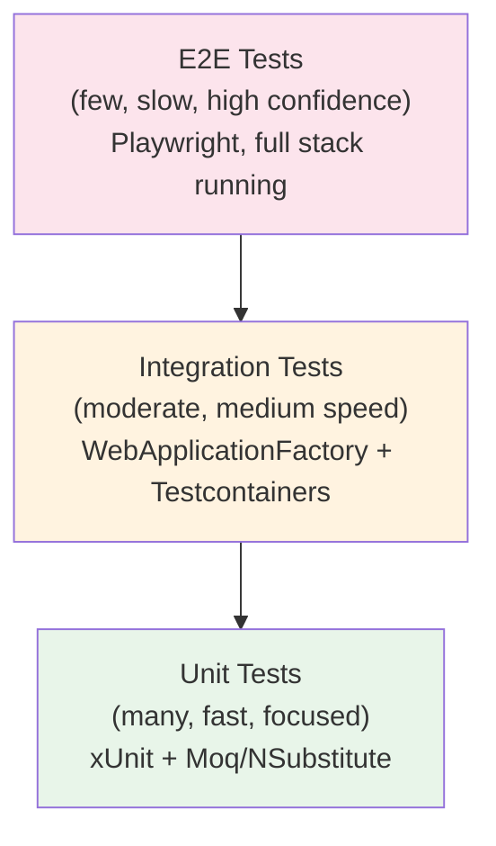

| Layer | Speed | What It Tests | Tools |
|-------|-------|---------------|-------|
| **Unit** | <5ms/test | Single class in isolation, business logic, domain rules | xUnit, Moq, NSubstitute |
| **Integration** | 100-500ms/test | Multiple components, real DB, HTTP pipeline | WebApplicationFactory, Testcontainers |
| **E2E** | 5-30s/test | Full user journey through deployed system | Playwright, k6 |

**Coverage targets:**
- Domain logic / business rules: 90%+
- Application services (handlers): 80%+
- Infrastructure (repos, clients): integration tests only
- Controllers / endpoints: integration tests via WebApplicationFactory

### Testcontainers vs EF InMemory

| | EF InMemory Provider | Testcontainers |
|--|---------------------|----------------|
| **Speed** | Very fast (in-process) | Slower (Docker container startup) |
| **Truthfulness** | Low — no constraints, no SQL translation, no migrations | High — real database, real behavior |
| **What it misses** | Unique constraints, foreign keys, computed columns, transactions, provider-specific SQL | Nothing — it IS the real DB |
| **Best for** | Quick feedback on simple logic | Catching real bugs: constraint violations, query translation issues |
| **Setup** | `options.UseInMemoryDatabase("test")` | `new PostgreSqlContainer().Build()` |

```csharp
// Integration test with WebApplicationFactory + Testcontainers
public class OrderApiTests : IAsyncLifetime
{
    private readonly PostgreSqlContainer _postgres = new PostgreSqlBuilder()
        .WithImage("postgres:16-alpine")
        .Build();

    private WebApplicationFactory<Program> _factory = null!;

    public async Task InitializeAsync()
    {
        await _postgres.StartAsync();

        _factory = new WebApplicationFactory<Program>()
            .WithWebHostBuilder(builder =>
            {
                builder.ConfigureServices(services =>
                {
                    // Replace the real DB with Testcontainers instance
                    services.RemoveAll<DbContextOptions<AppDbContext>>();
                    services.AddDbContext<AppDbContext>(options =>
                        options.UseNpgsql(_postgres.GetConnectionString()));
                });
            });

        // Run migrations
        using var scope = _factory.Services.CreateScope();
        var db = scope.ServiceProvider.GetRequiredService<AppDbContext>();
        await db.Database.MigrateAsync();
    }

    [Fact]
    public async Task CreateOrder_Returns201()
    {
        var client = _factory.CreateClient();
        var response = await client.PostAsJsonAsync("/api/v1/orders", new
        {
            CustomerId = "cust_123",
            Lines = new[] { new { ProductId = "prod_1", Quantity = 2, Price = 29.99m } }
        });

        Assert.Equal(HttpStatusCode.Created, response.StatusCode);
    }

    public async Task DisposeAsync()
    {
        await _factory.DisposeAsync();
        await _postgres.DisposeAsync();
    }
}
```

### 🎯 Key Insights

> **What matters here:**
> - You can identify the Service Locator anti-pattern immediately and explain why it's harmful (hides dependencies, breaks testability)
> - You know the Composition Root concept — all registration in one place, not scattered
> - You understand that DI enables testability — it's not just about "inversion of control," it's about **seams**
> - You prefer Testcontainers over InMemory for anything beyond trivial tests — and can explain why (truthfulness)
> - You can articulate the test pyramid and why most test effort belongs at the unit level (speed, specificity, cost)
> - You mention keyed services for strategy pattern — shows .NET 8+ awareness

---

## 12. Meta-Skills & Quick Reference

### How to Answer Architecture Questions

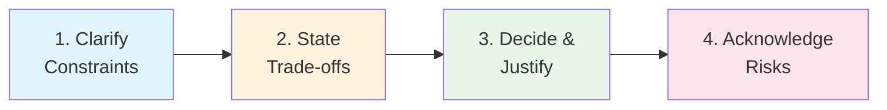

**Step 1: Clarify Constraints** (30 seconds — shows you don't jump to solutions)
- "How many users / requests per second are we designing for?"
- "What's the team size and their experience with distributed systems?"
- "Is this greenfield or do we have existing systems to integrate with?"
- "What are the latency requirements? Is eventual consistency acceptable?"
- "What's the deployment target — cloud provider, on-prem, hybrid?"

**Step 2: State Trade-offs** (the core of the answer)
- "If we go with X, we get [benefit] but we pay [cost]."
- "The alternative Y gives us [other benefit] at the expense of [other cost]."
- Never present a solution without its downsides.

**Step 3: Decide & Justify** (don't hedge endlessly)
- "Given [constraint], I'd choose X because [specific reason that maps to their context]."
- Commit to a decision. Avoid "it depends" without a follow-through.

**Step 4: Acknowledge Risks** (shows operational maturity)
- "What could go wrong: [failure mode]. I'd detect this via [monitoring/alerting]. Mitigation: [fallback]."

### Common Scenarios & Talking Points

#### "Design an order processing system"

**Key topics to hit:**
1. **Decouple with messaging** — API accepts order, publishes to queue, returns 202 Accepted
2. **Outbox pattern** — save order + outbox event in same transaction (Section 7)
3. **Idempotency** — consumers handle duplicates via idempotency key
4. **Compensation** — if payment fails after inventory reserved, publish compensation event
5. **Observability** — trace the order through queue → processor → fulfillment with correlation ID

**Architecture sketch:**
```
API → [Validate + Save + Outbox] → Publisher → Service Bus → Order Processor → [Charge Payment]
                                                                              → [Reserve Inventory]
                                                                              → [Send Confirmation]
```

#### "How would you migrate this monolith?"

**Key topics to hit:**
1. **Don't rewrite** — "You lose 10 years of edge-case handling nobody documented"
2. **Modular Monolith first** — enforce module boundaries in the existing codebase (project references, no cross-module DB access)
3. **Strangler Fig** — new features as separate services, old features extracted one at a time
4. **Shared database phase** — initially services may share the DB; eventually each owns its data
5. **Feature flags** — toggle between old and new implementation, rollback instantly

#### "This system is slow under load"

**Key topics to hit:**
1. **Measure first** — "Where's the time going?" (distributed trace, flame graph, DB slow query log)
2. **Caching layers** — add Redis for hot reads, HTTP cache headers for public responses
3. **Async processing** — move non-critical work out of the request path (email, notifications, analytics)
4. **Read replicas** — separate read traffic from write traffic (CQRS pattern)
5. **Connection pooling** — are we exhausting DB connections? (PgBouncer, connection string tuning)
6. **Scale out vs up** — horizontal scaling with stateless services, vertical scaling for the DB

#### "What's wrong with this design?" (code review question)

**Red flags to identify:**
- Singleton injecting scoped service (captive dependency)
- `DbContext` shared across threads (thread-safety violation)
- `.Result` or `.Wait()` on async calls (thread starvation)
- No resilience on external HTTP calls (cascade failure waiting to happen)
- Business logic in controllers (untestable, violates SRP)
- Service Locator pattern (hidden dependencies)
- No health checks or observability (operating blind)

### Master Pattern Reference Table

| Pattern | Use When | Avoid When | Key Benefit | Key Cost |
|---------|----------|-----------|-------------|----------|
| **MVC / Razor Pages** | Content sites, admin panels, small teams | SPAs needed, multiple clients, independent teams | Simplicity, SEO, fast dev | UI-backend coupling |
| **SPA + API** | Product apps, multiple clients, large teams | Small team, simple forms, SEO-critical only | Independent deployment, team autonomy | Two build systems, CORS, auth complexity |
| **Minimal APIs** | Microservices, high-perf endpoints | Need full MVC features (filters, model binding) | Low ceremony, fast | Less discoverable for large apps |
| **gRPC** | Internal service-to-service, streaming | Browser clients, simple CRUD | Performance, strong contracts | No browser support, tooling learning curve |
| **GraphQL** | Mobile BFF, flexible client queries | Simple APIs, single consumer | Reduced over-fetching | Schema governance, caching difficulty |
| **SignalR** | Real-time: chat, live updates, collab | Request-response patterns | Bi-directional push | Scaling (backplane needed), connection state |
| **CQRS** | Asymmetric read/write, complex queries | Simple CRUD, small team | Independent optimization of reads/writes | Eventual consistency, more code |
| **EF Core** | Domain-rich writes, migrations, rapid dev | High-throughput reads, complex SQL | Productivity, change tracking, migrations | Performance overhead, generated SQL quality |
| **Dapper** | Read-heavy, reporting, stored procs | Complex domain navigation, rapid prototyping | Performance, SQL control | No migrations, manual mapping |
| **Clean Architecture** | Large teams, complex domain, multiple UIs | Small apps, CRUD-heavy, solo dev | Clear boundaries, testable layers | Ceremony, many files per feature |
| **Vertical Slice** | Feature iteration, smaller teams | Heavy shared domain, multiple UIs | Low ceremony, feature-local changes | Convention-dependent, less enforcement |
| **Modular Monolith** | Most teams (2-15), bounded contexts identified | True independent scaling needed | Monolith simplicity + module boundaries | Still single deploy unit |
| **Microservices** | Large org, independent scaling, polyglot | Small teams, shared data, low operational maturity | Independent deploy + scale | Distributed systems complexity |
| **Serverless** | Event-driven, bursty traffic, per-request billing | Long-running, low-latency, steady-state load | Zero idle cost, auto-scale | Cold starts, vendor lock-in |
| **Containers (ACA/Fargate)** | Microservices, custom runtimes, steady traffic | Simple functions, event-driven spikes | Full control, predictable perf | Infra management, no scale-to-zero (mostly) |
| **Outbox Pattern** | Reliable event publishing, at-least-once | Synchronous-only workflows, single-service | Consistency between DB and bus | Extra table, publisher process |
| **Circuit Breaker** | External dependencies, cascading failure risk | In-process calls, fast-fail dependencies | Prevents cascade failure | Complexity, needs monitoring |
| **Redis Caching** | Hot reads, session state, distributed locks | Single-instance app with low traffic | Fast reads, reduces DB load | Cache invalidation complexity, extra infra |
| **Event Sourcing** | Full audit trail, temporal queries, undo | Simple CRUD, team unfamiliar | Complete history, replay capability | Complexity, storage growth, rebuild projections |
| **Multi-tenant (Shared DB)** | Many small tenants, cost-sensitive SaaS | Regulatory isolation, large enterprise tenants | Lowest cost, simplest ops | Data leak risk, noisy neighbor |
| **Multi-tenant (DB per Tenant)** | Compliance, enterprise SaaS, data residency | Many tenants (100+), cost-sensitive | Maximum isolation | Operational complexity, connection management |

### The "When Would You NOT Use This?" Drill

For each pattern above, practice articulating:
1. The pattern name
2. One sentence on what it gives you
3. One sentence on when it's the WRONG choice
4. A concrete example from your experience

**Example:** "CQRS gives us independent optimization of reads and writes. I would NOT use it for a simple CRUD app with 5 entities where reads and writes have similar shapes and traffic — the extra handlers and potential eventual consistency aren't worth the complexity. In my last project, we started with CQRS everywhere and ended up removing it from 3 out of 5 modules because they were just passing through."

---

## 13. Domain-Driven Design & Microservice Scope

### What is DDD?

Domain-Driven Design is an approach to software development that centers the architecture around the **business domain** rather than technical concerns. It provides a shared language (Ubiquitous Language) between developers and domain experts.

### Core DDD Concepts

| Concept | Definition | Example |
|---------|-----------|---------|
| **Bounded Context** | A boundary within which a model has consistent meaning | "Order" means different things in Sales vs Shipping |
| **Aggregate** | Cluster of entities treated as a single unit for writes | Order + OrderLines (Order is the Aggregate Root) |
| **Aggregate Root** | The entry point entity — all changes go through it | `Order.AddLine()`, never modify `OrderLine` directly |
| **Entity** | Object with identity that persists over time | Order (identified by OrderId) |
| **Value Object** | Immutable object defined by its properties, no identity | Money(100, "USD"), Address, DateRange |
| **Domain Event** | Something that happened that domain experts care about | OrderPlaced, PaymentReceived, InventoryReserved |
| **Repository** | Abstraction for retrieving/persisting aggregates | `IOrderRepository.GetByIdAsync(orderId)` |
| **Domain Service** | Logic that doesn't belong to a single entity | PricingService (needs Product + Discount + Customer info) |

### Bounded Context = Microservice Scope

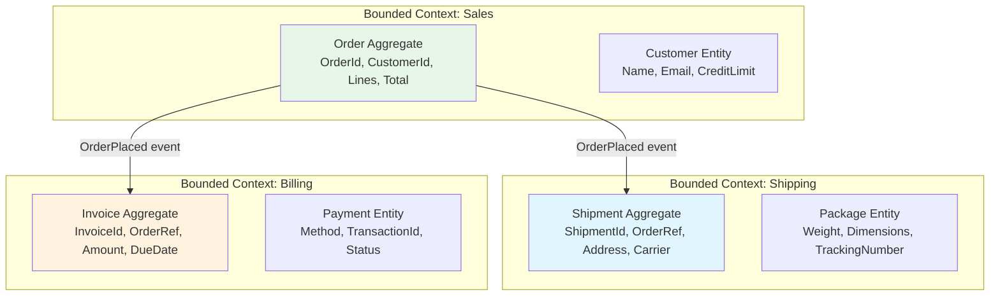

**The rule:** One microservice = one bounded context. Each service owns its data, its language, and its invariants.

**How to find boundaries:**
1. Listen for different definitions of the same word ("Order" in sales = what customer wants; "Order" in warehouse = what to pick)
2. Look for different rates of change (pricing rules change weekly, shipping rules change yearly)
3. Identify team ownership (sales team vs logistics team)
4. Find transactional boundaries (what MUST be consistent together?)

### Aggregate Design Rules

```csharp
// Aggregate Root — ALL access goes through here
public class Order  // Aggregate Root
{
    public Guid Id { get; private set; }
    public OrderStatus Status { get; private set; }
    public Money Total { get; private set; }
    private readonly List<OrderLine> _lines = [];
    public IReadOnlyList<OrderLine> Lines => _lines.AsReadOnly();

    private readonly List<IDomainEvent> _events = [];
    public IReadOnlyList<IDomainEvent> DomainEvents => _events.AsReadOnly();

    // Factory method — enforces invariants at creation
    public static Order Create(string customerId, List<OrderLineDto> lines)
    {
        if (lines.Count == 0) throw new DomainException("Order must have at least one line");

        var order = new Order
        {
            Id = Guid.NewGuid(),
            Status = OrderStatus.Draft,
        };

        foreach (var line in lines)
            order.AddLine(line.ProductId, line.Quantity, line.Price);

        order._events.Add(new OrderCreatedEvent(order.Id));
        return order;
    }

    // Behavior on the aggregate — not anemic setters
    public void AddLine(string productId, int quantity, Money price)
    {
        if (Status != OrderStatus.Draft)
            throw new DomainException("Cannot modify a submitted order");

        _lines.Add(new OrderLine(productId, quantity, price));
        RecalculateTotal();
    }

    public void Submit()
    {
        if (_lines.Count == 0) throw new DomainException("Cannot submit empty order");
        Status = OrderStatus.Submitted;
        _events.Add(new OrderSubmittedEvent(Id, Total));
    }

    private void RecalculateTotal() => Total = _lines.Sum(l => l.LineTotal);
}

// Value Object — immutable, equality by properties
public record Money(decimal Amount, string Currency)
{
    public static Money operator +(Money a, Money b)
    {
        if (a.Currency != b.Currency) throw new DomainException("Cannot add different currencies");
        return new Money(a.Amount + b.Amount, a.Currency);
    }
}
```

### 🎯 Key Insights

> **What matters here:**
> - You define microservice boundaries by **bounded context**, not by technical layer
> - You understand aggregates as consistency boundaries (everything inside = strong consistency; across aggregates = eventual)
> - You can explain why "Order" means different things in different contexts (ubiquitous language)
> - You prefer rich domain models over anemic entities with public setters
> - You know that DDD is overkill for simple CRUD — "Not every service needs a rich domain model"

---

## 14. .NET Microservice Project Architecture

### Project Structure & Libraries

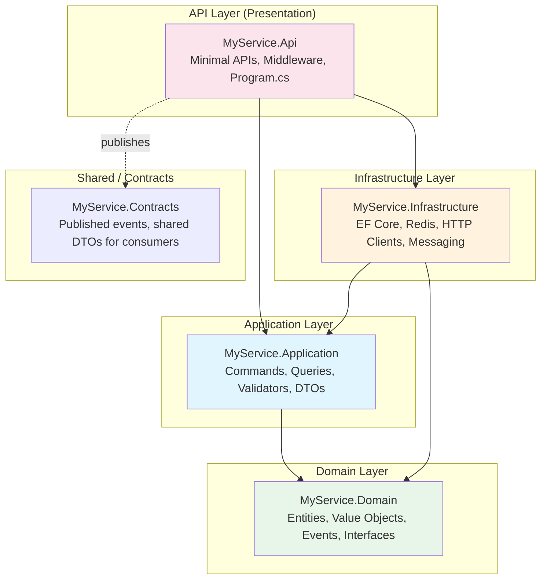

### Standard Library Stack per Service

| Concern | Library | Why |
|---------|---------|-----|
| **API Framework** | ASP.NET Core Minimal APIs | Low ceremony, fast, AOT-compatible |
| **Validation** | FluentValidation | Declarative rules, MediatR pipeline integration |
| **Mediator/CQRS** | MediatR (or custom dispatcher) | Decouples endpoints from handlers |
| **ORM (writes)** | EF Core 9 | Change tracking, migrations, domain model mapping |
| **ORM (reads)** | Dapper | High-performance queries, reporting |
| **Messaging** | MassTransit (or raw Azure.Messaging) | Abstraction over Service Bus/RabbitMQ/SQS |
| **Resilience** | Polly v8 (via Microsoft.Extensions.Http.Resilience) | Retry, circuit breaker, timeout |
| **Caching** | HybridCache (.NET 9) or IDistributedCache + Redis | L1/L2 cache with stampede protection |
| **Logging** | Serilog + OpenTelemetry OTLP exporter | Structured, correlated, exported to Grafana/Seq |
| **Tracing** | OpenTelemetry .NET SDK | Distributed tracing across services |
| **Health Checks** | AspNetCore.HealthChecks.* | Liveness/readiness for Kubernetes |
| **Auth** | Microsoft.Identity.Web or custom JWT | OAuth2 token validation |
| **Testing** | xUnit + Moq + Testcontainers + WebApplicationFactory | Full test pyramid |
| **API Docs** | Microsoft.AspNetCore.OpenApi + Scalar | OpenAPI spec generation + UI |

### Request Lifecycle Workflow

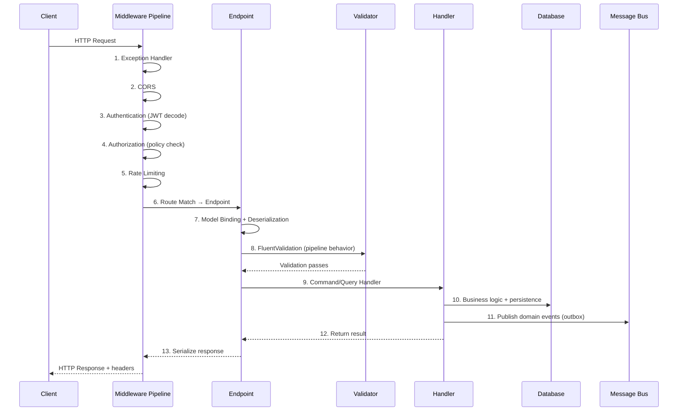

**What happens at each step:**

| Step | What | Key Concern |
|------|------|-------------|
| 1 | Global exception handler | Catches unhandled exceptions, logs, returns ProblemDetails |
| 2 | CORS middleware | Validates Origin header, adds CORS response headers |
| 3 | Authentication | Decodes JWT, validates signature/expiry, sets `HttpContext.User` |
| 4 | Authorization | Checks policies/roles against the authenticated user |
| 5 | Rate limiting | Per-client or per-endpoint throttling |
| 6 | Routing | Matches URL pattern to endpoint handler |
| 7 | Model binding | Deserializes JSON body, binds route/query params |
| 8 | Validation | FluentValidation rules on the command/query DTO |
| 9 | Handler | Business logic execution (CQRS command/query handler) |
| 10 | Persistence | EF Core SaveChanges or Dapper execute |
| 11 | Events | Outbox write (same transaction) or direct publish |
| 12 | Result | Success/failure returned to endpoint |
| 13 | Serialization | Object → JSON, status code selection |

---

## 15. CRON / Scheduled Job Architecture

### Architecture Overview

```mermaid
flowchart TD
    subgraph "Trigger Layer"
        A[Azure Timer Trigger<br/>CRON expression]
        B[Kubernetes CronJob<br/>CRON schedule]
        C[Hangfire Recurring<br/>Dashboard + DB state]
    end

    subgraph "Job Dispatcher"
        D[Job Runner<br/>Deserialize job, create scope, execute]
    end

    subgraph "Job Execution"
        E[Business Logic<br/>Scoped dependencies, CancellationToken]
    end

    subgraph "Observability"
        F[Structured Logging<br/>Job ID, duration, outcome]
        G[Metrics<br/>job_duration_seconds, job_failures_total]
        H[Health Check<br/>Last successful run timestamp]
    end

    subgraph "State"
        I[(Job Lock / Lease<br/>Prevent duplicate execution)]
        J[(Last Run Timestamp<br/>Idempotency check)]
    end

    A --> D
    B --> D
    C --> D
    D --> E
    E --> F
    E --> G
    E --> H
    D --> I
    E --> J
```

### CRON Expression Reference

| Expression | Schedule |
|-----------|----------|
| `0 * * * *` | Every hour at :00 |
| `*/5 * * * *` | Every 5 minutes |
| `0 0 * * *` | Daily at midnight |
| `0 9 * * 1-5` | Weekdays at 9 AM |
| `0 0 1 * *` | First of every month |

### Implementation Patterns

#### Pattern 1: BackgroundService with Timer (Simple)

```csharp
public class DailyReportJob : BackgroundService
{
    private readonly IServiceScopeFactory _scopeFactory;
    private readonly ILogger<DailyReportJob> _logger;
    private readonly TimeSpan _interval = TimeSpan.FromHours(1);

    protected override async Task ExecuteAsync(CancellationToken stoppingToken)
    {
        while (!stoppingToken.IsCancellationRequested)
        {
            using var scope = _scopeFactory.CreateScope();
            var generator = scope.ServiceProvider.GetRequiredService<IReportGenerator>();

            try
            {
                _logger.LogInformation("Starting daily report generation");
                await generator.GenerateAsync(stoppingToken);
                _logger.LogInformation("Daily report completed");
            }
            catch (Exception ex) when (ex is not OperationCanceledException)
            {
                _logger.LogError(ex, "Daily report failed");
            }

            await Task.Delay(_interval, stoppingToken);
        }
    }
}
```

#### Pattern 2: Azure Functions Timer Trigger (Serverless)

```csharp
public class ScheduledJobs
{
    private readonly IReportGenerator _generator;
    private readonly ILogger<ScheduledJobs> _logger;

    public ScheduledJobs(IReportGenerator generator, ILogger<ScheduledJobs> logger)
    {
        _generator = generator;
        _logger = logger;
    }

    [Function("DailyReport")]
    public async Task RunDailyReport(
        [TimerTrigger("0 0 6 * * *")] TimerInfo timer, // 6 AM daily
        CancellationToken ct)
    {
        _logger.LogInformation("Timer trigger fired. Next: {Next}", timer.ScheduleStatus?.Next);
        await _generator.GenerateAsync(ct);
    }

    [Function("HourlySync")]
    public async Task RunHourlySync(
        [TimerTrigger("0 0 * * * *")] TimerInfo timer, // Top of every hour
        CancellationToken ct)
    {
        await _syncService.SyncAsync(ct);
    }
}
```

#### Distributed Lock (Prevent Duplicate Execution)

```csharp
// When running multiple instances, only ONE should execute the job
public class DistributedCronJob : BackgroundService
{
    private readonly IDistributedLockProvider _lockProvider; // Redis-based

    protected override async Task ExecuteAsync(CancellationToken stoppingToken)
    {
        using var timer = new PeriodicTimer(TimeSpan.FromMinutes(5));

        while (await timer.WaitForNextTickAsync(stoppingToken))
        {
            // Try to acquire lock — only one instance wins
            await using var lockHandle = await _lockProvider.TryAcquireAsync(
                "daily-report-lock",
                TimeSpan.FromMinutes(10), // Lock TTL
                stoppingToken);

            if (lockHandle is null)
            {
                _logger.LogDebug("Another instance holds the lock, skipping");
                continue;
            }

            await ExecuteJobAsync(stoppingToken);
        }
    }
}
```

### Key Design Decisions for CRON Jobs

| Decision | Options | Recommendation |
|----------|---------|----------------|
| **Trigger mechanism** | Timer in app vs external scheduler | External (Azure Timer, k8s CronJob) for reliability |
| **Duplicate prevention** | Distributed lock vs single-instance | Distributed lock (Redis) for multi-instance |
| **Failure handling** | Retry vs dead-letter vs alert | Retry 3x, then alert (don't silently fail) |
| **Idempotency** | Timestamp tracking vs natural idempotency | Track last-processed watermark in DB |
| **Observability** | Logs only vs metrics + alerts | Metrics (duration, success/fail) + alert on missed runs |
| **Timeout** | Unlimited vs bounded | Always bounded — job shouldn't run forever |

---

## 16. AI Architecture in .NET

### Architecture Overview

```mermaid
flowchart TD
    subgraph "Client Layer"
        A[Web UI / API Consumer]
    end

    subgraph "API Layer"
        B[ASP.NET Core API<br/>Endpoints, rate limiting, auth]
    end

    subgraph "Orchestration Layer"
        C[Semantic Kernel / LangChain.NET<br/>Prompt templates, plugins, planners]
    end

    subgraph "AI Services"
        D[Azure OpenAI / OpenAI<br/>GPT-4, embeddings]
        E[Local Model<br/>Ollama, ONNX Runtime]
    end

    subgraph "Knowledge Layer"
        F[Vector DB<br/>Azure AI Search, Qdrant, Pgvector]
        G[Document Store<br/>Blob Storage, SharePoint]
    end

    subgraph "Tools / Plugins"
        H[Function Calling<br/>Database queries, API calls, calculations]
    end

    A --> B
    B --> C
    C --> D
    C --> E
    C --> F
    C --> H
    G -->|Chunked + embedded| F
    D -.->|Embeddings| F

    style C fill:#e1f5fe
    style D fill:#fff3e0
    style F fill:#e8f5e9
```

### RAG (Retrieval-Augmented Generation) Workflow

```mermaid
sequenceDiagram
    participant U as User
    participant API as API
    participant SK as Semantic Kernel
    participant VS as Vector Store
    participant LLM as Azure OpenAI

    U->>API: "What's our refund policy for enterprise?"
    API->>SK: Process query
    SK->>LLM: Generate embedding for query
    LLM-->>SK: [0.12, -0.34, 0.78, ...]
    SK->>VS: Search similar chunks (top 5)
    VS-->>SK: Relevant document chunks
    SK->>SK: Build prompt: system + context chunks + user query
    SK->>LLM: Complete (GPT-4)
    LLM-->>SK: "Enterprise refund policy allows..."
    SK-->>API: Response + source citations
    API-->>U: Answer with references
```

### Semantic Kernel Implementation

```csharp
// Program.cs — register Semantic Kernel
builder.Services.AddKernel()
    .AddAzureOpenAIChatCompletion(
        deploymentName: "gpt-4o",
        endpoint: builder.Configuration["AzureOpenAI:Endpoint"]!,
        apiKey: builder.Configuration["AzureOpenAI:ApiKey"]!)
    .AddAzureOpenAITextEmbeddingGeneration(
        deploymentName: "text-embedding-3-large",
        endpoint: builder.Configuration["AzureOpenAI:Endpoint"]!,
        apiKey: builder.Configuration["AzureOpenAI:ApiKey"]!);

// Register vector store
builder.Services.AddAzureAISearch(
    builder.Configuration["AzureSearch:Endpoint"]!,
    new AzureKeyCredential(builder.Configuration["AzureSearch:ApiKey"]!));

// RAG endpoint
app.MapPost("/api/chat", async (
    ChatRequest request,
    Kernel kernel,
    IVectorStore vectorStore,
    CancellationToken ct) =>
{
    // 1. Generate embedding for the user's query
    var embeddingService = kernel.GetRequiredService<ITextEmbeddingGenerationService>();
    var queryEmbedding = await embeddingService.GenerateEmbeddingAsync(request.Message, ct: ct);

    // 2. Search vector store for relevant chunks
    var collection = vectorStore.GetCollection<string, DocumentChunk>("knowledge-base");
    var searchResults = await collection.SearchAsync(queryEmbedding, top: 5, ct: ct);

    // 3. Build context-augmented prompt
    var context = string.Join("\n\n", searchResults.Select(r => r.Record.Content));
    var prompt = $"""
        You are a helpful assistant. Answer based on the provided context.
        If the context doesn't contain the answer, say so.

        ## Context
        {context}

        ## Question
        {request.Message}
        """;

    // 4. Get completion
    var chatService = kernel.GetRequiredService<IChatCompletionService>();
    var result = await chatService.GetChatMessageContentAsync(prompt, cancellationToken: ct);

    return Results.Ok(new ChatResponse(result.Content!, searchResults.Select(r => r.Record.Source)));
});
```

### Function Calling (Tool Use)

```csharp
// Define plugins that the LLM can invoke
public class OrderPlugin
{
    private readonly IOrderRepository _repo;

    public OrderPlugin(IOrderRepository repo) => _repo = repo;

    [KernelFunction("get_order_status")]
    [Description("Gets the current status of an order by order ID")]
    public async Task<string> GetOrderStatus(
        [Description("The order ID (GUID format)")] string orderId,
        CancellationToken ct)
    {
        var order = await _repo.GetByIdAsync(Guid.Parse(orderId), ct);
        return order is null
            ? "Order not found"
            : $"Order {orderId}: Status={order.Status}, Total=${order.Total}";
    }

    [KernelFunction("cancel_order")]
    [Description("Cancels an order. Only works for orders in 'Pending' status.")]
    public async Task<string> CancelOrder(string orderId, CancellationToken ct)
    {
        var result = await _repo.CancelAsync(Guid.Parse(orderId), ct);
        return result ? "Order cancelled successfully" : "Cannot cancel — order already shipped";
    }
}

// Register and use with auto function calling
kernel.Plugins.AddFromObject(new OrderPlugin(orderRepo));

var settings = new OpenAIPromptExecutionSettings
{
    FunctionChoiceBehavior = FunctionChoiceBehavior.Auto() // LLM decides when to call tools
};

var result = await kernel.InvokePromptAsync(
    "What's the status of order abc-123? If it's pending, cancel it.",
    new KernelArguments(settings));
```

### Key Architecture Decisions for AI

| Decision | Options | Recommendation |
|----------|---------|----------------|
| **Model hosting** | Azure OpenAI vs OpenAI direct vs local (Ollama) | Azure OpenAI for enterprise (data residency, SLA) |
| **Orchestration** | Semantic Kernel vs LangChain.NET vs raw HTTP | Semantic Kernel (Microsoft-maintained, .NET native) |
| **Vector store** | Azure AI Search vs Pgvector vs Qdrant vs Pinecone | Azure AI Search (integrated), Pgvector (if already on Postgres) |
| **Chunking strategy** | Fixed-size vs semantic vs recursive | Recursive text splitter with overlap (500 tokens, 50 overlap) |
| **Embedding model** | text-embedding-3-large vs small vs ada-002 | text-embedding-3-large (best quality) for production |
| **Streaming** | Full response vs streamed tokens | Stream for chat UX (perceived latency) |
| **Caching** | Semantic cache vs exact match | Exact match on embedding similarity > 0.98 threshold |
| **Guard rails** | Content filters, output validation | Azure AI Content Safety + output schema validation |

---

## 17. Decorator Pattern in .NET

### What is the Decorator Pattern?

A decorator wraps an existing service with additional behavior (logging, caching, retry, validation) **without modifying the original class**. In .NET DI, it's implemented by registering a wrapper that takes the inner service as a constructor parameter.

```mermaid
flowchart LR
    A[Consumer] -->|IOrderRepository| B[CachingDecorator]
    B -->|IOrderRepository| C[LoggingDecorator]
    C -->|IOrderRepository| D[PostgresOrderRepository]

    style B fill:#e1f5fe
    style C fill:#fff3e0
    style D fill:#e8f5e9
```

**Each layer adds one concern.** The consumer doesn't know or care how many decorators are wrapped around the real implementation.

### Implementation

#### The Interface

```csharp
public interface IOrderRepository
{
    Task<Order?> GetByIdAsync(Guid id, CancellationToken ct);
    Task SaveAsync(Order order, CancellationToken ct);
}
```

#### The Core Implementation

```csharp
public class PostgresOrderRepository : IOrderRepository
{
    private readonly AppDbContext _db;

    public PostgresOrderRepository(AppDbContext db) => _db = db;

    public async Task<Order?> GetByIdAsync(Guid id, CancellationToken ct)
        => await _db.Orders.Include(o => o.Lines).FirstOrDefaultAsync(o => o.Id == id, ct);

    public async Task SaveAsync(Order order, CancellationToken ct)
    {
        _db.Orders.Update(order);
        await _db.SaveChangesAsync(ct);
    }
}
```

#### Decorator 1: Caching

```csharp
public class CachingOrderRepository : IOrderRepository
{
    private readonly IOrderRepository _inner;
    private readonly IDistributedCache _cache;

    public CachingOrderRepository(IOrderRepository inner, IDistributedCache cache)
    {
        _inner = inner;
        _cache = cache;
    }

    public async Task<Order?> GetByIdAsync(Guid id, CancellationToken ct)
    {
        var key = $"order:{id}";
        var cached = await _cache.GetStringAsync(key, ct);
        if (cached is not null)
            return JsonSerializer.Deserialize<Order>(cached);

        var order = await _inner.GetByIdAsync(id, ct); // Delegate to inner
        if (order is not null)
        {
            await _cache.SetStringAsync(key, JsonSerializer.Serialize(order),
                new DistributedCacheEntryOptions { AbsoluteExpirationRelativeToNow = TimeSpan.FromMinutes(5) }, ct);
        }
        return order;
    }

    public async Task SaveAsync(Order order, CancellationToken ct)
    {
        await _inner.SaveAsync(order, ct); // Delegate to inner
        await _cache.RemoveAsync($"order:{order.Id}", ct); // Invalidate cache
    }
}
```

#### Decorator 2: Logging

```csharp
public class LoggingOrderRepository : IOrderRepository
{
    private readonly IOrderRepository _inner;
    private readonly ILogger<LoggingOrderRepository> _logger;

    public LoggingOrderRepository(IOrderRepository inner, ILogger<LoggingOrderRepository> logger)
    {
        _inner = inner;
        _logger = logger;
    }

    public async Task<Order?> GetByIdAsync(Guid id, CancellationToken ct)
    {
        _logger.LogDebug("Getting order {OrderId}", id);
        var sw = Stopwatch.StartNew();

        var order = await _inner.GetByIdAsync(id, ct);

        _logger.LogDebug("Got order {OrderId} in {Elapsed}ms (found={Found})",
            id, sw.ElapsedMilliseconds, order is not null);
        return order;
    }

    public async Task SaveAsync(Order order, CancellationToken ct)
    {
        _logger.LogInformation("Saving order {OrderId}", order.Id);
        await _inner.SaveAsync(order, ct);
        _logger.LogInformation("Saved order {OrderId}", order.Id);
    }
}
```

### Registration (Manual)

```csharp
// Order matters! Outermost decorator is resolved first
// Consumer → Caching → Logging → Postgres
builder.Services.AddScoped<PostgresOrderRepository>();
builder.Services.AddScoped<IOrderRepository>(sp =>
{
    var postgres = sp.GetRequiredService<PostgresOrderRepository>();
    var logger = sp.GetRequiredService<ILogger<LoggingOrderRepository>>();
    var cache = sp.GetRequiredService<IDistributedCache>();

    var withLogging = new LoggingOrderRepository(postgres, logger);
    var withCaching = new CachingOrderRepository(withLogging, cache);
    return withCaching;
});
```

### Registration (Scrutor — Cleaner)

```csharp
// Using Scrutor library for declarative decoration
builder.Services.AddScoped<IOrderRepository, PostgresOrderRepository>();
builder.Services.Decorate<IOrderRepository, LoggingOrderRepository>();
builder.Services.Decorate<IOrderRepository, CachingOrderRepository>();
// Execution order: Caching → Logging → Postgres (last registered = outermost)
```

### When to Use Decorators

| Use Case | Example |
|----------|---------|
| **Caching** | Wrap repository with cache-aside logic |
| **Logging/Metrics** | Wrap any service with timing + structured logging |
| **Retry/Resilience** | Wrap HTTP client with Polly retry logic |
| **Validation** | Wrap command handler with input validation |
| **Authorization** | Wrap service with permission checks |
| **Circuit Breaking** | Wrap external service calls |

### When NOT to Use Decorators

| Signal | Why |
|--------|-----|
| Only one behavior to add | Just put it in the class — decorator is over-engineering |
| Logic is specific to one method, not all methods | Interface has 10 methods but you only need caching on 1 — lots of pass-through |
| Team is unfamiliar with the pattern | Magic registration → confusion debugging |

### 🎯 Key Insights

> **What matters here:**
> - You can explain Open/Closed Principle: decorators add behavior without modifying existing code
> - You know the registration order matters and can explain why
> - You mention Scrutor as the clean registration approach
> - You articulate when NOT to use it (single concern, many pass-through methods)
> - You connect it to real concerns: "I'd use this to add caching to a repository without the repository knowing about caching"

---

## 18. CORS & Security Walkthrough

### What is CORS and Why Does It Exist?

**CORS (Cross-Origin Resource Sharing)** is a browser security mechanism that prevents JavaScript on `https://evil.com` from making API calls to `https://your-api.com` and reading the response.

**Without CORS:** Any website could make authenticated requests to your API using the user's cookies and steal data.

```mermaid
sequenceDiagram
    participant B as Browser (https://app.example.com)
    participant API as API (https://api.example.com)

    Note over B: Different origin! Browser blocks by default.
    B->>API: OPTIONS /api/orders (Preflight)
    Note right of API: "Is app.example.com allowed?"
    API-->>B: 204 + Access-Control-Allow-Origin: https://app.example.com
    B->>API: GET /api/orders + Cookie
    API-->>B: 200 + data (browser allows JS to read it)
```

### CORS in ASP.NET Core — Complete Setup

```csharp
// Program.cs
var builder = WebApplication.CreateBuilder(args);

// Define CORS policies
builder.Services.AddCors(options =>
{
    // ✅ Production policy — explicit origins, not wildcard
    options.AddPolicy("Production", policy =>
    {
        policy.WithOrigins(
                "https://app.example.com",
                "https://admin.example.com")
            .AllowAnyMethod()
            .AllowAnyHeader()
            .AllowCredentials()  // Required for cookies/auth headers
            .SetPreflightMaxAge(TimeSpan.FromMinutes(10)); // Cache preflight for 10 min
    });

    // Development policy — more permissive for local dev
    options.AddPolicy("Development", policy =>
    {
        policy.WithOrigins(
                "http://localhost:3000",
                "http://localhost:5173")
            .AllowAnyMethod()
            .AllowAnyHeader()
            .AllowCredentials();
    });
});

var app = builder.Build();

// Apply based on environment
if (app.Environment.IsDevelopment())
    app.UseCors("Development");
else
    app.UseCors("Production");
```

### CORS Rules You Must Know

| Rule | Explanation |
|------|-------------|
| **Wildcard `*` + Credentials = REJECTED** | Browser refuses `Access-Control-Allow-Origin: *` when `credentials: include`. You MUST specify exact origins. |
| **Preflight only for "complex" requests** | Simple GET/POST with standard headers skip OPTIONS. Custom headers, PUT/DELETE, or non-standard content types trigger preflight. |
| **CORS is browser-only** | Postman, curl, mobile apps, and server-to-server calls ignore CORS entirely. It's a browser security feature. |
| **Origin = scheme + host + port** | `http://localhost:3000` ≠ `http://localhost:5173` ≠ `https://localhost:3000` |
| **Response headers, not request** | CORS headers go on the RESPONSE. The server decides who's allowed. |
| **Per-endpoint override** | `[EnableCors("PolicyName")]` or `[DisableCors]` on specific endpoints |

### Common CORS Mistakes

```csharp
// ❌ MISTAKE 1: Wildcard with credentials
policy.AllowAnyOrigin().AllowCredentials(); // Browser will reject this!

// ❌ MISTAKE 2: Forgetting to allow the auth header
policy.WithOrigins("https://app.example.com")
    .WithHeaders("Content-Type"); // Missing "Authorization" — bearer tokens fail!

// ✅ FIX: Allow all headers (or explicitly list Authorization)
policy.WithOrigins("https://app.example.com")
    .AllowAnyHeader()  // Includes Authorization, X-Requested-With, etc.
    .AllowCredentials();

// ❌ MISTAKE 3: CORS middleware order (must be before auth/endpoints)
app.UseAuthentication();
app.UseCors("Production"); // TOO LATE — auth already rejected the preflight OPTIONS
app.UseAuthorization();

// ✅ FIX: Correct middleware order
app.UseCors("Production");      // First: CORS handles OPTIONS preflight
app.UseAuthentication();         // Then: decode token
app.UseAuthorization();          // Then: check policies
app.MapControllers();
```

### Security Concerns Beyond CORS

#### Authentication Flow (JWT Bearer)

```csharp
// Program.cs — JWT authentication setup
builder.Services.AddAuthentication(JwtBearerDefaults.AuthenticationScheme)
    .AddJwtBearer(options =>
    {
        options.Authority = "https://login.example.com"; // OAuth2 issuer
        options.Audience = "api://my-service";
        options.TokenValidationParameters = new TokenValidationParameters
        {
            ValidateIssuer = true,
            ValidateAudience = true,
            ValidateLifetime = true,
            ClockSkew = TimeSpan.FromMinutes(1), // Tight skew
        };
    });

builder.Services.AddAuthorizationBuilder()
    .AddPolicy("AdminOnly", p => p.RequireRole("admin"))
    .AddPolicy("CanManageOrders", p => p.RequireClaim("permission", "orders:write"));

// Endpoint authorization
app.MapDelete("/api/orders/{id}", DeleteOrder)
    .RequireAuthorization("CanManageOrders");
```

#### Rate Limiting (.NET 7+)

```csharp
builder.Services.AddRateLimiter(options =>
{
    // Global fixed window
    options.GlobalLimiter = PartitionedRateLimiter.Create<HttpContext, string>(context =>
        RateLimitPartition.GetFixedWindowLimiter(
            partitionKey: context.User?.Identity?.Name ?? context.Connection.RemoteIpAddress?.ToString() ?? "anon",
            factory: _ => new FixedWindowRateLimiterOptions
            {
                PermitLimit = 100,
                Window = TimeSpan.FromMinutes(1),
                QueueLimit = 10,
            }));

    // Stricter policy for auth endpoints
    options.AddFixedWindowLimiter("AuthEndpoints", opt =>
    {
        opt.PermitLimit = 5;
        opt.Window = TimeSpan.FromMinutes(1);
    });

    options.RejectionStatusCode = StatusCodes.Status429TooManyRequests;
});

app.UseRateLimiter();
app.MapPost("/api/auth/login", Login).RequireRateLimiting("AuthEndpoints");
```

#### Input Validation (Defense in Depth)

```csharp
// ALWAYS validate at the API boundary — never trust client input
public class CreateOrderValidator : AbstractValidator<CreateOrderRequest>
{
    public CreateOrderValidator()
    {
        RuleFor(x => x.CustomerId)
            .NotEmpty()
            .MaximumLength(50)
            .Matches(@"^[a-zA-Z0-9_-]+$"); // No injection characters

        RuleFor(x => x.Lines).NotEmpty().Must(l => l.Count <= 100);

        RuleForEach(x => x.Lines).ChildRules(line =>
        {
            line.RuleFor(l => l.Quantity).InclusiveBetween(1, 10000);
            line.RuleFor(l => l.Price).GreaterThan(0).LessThan(1_000_000);
        });
    }
}

// SQL injection prevention — ALWAYS parameterized queries
// ❌ string concatenation
var sql = $"SELECT * FROM orders WHERE id = '{id}'"; // SQL INJECTION!

// ✅ Parameterized (Dapper)
var order = await conn.QuerySingleAsync<Order>(
    "SELECT * FROM orders WHERE id = @Id", new { Id = id });

// ✅ EF Core (always parameterized via LINQ)
var order = await db.Orders.FirstOrDefaultAsync(o => o.Id == id);
```

#### Security Headers

```csharp
// Middleware to add security headers to all responses
app.Use(async (context, next) =>
{
    var headers = context.Response.Headers;
    headers["X-Content-Type-Options"] = "nosniff";
    headers["X-Frame-Options"] = "DENY";
    headers["Referrer-Policy"] = "strict-origin-when-cross-origin";
    headers["Permissions-Policy"] = "camera=(), microphone=(), geolocation=()";
    headers["Content-Security-Policy"] = "default-src 'self'; script-src 'self'";
    headers["Strict-Transport-Security"] = "max-age=31536000; includeSubDomains";
    await next();
});
```

#### Secrets Management

| Environment | Approach | Example |
|-------------|----------|---------|
| **Local dev** | User secrets (`dotnet user-secrets`) | `dotnet user-secrets set "Db:Password" "local123"` |
| **CI/CD** | Pipeline secrets (GitHub Actions, Azure DevOps) | `${{ secrets.DB_PASSWORD }}` |
| **Production** | Azure Key Vault / AWS Secrets Manager | `builder.Configuration.AddAzureKeyVault(...)` |

```csharp
// Azure Key Vault integration
builder.Configuration.AddAzureKeyVault(
    new Uri("https://my-vault.vault.azure.net/"),
    new DefaultAzureCredential()); // Uses managed identity in Azure, CLI creds locally

// Access secrets as normal configuration
var dbPassword = builder.Configuration["Database:Password"];
```

### Security Checklist for .NET APIs

| Concern | Implementation | Verify |
|---------|---------------|--------|
| **Authentication** | JWT Bearer / OAuth2 PKCE | Token validated on every request |
| **Authorization** | Policy-based (`RequireAuthorization`) | Endpoints protected by default (fallback policy) |
| **Input validation** | FluentValidation on all DTOs | No raw user input reaches DB/service |
| **SQL injection** | Parameterized queries (EF/Dapper) | No string concatenation in queries |
| **CORS** | Explicit origins, no wildcard + credentials | Only known frontends can call API |
| **Rate limiting** | Per-IP / per-user throttling | Brute-force and DDoS mitigated |
| **HTTPS** | HSTS header, redirect HTTP→HTTPS | No plaintext traffic |
| **Secrets** | Key Vault / user-secrets, never in code | `git log` shows no secrets ever committed |
| **Headers** | Security headers middleware | XSS, clickjacking, MIME sniffing blocked |
| **Dependency scanning** | `dotnet list package --vulnerable` in CI | No known CVEs in dependencies |
| **Container** | Non-root user, read-only filesystem | Minimal attack surface |

### 🎯 Key Insights

> **What matters here:**
> - You explain CORS as a browser mechanism (not a server security feature) — curl/Postman bypass it entirely
> - You know the wildcard + credentials restriction and why it exists
> - You mention middleware order matters: CORS before Auth (preflight OPTIONS has no token)
> - You can explain defense in depth: validate at every layer (client → API → service → DB constraints)
> - You reach for rate limiting as a first-line DDoS defense and know it belongs at the infrastructure level (nginx) too
> - You never hardcode secrets and can explain the local → CI → prod progression

---

## References

- `steering/preferences/stack/csharp/efcore-query-patterns.md` — EF Core query patterns, diagnostic framework, concurrency
- `steering/preferences/stack/csharp/efcore-antipatterns.md` — EF Core anti-pattern catalog with code examples
- `steering/preferences/stack/csharp/dapper-antipatterns.md` — Dapper anti-pattern catalog with code examples
- `steering/preferences/stack/csharp/api-caching.md` — Caching layer patterns (response, output, Redis, IMemoryCache)
- `steering/preferences/stack/mssql/query-performance.md` — SQL-level optimization and index decisions
- `steering/preferences/stack/mssql/mssql-cheatsheet.md` — SQL Server comprehensive patterns reference
