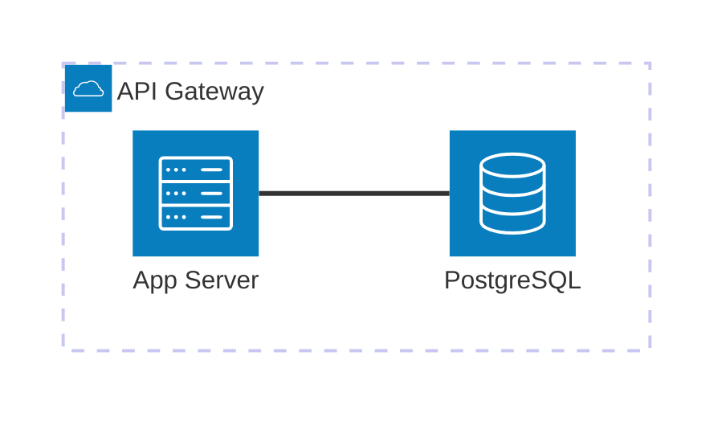

# Architecture (`architecture-beta`)

Maps structural layouts and cloud topologies. Services are nested within groups, and edges define directional relationships.

* **Anti-patterns:** Flat topologies without bounded context groups; confusing L/R/T/B attachment points causing overlapping lines.
* **Telemetry metrics:** Node-to-group ratio (detects unorganized monolithic architectures).
* **Other design options:** Progressive disclosure (use `click` events to drill down into sequence diagrams for specific services).