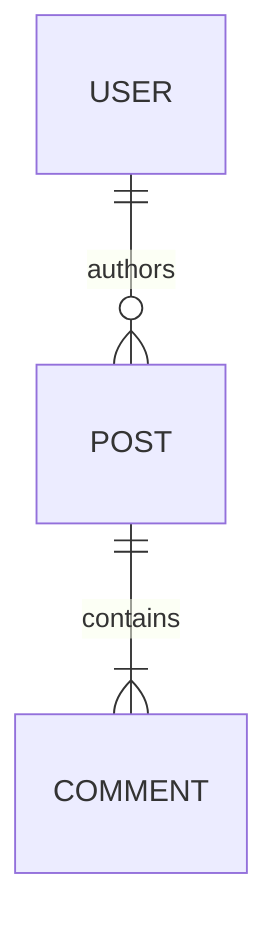

# Entity Relationship (`erDiagram`)

Defines data structures and cardinality.

* **Anti-patterns:** Including every table column instead of just primary/foreign keys and core domain fields.
* **Telemetry metrics:** Render parsing success rate (cardinality syntax `||--o{` is highly prone to LLM hallucination).
* **Other design options:** Map bounded contexts to individual ER diagrams rather than one massive enterprise schema.