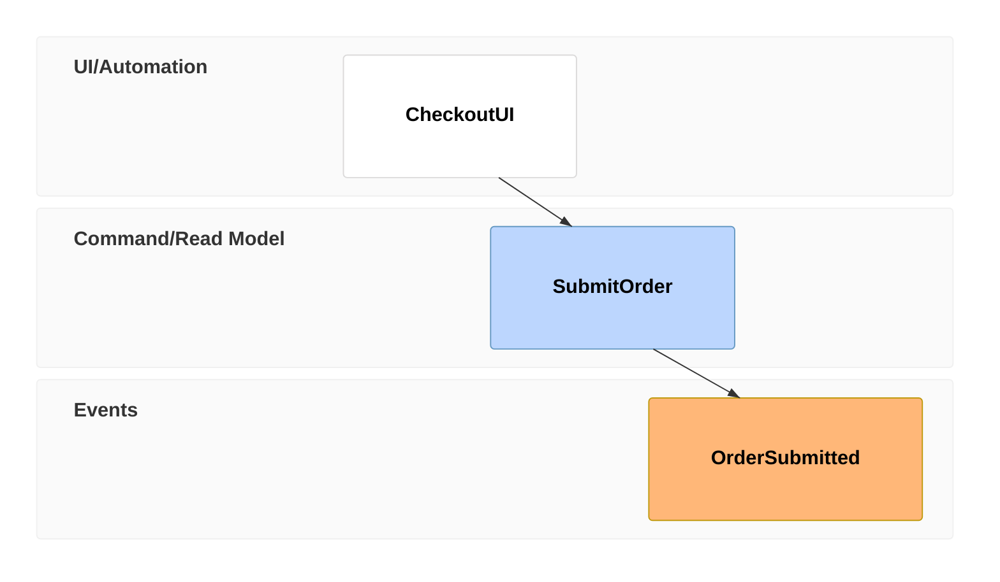

# Event Modeling (`eventmodeling`)

Plots information flow over time across UI, Commands, and Events.

* **Anti-patterns:** Dropping the time-frame (`tf`) prefixes which breaks the chronological rendering.
* **Telemetry metrics:** Token complexity density (event modeling syntax is terse, so large payloads indicate injected data).
* **Other design options:** Integrate JSON payload blocks to define the exact shape of commands and events.