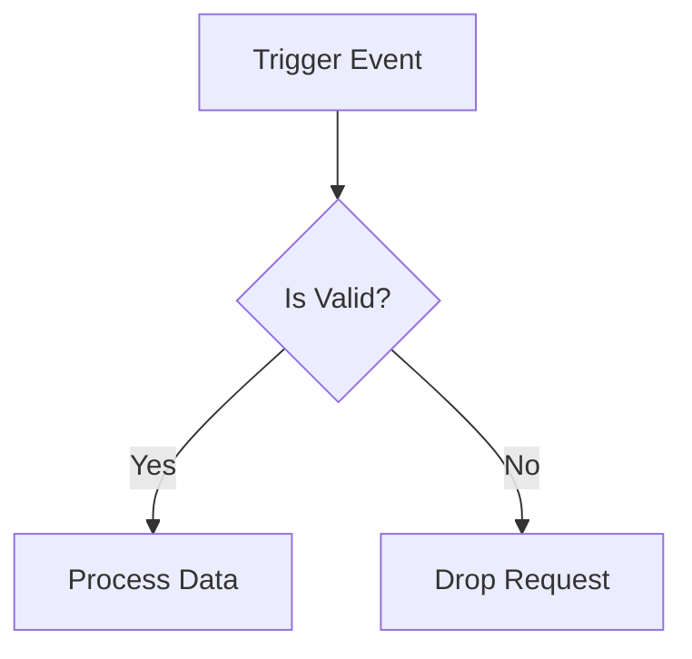

# Workflow (`flowchart TD`)

Visualizes decision trees and procedural logic.

* **Anti-patterns:** Monolithic graphs with 50+ nodes; bypassing `subgraph` usage for distinct logical phases.
* **Telemetry metrics:** Diagram generation latency (flowcharts scale poorly with high node counts).
* **Other design options:** Top-Down (`TD`) vs Left-Right (`LR`) layout toggles depending on the aspect ratio of the viewing platform.