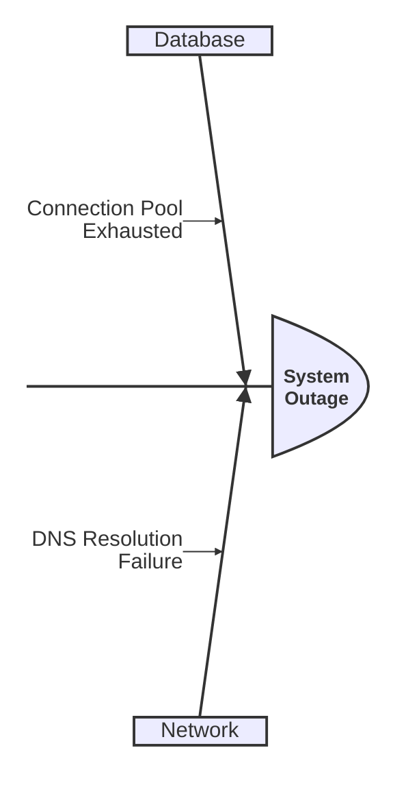

# Cause and Effect (`ishikawa-beta`)

Fishbone diagram for root cause analysis, driven by indentation.

* **Anti-patterns:** Using tabs instead of spaces; mixing indentation levels (must strictly use 4 spaces).
* **Telemetry metrics:** Depth of branch rendering success (deep nesting often fails).
* **Other design options:** Limit to 3 levels of depth for optimal readability.