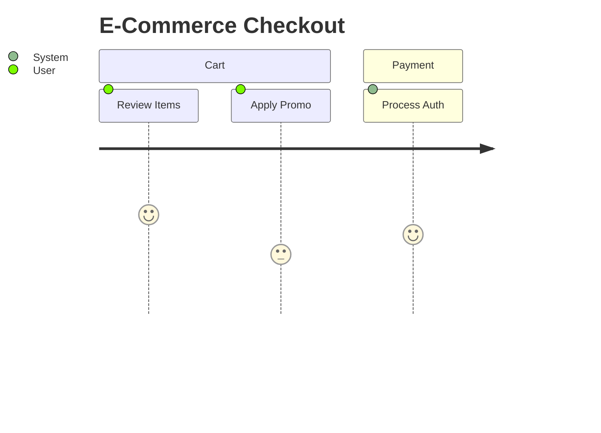

# User Journey (`journey`)

Maps user experience, assigning scores to specific actions across phases.

* **Anti-patterns:** Missing sections (phases); using non-numeric scores.
* **Telemetry metrics:** Parse failure rate on actor declarations.
* **Other design options:** Map alternative failure paths as separate journeys rather than cramming them into the happy path.