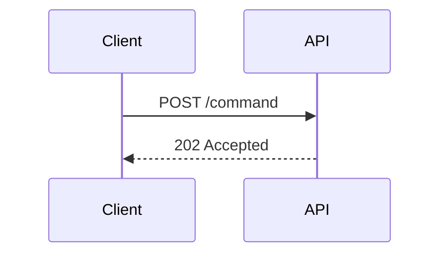

# Sequence Interaction (`sequenceDiagram`)

Tracks chronological API calls, outbox messages, or component interactions.

* **Anti-patterns:** Missing `autonumber` for complex traces; forgetting to use `activate`/`deactivate` for execution lifespans.
* **Telemetry metrics:** Actor count (more than 5 actors usually indicates the trace needs to be split).
* **Other design options:** Use `box` to group actors into their respective bounded contexts or physical servers.
