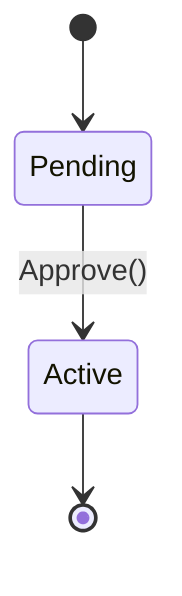

# State Behavior (`stateDiagram-v2`)

Models the states and transitions of a system or object.

* **Anti-patterns:** Self-transitions on composite states (causes TypeError); deep nesting of states.
* **Telemetry metrics:** Transition count per state (highlights overly complex god-states).
* **Other design options:** Fallback to standard flowcharts with subgraphs if the environment renderer crashes on composite states.