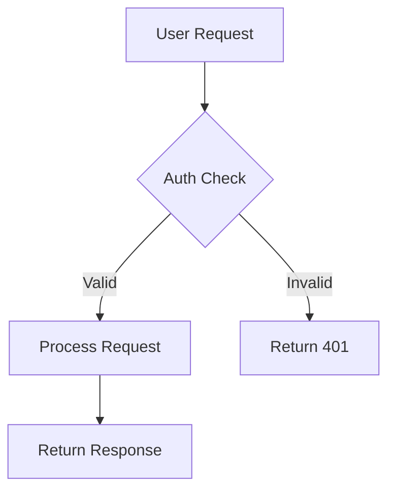

# Project README Documentation

## Environment Scope

**write+validate** — Writes/updates README.md and related docs. Runs `npx mmdc -i README.md -o /tmp/test.svg` to validate Mermaid diagrams render. Does NOT deploy, build, or modify source code.

## Workflow

1. **Check Existing State** — Does README.md exist? If yes, read it and determine if this is an add (fill gaps) or refactor (update stale content) operation.
2. **Detect Changes** — If triggered by pre-push: run `git diff -w --ignore-blank-lines -G'[^[:space:]///*#]' @{push}.. -- . ':!*.md'`. If no substantive changes, report "docs up to date" and stop.
3. **Gather Context** — Read source files, configs, and package manifests relevant to what changed. Bounded: read only files that changed or that the README references.
4. **Generate Spec** — List: sections to add/update/remove, diagrams to create, stale content to delete. Present to user.
5. **Await Approval** — Do NOT modify README until user confirms the spec.
6. **Implement** — Write/update README sections following the structure in `steering/conventions/documentation.md`. Generate diagrams first.
7. **Verify** — Run `npx mmdc -i README.md -o /tmp/readme-diagrams.svg -e svg`. If Mermaid syntax errors, enter failure loop.
8. **Date** — Update "Last updated" line with today's date and `git config user.name`.

### Failure Recovery (max 3 retries)

7a. Read mmdc error output → identify which diagram has syntax errors
7b. Fix the specific Mermaid block
7c. Re-run mmdc validation
7d. After 3 failures → show errors to user, ask for guidance

### Rollback

If user cancels mid-implementation:
1. `git checkout -- README.md` to restore previous version
2. Revert any other doc files modified
3. Confirm with `git diff --stat`

## Trigger Conditions

This skill activates when:
1. User says **"refactor project documentation"** or **"add project documentation"**
2. Before `git push` to remote or branch change — IF substantive changes detected

### Change Detection

```bash
git diff -w --ignore-blank-lines -G'[^[:space:]///*#]' @{push}.. -- . ':!*.md'
```

If this returns results → README must be reviewed and updated. See `steering/conventions/documentation.md` for the full git hook script.

## Mermaid Diagrams

Every README needs at least one diagram. Choose by content type. See `steering/conventions/documentation.md` for all templates and validation commands.



## Behavior: Adding Documentation

1. Scan source files, configs, and existing docs (bounded)
2. Identify public APIs, services, data models, workflows
3. **Generate diagrams FIRST** — they drive the narrative
4. Add code examples matching current implementation
5. Date the document: `git config user.name` + today's date
6. Link to relevant steering/skill/agent files in Related section
7. Validate Mermaid diagrams render

## Behavior: Refactoring Documentation

1. Diff current code against what README describes
2. **Remove** references to dead code, deleted files, deprecated APIs
3. **Update** diagrams to reflect current architecture
4. **Update** dependency table (check package.json/pyproject.toml/go.mod)
5. **Update** test commands if runner or structure changed
6. **Update** build/deploy if commands or targets changed
7. Update "Last updated" date and author
8. Validate all Mermaid diagrams still render

See `steering/conventions/documentation.md` for staleness detection rules.

## Guardrails

- NEVER add documentation without validating Mermaid diagrams render
- NEVER leave stale references to dead code, removed APIs, or uninstalled dependencies
- NEVER skip the Architecture section — every README needs at least one diagram
- NEVER document aspirational features — only document what currently exists
- NEVER expose secrets, tokens, or credentials in documentation examples
- NEVER skip the "Last updated" date — every modification must be dated

## References

- `steering/conventions/documentation.md` — README structure template, Mermaid diagram examples, validation commands, git hook script
- `steering/orchestration/local.md` — Project structure, Tilt topology, deploy patterns
- `steering/preferences/stack/react/dependency-graph.md` — React stack documentation
- `steering/preferences/stack/nextjs/overview.md` — Next.js stack documentation
- `skills/react-components.md` — Component scaffolding (document new components)
- `skills/backend-rest-api-feature.md` — API endpoint docs
- `skills/backend-cron-feature.md` — Background job docs
- `skills/deploy.md` — Deploy commands to document
- `skills/test.md` — Test commands to document
