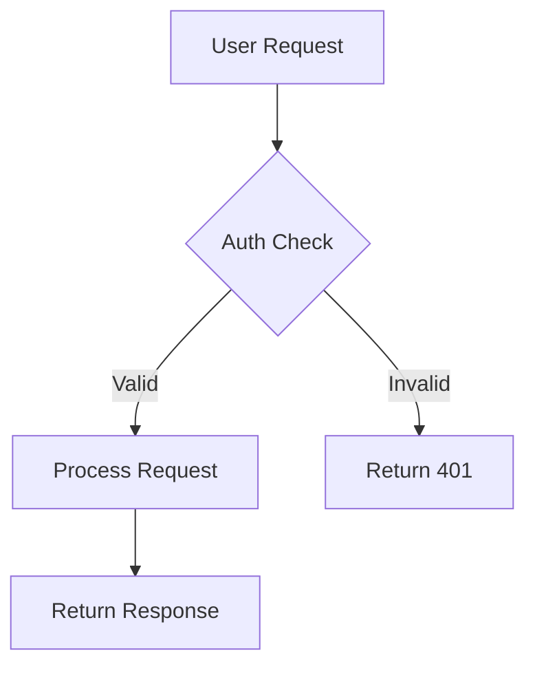
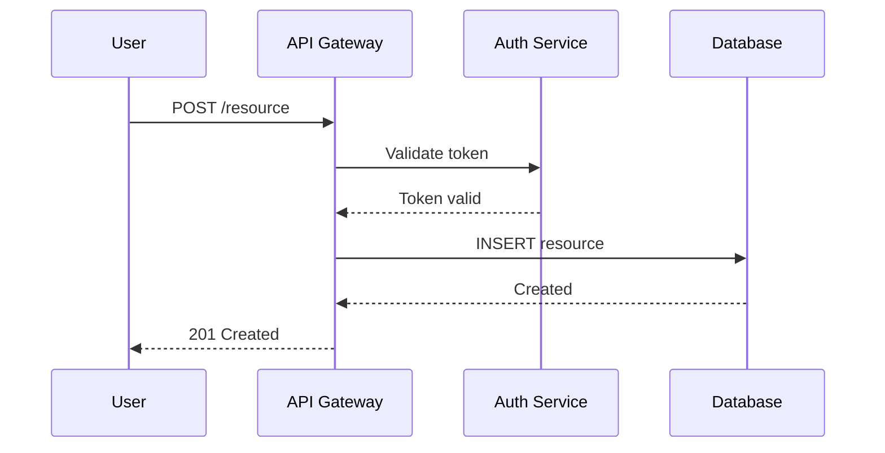
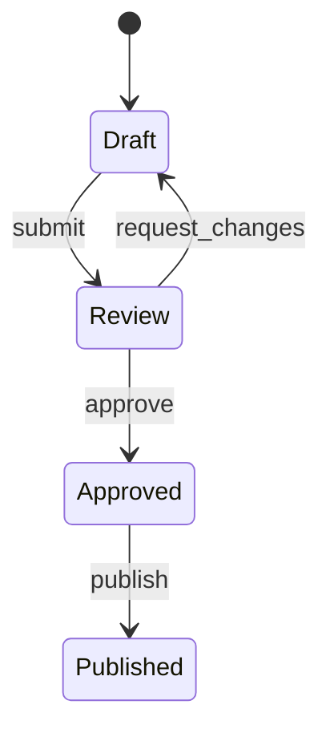
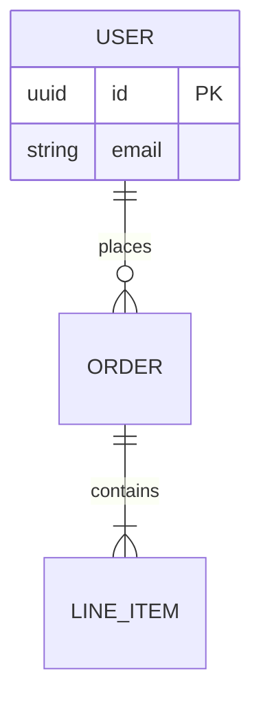
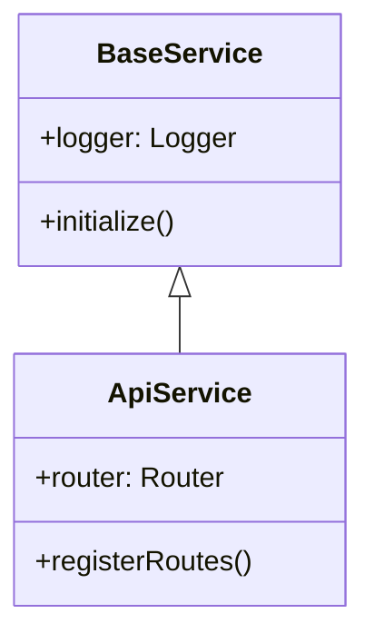

# Project Documentation Patterns

## Why This Exists

Documentation standards, Mermaid diagram templates, README structure, and staleness rules are reference material that multiple skills and agents need. Consolidating them here keeps the `general-documentation` skill focused on workflow execution while providing a single source of truth for documentation conventions across all projects.

## README Structure (Required Order)

```markdown
# Project Name

> One-line description

**Last updated:** YYYY-MM-DD | **Author:** <git user.name>

## Architecture
<!-- Mermaid diagrams — ALWAYS first visual content -->

## What It Does

## Dependencies
<!-- Table: dependency | version | purpose -->

## Installation

## Usage
### Use Cases
<!-- For each: description → diagram → code example -->

## Build

## Deploy

## Testing
### Unit Tests
### Integration Tests
### Performance Tests

## Related
<!-- Links to steering, skill, and agent files -->
```

## Mermaid Diagram Templates

Diagrams are the FIRST thing to add. Every README needs at least one. Choose diagram type by content:

### Flowchart — System/Feature Flow



**Use for:** request flows, decision trees, build pipelines, deployment flows.

### Sequence — Service Interactions



**Use for:** API flows, multi-service communication, OAuth flows.

### State Diagram — Lifecycle



**Use for:** order states, deployment stages, job processing.

### Entity Relationship — Data Models



**Use for:** database schema, domain models, API resource relationships.

### Class Diagram — Code Architecture



**Use for:** service architecture, inheritance, module dependencies.

## Diagram Validation

```bash
npx @mermaid-js/mermaid-cli --version || npm install -g @mermaid-js/mermaid-cli
npx mmdc -i README.md -o /tmp/readme-diagrams.svg -e svg
```

If mmdc exits non-zero, fix syntax before committing.

## Staleness Detection

Remove docs for:

- Functions/classes that no longer exist
- API endpoints that were removed
- Dependencies that were uninstalled
- Config options no longer supported
- Diagrams that don't match current flow

## Git Hook Integration

```bash
#!/bin/bash
CHANGED=$(git diff -w --ignore-blank-lines -G'[^[:space:]///*#]' @{push}.. -- . ':!*.md' 2>/dev/null)
if [ -n "$CHANGED" ]; then
  README_CHANGED=$(git diff --name-only @{push}.. -- README.md 2>/dev/null)
  if [ -z "$README_CHANGED" ]; then
    echo "⚠️  Substantive code changes detected but README.md not updated."
    echo "   Run: 'refactor project documentation' or update manually."
    exit 1
  fi
fi
```

## Change Detection

```bash
git diff -w --ignore-blank-lines -G'[^[:space:]///*#]' @{push}.. -- . ':!*.md'
```

This command detects substantive code changes since the last push by:

- `-w` — ignoring whitespace-only changes
- `--ignore-blank-lines` — skipping blank line additions/removals
- `-G'[^[:space:]///*#]'` — only matching diffs that add/remove lines with non-whitespace, non-comment content
- `@{push}..` — comparing against what's already pushed to the remote tracking branch
- `-- . ':!*.md'` — checking all files except markdown (documentation itself)

If this returns results → README must be reviewed and updated.
