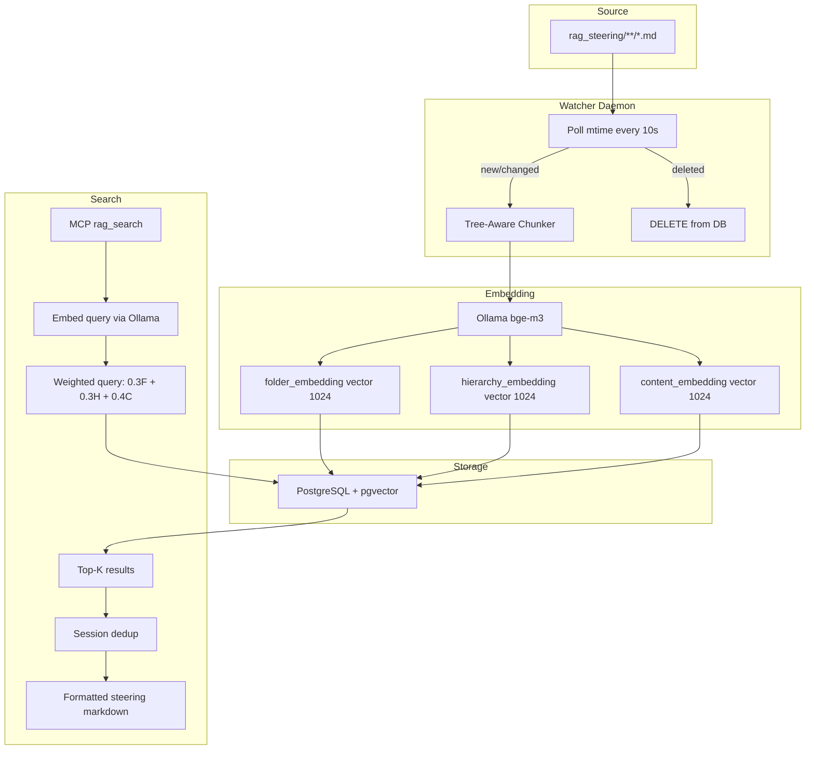

# RAG Vector Steering — Architecture & Behavior

## Why This Exists

Large steering documents (1,000-4,000+ lines) cannot be loaded as always-in-context without consuming excessive tokens. This document defines how those documents are decomposed, vectorized, stored, and retrieved via a semantic search MCP server -- providing relevant steering context on-demand with minimal token cost.

---

## Architecture Overview



---

## Document Decomposition Strategy

### Heading Hierarchy as a Tree

Every markdown file is a tree rooted at its filename. Subsections are identified by heading depth:

```
# .NET Architecture Patterns              -- Level 1 (document root heading)
  ## EF Core vs Dapper                    -- Level 2 (category)
    ### Decision Criteria                 -- Level 3 (topic)
    ### EF Core Patterns                  -- Level 3
      #### Projection-First Rule          -- Level 4 (specific pattern)
    ### Dapper Patterns                   -- Level 3
  ## CQRS                                 -- Level 2
    ### The CQRS Spectrum                 -- Level 3
    ### Implementation Patterns           -- Level 3
      #### MediatR-Based                  -- Level 4
```

### Chunk Boundaries

A chunk is one heading section INCLUDING its direct content but EXCLUDING child sections:

| Field | Source | Example |
|-------|--------|---------|
| `folder_path` | Subdirectory in rag_steering | `csharp` |
| `source_file` | Relative path from rag_steering root | `csharp/efcore-query-patterns.md` |
| `hierarchy_path` | Concatenation of ancestor headings | `EF Core vs Dapper > EF Core Patterns > Projection-First Rule` |
| `heading` | This section heading | `Projection-First Rule` |
| `content` | Text under this heading (before next same-or-higher heading) | The markdown body |
| `depth` | Heading level (1-4) | `4` |

### Chunking Rules

1. Split at every heading (`#`, `##`, `###`, `####`) -- each becomes its own chunk
2. Inherit hierarchy -- each chunk knows its full ancestor path via a stack
3. Content belongs to the NEAREST heading above it
4. Code blocks (triple backtick fences) are atomic -- never split mid-fence
5. Max chunk size: 1024 tokens (chars/4 approximation) -- split by paragraph with overlap if exceeded
6. Min chunk size: 50 tokens -- merge into parent if below threshold
7. YAML frontmatter is stripped before processing

---

## Triple-Vector Strategy

Each chunk gets THREE embeddings computed by Ollama (bge-m3, 1024 dimensions):

### 1. Folder Vector (Domain Signal)

**Input text:** `"{folder_path} {filename_stem}"`

**Example:** `"csharp efcore-query-patterns"`

**Purpose:** Enables search to find chunks by technology domain even when the query uses different terminology. A query "Entity Framework performance" matches `csharp efcore-*` folders even without exact keyword overlap.

### 2. Hierarchy Vector (Topic Signal)

**Input text:** The full `hierarchy_path`

**Example:** `"EF Core vs Dapper > EF Core Patterns > Projection-First Rule"`

**Purpose:** Enables search to find chunks by structural position in the knowledge tree. A query "how should I select data with Entity Framework" matches the hierarchy even if content talks about "AsNoTracking" and "Select()".

### 3. Content Vector (Detail Signal)

**Input text:** `"{heading}\n\n{content[:800 chars]}"`

**Example:** `"Projection-First Rule\n\nNever load full entities for read-only operations..."`

**Purpose:** Enables matching on specific patterns, code snippets, error messages, and anti-pattern signatures within a section.

### Why Three Vectors?

| Query Type | Primary Match | Example |
|-----------|--------------|---------|
| Domain-level | Folder | "C# caching patterns" |
| Topic/structural | Hierarchy | "Tell me about CQRS patterns" |
| Specific code/pattern | Content | "how to prevent N+1 with Include" |
| Mixed | All three contribute | "EF Core concurrency with RowVersion" |

---

## Search Weighting

```
final_score = (0.3 * folder_similarity) + (0.3 * hierarchy_similarity) + (0.4 * content_similarity)
```

| Vector | Weight | Rationale |
|--------|--------|-----------|
| Folder | 0.3 | Domain filtering -- ensures technology-specific results surface first |
| Hierarchy | 0.3 | Topic relevance -- correct section of the right document |
| Content | 0.4 | Precision -- the most semantically precise match wins when content is specific |

### Search Flow

```
1. User query --> embed with Ollama --> query_vector (384 dims)
2. Query pgvector with same vector against all 3 columns:
   - folder_embedding <=> query_vector
   - hierarchy_embedding <=> query_vector
   - content_embedding <=> query_vector
3. Compute weighted combined_score per row
4. Filter: combined_score >= 0.3 (minimum threshold)
5. Exclude: chunk IDs already returned this session
6. Return: top_k results formatted as steering markdown
```

---

## Database Schema

```sql
CREATE TABLE chunks (
    id                  SERIAL PRIMARY KEY,
    source_file         TEXT NOT NULL,
    folder_path         TEXT NOT NULL,
    chunk_index         INTEGER NOT NULL,
    hierarchy_path      TEXT NOT NULL,
    heading             TEXT NOT NULL,
    content             TEXT NOT NULL,
    depth               INTEGER NOT NULL,
    token_count         INTEGER NOT NULL,
    folder_embedding    vector(1024) NOT NULL,
    hierarchy_embedding vector(1024) NOT NULL,
    content_embedding   vector(1024) NOT NULL,
    file_modified_at    TIMESTAMPTZ NOT NULL,
    created_at          TIMESTAMPTZ DEFAULT NOW(),
    UNIQUE(source_file, chunk_index)
);

-- 3 HNSW indexes (one per vector column)
CREATE INDEX ix_chunks_folder_emb ON chunks
    USING hnsw (folder_embedding vector_cosine_ops);
CREATE INDEX ix_chunks_hierarchy_emb ON chunks
    USING hnsw (hierarchy_embedding vector_cosine_ops);
CREATE INDEX ix_chunks_content_emb ON chunks
    USING hnsw (content_embedding vector_cosine_ops);

-- Ingestion state (timestamp tracking)
CREATE TABLE ingest_state (
    source_file      TEXT PRIMARY KEY,
    file_modified_at TIMESTAMPTZ NOT NULL,
    chunk_count      INTEGER NOT NULL,
    ingested_at      TIMESTAMPTZ DEFAULT NOW()
);
```

---

## Watcher Daemon Behavior

### File Detection (Timestamp-Based)

The daemon polls `rag_steering/` recursively every N seconds (default: 10):

```
for each .md file in rag_steering/**/:
    current_mtime = file.stat().st_mtime
    stored_mtime = ingest_state[source_file].file_modified_at

    if file is new (not in ingest_state):
        --> INGEST (chunk + embed + insert)
    elif current_mtime > stored_mtime:
        --> RE-INGEST (delete old + chunk + embed + insert)
    else:
        --> SKIP (unchanged)

for each source_file in ingest_state:
    if file no longer exists on disk:
        --> DELETE (remove all chunks + state record)
```

### Processing Pipeline (Per File)

```
1. Read markdown file
2. Strip frontmatter
3. Parse heading tree --> identify hierarchy paths
4. Split into chunks (by heading, with size limits)
5. For each chunk generate 3 embeddings via Ollama:
   - folder_embedding: "{folder_path} {filename_stem}"
   - hierarchy_embedding: hierarchy_path
   - content_embedding: "{heading}\n\n{content[:800]}"
6. BEGIN TRANSACTION
7. DELETE FROM chunks WHERE source_file = X
8. INSERT all new chunks
9. UPSERT ingest_state
10. COMMIT
```

### Failure Handling

- Ollama unreachable: log error, skip file, retry next cycle
- Single chunk embed failure: use zero vector placeholder, log warning
- Database unreachable: log error, retry entire cycle next poll
- Transaction ensures no partial state: DELETE + INSERT is atomic

---

## MCP Server Tools

### rag_search

| Parameter | Type | Default | Description |
|-----------|------|---------|-------------|
| `query` | string | required | Natural language search query |
| `top_k` | integer | 5 | Results to return (1-10) |
| `source_filter` | string | none | Filter by folder_path (e.g., "csharp", "mssql") |
| `depth_max` | integer | none | Max heading depth (1-4) |

**Returns:** Formatted markdown with hierarchy path + content per chunk. Session-deduplicated.

### rag_status

**Returns:** Ollama connectivity, DB stats (per-folder chunk counts), session dedup count.

---

## Search Scenarios -- Document Context Mapping

| Search Query Pattern | Expected Folder | Expected Hierarchy Match |
|---------------------|-----------------|------------------------|
| "EF Core N+1" / "Include" / "lazy loading" | csharp | EF Core > Anti-Patterns > N+1 |
| "Dapper SQL injection" / "connection pool" / "connection leak" | csharp | Dapper > Anti-Patterns |
| "CQRS command handler" / "MediatR" / "pipeline behavior" | csharp | CQRS > Implementation Patterns |
| "SQL Server index" / "missing index" / "SARGable" | mssql | Indexing Strategy |
| "execution plan" / "key lookup" / "parameter sniffing" | mssql | Execution Plans / Performance Troubleshooting |
| "APPLY vs JOIN" / "CROSS APPLY" / "top-N per group" | mssql | APPLY vs JOIN |
| "window functions" / "ROW_NUMBER" / "LAG" / "running total" | mssql | Window Functions |
| "clean architecture" / "vertical slice" / "modular monolith" | csharp | Clean Architecture vs Vertical Slice |
| "Polly" / "circuit breaker" / "resilience" / "retry" | csharp | Resilience Patterns |
| "outbox pattern" / "messaging" / "event publishing" | csharp | Resilience Patterns > Outbox |
| "thread safety" / "SemaphoreSlim" / "ConcurrentDictionary" | csharp | Thread Safety |
| "DbContext lifetime" / "scoped vs singleton" / "captive dependency" | csharp | Thread Safety > DI Lifetime |
| "Always Encrypted" / "PHI" / "search index" | csharp | EF Core > PHI / Always Encrypted |
| "Next.js middleware" / "edge" / "A/B testing" / "geolocation" | nextjs | Middleware |
| "ISR" / "revalidation" / "Server Actions" / "route handlers" | nextjs | Data Patterns |
| "serverless" / "Lambda" / "Azure Functions" / "cold start" | csharp | Serverless |
| "multi-tenancy" / "row-level filter" / "tenant isolation" | csharp | Multi-Tenancy Patterns |
| "DDD" / "bounded context" / "aggregate" / "value object" | csharp | Domain-Driven Design |
| "decorator pattern" / "Scrutor" / "cross-cutting" | csharp | Decorator Pattern |
| "CORS" / "security headers" / "JWT" / "rate limiting" | csharp | CORS and Security |
| "temp table vs table variable" / "CTE" | mssql | CTEs and Temp Tables |
| "locking" / "deadlock" / "RCSI" / "isolation level" | mssql | Locking and Concurrency |
| "batch delete" / "pagination" / "MERGE" / "upsert" | mssql | Quick Reference |
| "columnstore" / "filtered index" / "covering index" | mssql | Index Type Decision Hierarchy |
| "DMV" / "wait stats" / "query store" / "blocking" | mssql | Performance Troubleshooting |
| "compiled query" / "EF hot path" / "expression tree" | csharp | EF Core > Compiled Queries |
| "ExecuteUpdate" / "bulk insert" / "SqlBulkCopy" | csharp | EF Core > Mutation Patterns |
| "optimistic concurrency" / "RowVersion" / "pessimistic lock" | csharp | EF Core > Concurrency |
| "gRPC" / "GraphQL" / "SignalR" / "API style" | csharp | API Communication Patterns |
| "background service" / "Channel" / "producer consumer" | csharp | Thread Safety > Background Processing |
| "Minimal APIs" / "endpoint grouping" / "Carter" | csharp | API Communication Patterns > REST |
| "EF Core projection" / "Select" / "AsNoTracking" | csharp | EF Core > SELECT Patterns |
| "Dapper multi-mapping" / "QueryMultiple" / "splitOn" | csharp | Dapper > Anti-Patterns |

---

## Subfolder Conventions

Place files in `rag_steering/` organized by technology domain:

```
rag_steering/
+-- csharp/                  -- .NET / C# / EF Core / Dapper
+-- mssql/                   -- SQL Server query patterns
+-- nextjs/                  -- Next.js App Router, middleware, data
+-- react/                   -- React hooks, components (if added)
+-- node/                    -- Node.js patterns (if added)
+-- security/                -- Cross-cutting security (if added)
```

**Rules:**
- One folder per technology domain
- Filename should be descriptive: `efcore-query-patterns.md` not `doc1.md`
- The folder name becomes part of the folder vector -- keep it short and meaningful
- Files at the root of `rag_steering/` (no subfolder) get `folder_path = ""`

---

## Ollama Configuration

| Setting | Value | Notes |
|---------|-------|-------|
| Model | `bge-m3` | 1024 dimensions, top MTEB scorer, excellent on code/technical text |
| Host | Windows Docker Desktop | NOT WSL2 -- runs natively on Windows |
| URL | `OLLAMA_BASE_URL` (default `http://localhost:11434`) | WSL2 reaches Windows localhost |
| Container access | `http://host.docker.internal:11434` | Docker Desktop networking |
| API endpoint | `POST /api/embeddings` | Body: `{"model": "bge-m3", "prompt": "..."}` |

### Pull Command (Windows)

```powershell
ollama pull bge-m3
```

---

## Session Deduplication

The MCP server process persists for the lifetime of one agent conversation:

```
Session key: os.getppid() (parent PID = MCP server process)
Storage: /tmp/rag_session_{ppid}.json
Content: {"returned_ids": [1, 5, 23, 44, ...]}
```

**Behavior:**
- First call: returns top_k best matches
- Second call (different topic): excludes previously returned IDs, finds fresh chunks
- Same topic again: returns "No NEW results (N chunks returned this session)"
- New conversation: MCP server restarts, clean session

---

## File Lifecycle in rag_steering/

| Action | Watcher Response |
|--------|-----------------|
| New `.md` file placed in subfolder | Chunk, embed (3 vectors), insert. Record in ingest_state. |
| Existing file modified (mtime changes) | Delete old chunks, re-chunk, re-embed, insert. Update ingest_state. |
| File deleted from disk | Delete all chunks for that source_file. Remove from ingest_state. |
| Non-`.md` file | Ignored |
| File with unchanged mtime | Skipped |
| Subfolder created (empty) | Ignored until .md files appear |

---

## Environment Variables

| Variable | Default | Purpose |
|----------|---------|---------|
| `OLLAMA_BASE_URL` | `http://localhost:11434` | Ollama server (Windows Docker) |
| `RAG_EMBEDDING_MODEL` | `bge-m3` | Ollama model for embeddings |
| `RAG_DB_HOST` | `localhost` | PostgreSQL host |
| `RAG_DB_PORT` | `5433` | PostgreSQL port |
| `RAG_DB_USER` | `rag` | PostgreSQL user |
| `RAG_DB_PASSWORD` | `rag_local` | PostgreSQL password |
| `RAG_DB_NAME` | `rag` | PostgreSQL database |
| `RAG_STEERING_DIR` | `../rag_steering` | Watch directory path |
| `RAG_POLL_INTERVAL` | `10` | Seconds between watch polls |
| `RAG_FOLDER_WEIGHT` | `0.3` | Weight for folder vector in search |
| `RAG_HIERARCHY_WEIGHT` | `0.3` | Weight for hierarchy vector in search |
| `RAG_CONTENT_WEIGHT` | `0.4` | Weight for content vector in search |
| `RAG_MIN_SIMILARITY` | `0.3` | Minimum combined score threshold |

---

## References

- `rag/init.sql` — Database schema (triple-vector)
- `rag/chunker.py` — Tree-aware markdown chunker
- `rag/embedder.py` — Ollama embedding client
- `rag/ingest.py` — Watcher daemon
- `rag/search_cli.py` — Weighted search CLI
- `rag/docker-compose.yml` — Infrastructure (PostgreSQL + pgvector + watcher)
- `mcp/mcp-scripts/servers/rag.ts` — MCP server entry point
- `agents/dotnet-dev.json` — Primary agent consuming RAG
- `agents/general-dev.json` — Secondary agent consuming RAG
