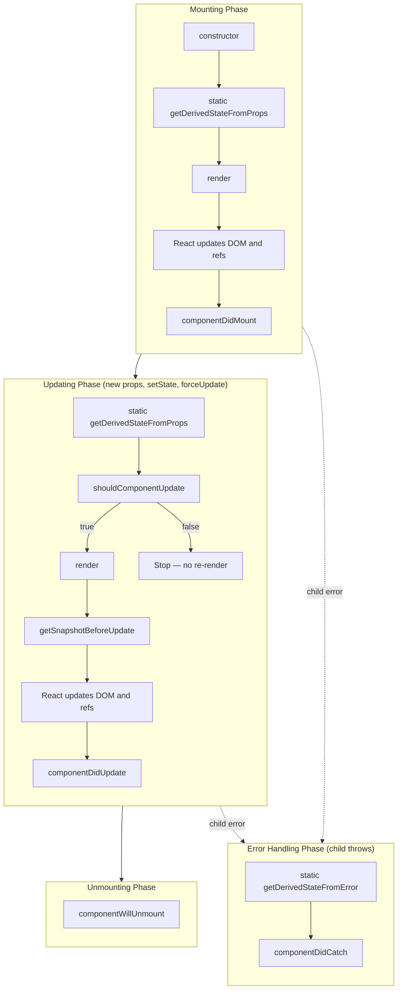

# Legacy React Class Component Lifecycle

## Why This Exists

This document serves as a reference for understanding and maintaining React class components in legacy codebases. It is not connected to any skill or agent — it exists purely for documentation and support when working with pre-hooks React code.

Modern React uses function components with hooks exclusively. Class components remain relevant only for:
- Error boundaries (`getDerivedStateFromError` / `componentDidCatch` have no hook equivalent)
- Maintaining existing class-based codebases where a full rewrite isn't justified
- `getSnapshotBeforeUpdate` (no hook equivalent)

---

## Lifecycle Diagram



---

## Lifecycle Methods — Detailed Reference

### Mounting Phase

#### `constructor(props)`

Called before the component mounts. The only lifecycle method that receives props as a direct argument.

| Do | Don't |
|----|-------|
| Initialize `this.state` directly (no `setState`) | Call `setState()` |
| Bind event handler methods to `this` | Perform side effects (fetch, subscribe) |
| Set up instance variables (abort controllers, refs) | Copy props into state without a reason |

```tsx
constructor(props: MyProps) {
  super(props) // Required — must call before accessing this.props
  this.state = { count: 0, data: null }
  this.handleClick = this.handleClick.bind(this)
}
```

#### `static getDerivedStateFromProps(props, state)`

Called on every render — both mount and update. Must be pure. Returns an object to merge into state, or `null` to change nothing.

| Do | Don't |
|----|-------|
| Sync state to props when state depends on prop transitions | Use as a data-fetching trigger |
| Return `null` when no state change is needed | Access `this` (it's static) |
| Keep logic minimal and deterministic | Perform side effects |

**You probably don't need this.** Most use cases are better served by fully controlled components or memoization.

#### `render()`

The only required method. Must be pure — same props + state = same output.

| Do | Don't |
|----|-------|
| Return JSX, arrays, fragments, strings, numbers, booleans, `null`, portals | Call `setState()` |
| Read from `this.props` and `this.state` | Modify the DOM directly |
| Conditionally render based on state | Perform side effects (fetch, subscribe, timers) |

#### `componentDidMount()`

Called once after the component's first render is committed to the DOM.

| Do | Don't |
|----|-------|
| Fetch data from APIs | Forget to clean up in `componentWillUnmount` |
| Set up subscriptions (WebSocket, event listeners) | Call `setState` synchronously without a DOM measurement reason |
| Initialize third-party libraries needing DOM nodes | Put logic that should run on every update here |
| Measure DOM elements (getBoundingClientRect) | Block with synchronous heavy computation |
| Start timers / intervals | |

---

### Updating Phase

#### `shouldComponentUpdate(nextProps, nextState)`

Called before re-rendering when new props or state arrive. Return `false` to skip the render.

| Do | Don't |
|----|-------|
| Compare specific props/state for shallow equality | Use for correctness logic (only performance) |
| Return `true` by default when unsure | Perform side effects |
| Consider `PureComponent` instead for automatic shallow comparison | Return `false` for updates that should render |

#### `getSnapshotBeforeUpdate(prevProps, prevState)`

Called right before DOM mutations are applied. Return value is passed as the third argument to `componentDidUpdate`.

| Do | Don't |
|----|-------|
| Capture scroll position before DOM changes | Perform side effects |
| Read DOM measurements that will change | Call `setState` |
| Return a serializable snapshot value | Use for anything other than DOM reading |

```tsx
getSnapshotBeforeUpdate(prevProps: Props, prevState: State): number | null {
  if (prevState.messages.length < this.state.messages.length) {
    const list = this.listRef.current
    return list ? list.scrollHeight - list.scrollTop : null
  }
  return null
}
```

#### `componentDidUpdate(prevProps, prevState, snapshot)`

Called after every re-render (not on initial mount).

| Do | Don't |
|----|-------|
| Fetch new data when relevant props change | Call `setState` unconditionally (infinite loop) |
| Update third-party libraries with new data | Forget the condition guard |
| Operate on DOM using snapshot value | Use for initial setup (that's `componentDidMount`) |
| Always wrap in a condition: `if (prevProps.id !== this.props.id)` | Perform work unrelated to what changed |

```tsx
componentDidUpdate(prevProps: Props, _prevState: State, snapshot: number | null): void {
  // Data re-fetch on prop change
  if (prevProps.userId !== this.props.userId) {
    this.fetchUserData()
  }

  // Scroll restoration using snapshot
  if (snapshot !== null && this.listRef.current) {
    this.listRef.current.scrollTop = this.listRef.current.scrollHeight - snapshot
  }
}
```

---

### Unmounting Phase

#### `componentWillUnmount()`

Called immediately before the component is destroyed.

| Do | Don't |
|----|-------|
| Cancel pending API requests (AbortController) | Call `setState` — component is dead |
| Remove event listeners | Start new async work |
| Clear timers / intervals | Leave subscriptions active (memory leak) |
| Disconnect WebSockets | |
| Clean up third-party library instances | |

```tsx
componentWillUnmount(): void {
  this.abortController?.abort()
  clearInterval(this.pollInterval)
  window.removeEventListener('resize', this.handleResize)
}
```

---

### Error Handling Phase

#### `static getDerivedStateFromError(error)`

Called when a child component throws during rendering. Returns state update to display fallback UI.

| Do | Don't |
|----|-------|
| Return state to trigger fallback render | Perform side effects (logging) |
| Keep it pure and synchronous | Access `this` (it's static) |

#### `componentDidCatch(error, errorInfo)`

Called after a child error has been committed to the DOM.

| Do | Don't |
|----|-------|
| Log errors to monitoring (Sentry, DataDog) | Call `setState` for fallback UI (use `getDerivedStateFromError`) |
| Report error analytics | Swallow errors silently |
| Access `errorInfo.componentStack` for debugging | Try to recover by re-rendering the failing child |

```tsx
static getDerivedStateFromError(error: Error): Partial<State> {
  return { hasError: true, error }
}

componentDidCatch(error: Error, errorInfo: ErrorInfo): void {
  errorReportingService.captureException(error, {
    componentStack: errorInfo.componentStack,
  })
}
```

---

## Deprecated Methods (NEVER USE)

These were removed due to misuse causing bugs in async rendering (Concurrent Mode):

| Deprecated | UNSAFE Alias | Replacement |
|-----------|--------------|-------------|
| `componentWillMount` | `UNSAFE_componentWillMount` | `constructor` + `componentDidMount` |
| `componentWillReceiveProps` | `UNSAFE_componentWillReceiveProps` | `static getDerivedStateFromProps` or controlled component |
| `componentWillUpdate` | `UNSAFE_componentWillUpdate` | `getSnapshotBeforeUpdate` + `componentDidUpdate` |

The `UNSAFE_` prefix does NOT mean "dangerous to use" — it means "unsafe in Concurrent Mode" and is scheduled for removal. Do not introduce these in any code.

---

## Hook Equivalents (Quick Reference)

For teams planning migration from class to function components:

| Class Lifecycle | Hook Equivalent |
|----------------|-----------------|
| `constructor` (state init) | `useState(initialValue)` or `useReducer` |
| `constructor` (bind methods) | Arrow functions or `useCallback` |
| `componentDidMount` | `useEffect(() => { ... }, [])` |
| `componentDidUpdate` | `useEffect(() => { ... }, [deps])` |
| `componentWillUnmount` | `useEffect(() => { return () => cleanup }, [])` |
| `shouldComponentUpdate` | `React.memo(Component)` |
| `getDerivedStateFromProps` | Compute during render or `useMemo` |
| `getSnapshotBeforeUpdate` | No hook equivalent — class only |
| `getDerivedStateFromError` | No hook equivalent — class only |
| `componentDidCatch` | No hook equivalent — class only |
| Instance variables (`this.x`) | `useRef` |
| `this.setState` callback | `useEffect` reacting to state change |
| `forceUpdate` | `useReducer` dispatch with increment |

---

## Common Patterns

### Data Fetching with Abort

```tsx
class UserProfile extends Component<{ userId: string }, State> {
  private abortController: AbortController | null = null

  componentDidMount(): void {
    this.fetchUser()
  }

  componentDidUpdate(prevProps: Props): void {
    if (prevProps.userId !== this.props.userId) {
      this.fetchUser()
    }
  }

  componentWillUnmount(): void {
    this.abortController?.abort()
  }

  private async fetchUser(): Promise<void> {
    this.abortController?.abort()
    this.abortController = new AbortController()

    this.setState({ isLoading: true, error: null })
    try {
      const res = await fetch(`/api/users/${this.props.userId}`, {
        signal: this.abortController.signal,
      })
      if (!res.ok) throw new Error(`HTTP ${res.status}`)
      const user = await res.json()
      this.setState({ user, isLoading: false })
    } catch (err) {
      if (err instanceof DOMException && err.name === 'AbortError') return
      this.setState({
        error: err instanceof Error ? err.message : 'Unknown error',
        isLoading: false,
      })
    }
  }

  render() { /* ... */ }
}
```

### Error Boundary

```tsx
class ErrorBoundary extends Component<
  { children: ReactNode; fallback?: ReactNode },
  { hasError: boolean; error: Error | null }
> {
  constructor(props: Props) {
    super(props)
    this.state = { hasError: false, error: null }
  }

  static getDerivedStateFromError(error: Error) {
    return { hasError: true, error }
  }

  componentDidCatch(error: Error, errorInfo: ErrorInfo): void {
    console.error('ErrorBoundary caught:', error, errorInfo.componentStack)
  }

  render() {
    if (this.state.hasError) {
      return this.props.fallback ?? <h2>Something went wrong.</h2>
    }
    return this.props.children
  }
}
```

### Scroll Restoration with Snapshot

```tsx
class ChatMessages extends Component<Props, State> {
  private listRef = createRef<HTMLDivElement>()

  getSnapshotBeforeUpdate(prevProps: Props, prevState: State): number | null {
    if (prevState.messages.length < this.state.messages.length) {
      const list = this.listRef.current
      return list ? list.scrollHeight - list.scrollTop : null
    }
    return null
  }

  componentDidUpdate(_prevProps: Props, _prevState: State, snapshot: number | null): void {
    if (snapshot !== null && this.listRef.current) {
      this.listRef.current.scrollTop = this.listRef.current.scrollHeight - snapshot
    }
  }

  render() {
    return (
      <div ref={this.listRef} style={{ overflowY: 'auto', maxHeight: 400 }}>
        {this.state.messages.map((msg) => (
          <div key={msg.id}>{msg.text}</div>
        ))}
      </div>
    )
  }
}
```

---

## Anti-Patterns

- ❌ Using deprecated lifecycle methods (`componentWillMount`, `componentWillReceiveProps`, `componentWillUpdate`)
- ❌ Calling `setState` in `constructor`, `render`, or `componentWillUnmount`
- ❌ Unconditional `setState` in `componentDidUpdate` (infinite loop)
- ❌ Side effects in `render` or `getDerivedStateFromProps`
- ❌ Missing cleanup in `componentWillUnmount` (memory leaks)
- ❌ Copying props into state without a valid derivation reason (`state = { value: props.value }`)
- ❌ Using `forceUpdate` to work around broken state logic
- ❌ Deep inheritance hierarchies (`class extends class extends Component`)
- ❌ Mixing class and function component patterns inconsistently within a single module
- ❌ Using class components in new projects when hooks solve the same problem
