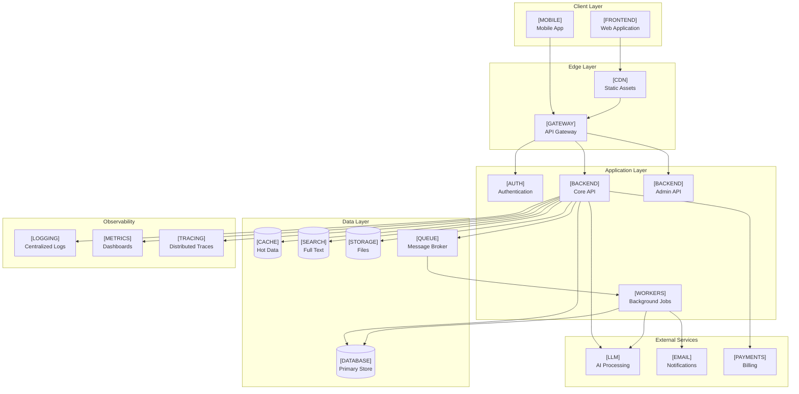
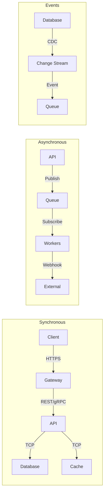

# Design & Architecture: [Project Name]

**Version:** Draft 1.0 | **Date:** YYYY-MM-DD | **Author:** [Architect]
**Status:** Draft — Stack Review Only
**Based on:** Scope Profile v[X], Gap Assessment v[X], Debate Outcomes

---

## Executive Summary

<!-- 3-5 sentences: What are we building, what technology did we select, and why does this architecture serve the scope requirements? -->

---

## Technology Stack (Selected)

| Layer | Technology | Version | Justification |
|-------|-----------|---------|---------------|
| Frontend Framework | <!-- selected --> | <!-- X.Y --> | <!-- from debate --> |
| Meta-framework | <!-- selected --> | <!-- X.Y --> | |
| State Management | <!-- selected --> | <!-- X.Y --> | |
| Backend Language | <!-- selected --> | <!-- X.Y --> | |
| Backend Framework | <!-- selected --> | <!-- X.Y --> | |
| API Style | <!-- selected --> | | |
| Primary Database | <!-- selected --> | <!-- X.Y --> | |
| Cache | <!-- selected --> | <!-- X.Y --> | |
| Message Queue | <!-- selected --> | <!-- X.Y --> | |
| Search Engine | <!-- selected --> | <!-- X.Y --> | |
| Auth Provider | <!-- selected --> | | |
| Cloud Platform | <!-- selected --> | | |
| Container Orchestration | <!-- selected --> | <!-- X.Y --> | |
| IaC | <!-- selected --> | <!-- X.Y --> | |
| CI/CD | <!-- selected --> | | |
| CDN | <!-- selected --> | | |
| API Gateway | <!-- selected --> | <!-- X.Y --> | |
| Logging | <!-- selected --> | | |
| Metrics | <!-- selected --> | | |
| Tracing | <!-- selected --> | | |
| LLM Provider | <!-- selected --> | | |
| Email | <!-- selected --> | | |
| Payments | <!-- selected --> | | |

---

## Detailed Architecture Diagram

<!-- Replace placeholder names with actual selected technology -->

---

## Service Communication Patterns

---

## Data Flow Summary

| Flow | Path | Protocol | Auth | Latency Target |
|------|------|----------|------|----------------|
| User request | Client → Gateway → API → DB | HTTPS → internal | <!-- auth method --> | <!-- ms p95 --> |
| Background job | API → Queue → Worker → DB | Internal | <!-- auth method --> | <!-- seconds --> |
| File upload | Client → Gateway → API → Storage | HTTPS multipart | <!-- auth method --> | <!-- seconds --> |
| Search query | Client → Gateway → API → Search | HTTPS → internal | <!-- auth method --> | <!-- ms p95 --> |
| LLM request | Worker → LLM Provider | HTTPS | <!-- auth method --> | <!-- seconds --> |
| Webhook inbound | External → Gateway → API → Queue | HTTPS | <!-- auth method --> | <!-- ms --> |

---

## Environment Strategy

| Environment | Purpose | Infrastructure | Data |
|-------------|---------|---------------|------|
| Local (dev) | Individual developer | <!-- Tilt/docker-compose/DevContainers --> | Seeded test data |
| CI | Automated testing | <!-- ephemeral containers --> | Test fixtures |
| Staging | Pre-production validation | <!-- scaled-down prod mirror --> | Anonymized prod subset |
| Production | Live users | <!-- full infrastructure --> | Production data |

---

## Security Architecture

| Concern | Approach | Technology |
|---------|----------|-----------|
| Authentication | <!-- OAuth2 PKCE / session-based / etc --> | <!-- selected auth provider --> |
| Authorization | <!-- RBAC / ABAC / policy engine --> | <!-- tool --> |
| Data at rest | <!-- AES-256 / provider-managed --> | <!-- service --> |
| Data in transit | <!-- TLS 1.3 --> | <!-- cert management --> |
| Secrets | <!-- env vars → secret manager --> | <!-- selected tool --> |
| API security | <!-- rate limiting, WAF, input validation --> | <!-- tools --> |
| Audit logging | <!-- what events, where stored --> | <!-- tool --> |

---

## Scalability Considerations

| Component | Scaling Strategy | Trigger | Target |
|-----------|-----------------|---------|--------|
| API | <!-- horizontal pod autoscaling --> | <!-- CPU > 70% / request latency --> | <!-- min/max pods --> |
| Workers | <!-- queue depth scaling --> | <!-- queue length > X --> | <!-- min/max --> |
| Database | <!-- read replicas / sharding / managed scaling --> | <!-- connections / IOPS --> | <!-- target --> |
| Cache | <!-- cluster mode / memory threshold --> | <!-- hit rate / evictions --> | <!-- target --> |

---

## Feasibility Re-evaluation

| Question | Assessment | Notes |
|----------|-----------|-------|
| Can team deliver with this stack in timeline? | <!-- Yes/No/Risk --> | <!-- explain --> |
| Does architecture handle scale requirements? | <!-- Yes/No/Risk --> | <!-- explain --> |
| Are all compliance requirements met? | <!-- Yes/No/Risk --> | <!-- explain --> |
| Is cost within budget at projected scale? | <!-- Yes/No/Risk --> | <!-- monthly estimate --> |
| Are there single points of failure? | <!-- Yes/No/List --> | <!-- explain --> |
| Is the architecture operationally maintainable? | <!-- Yes/No/Risk --> | <!-- explain --> |
| Are there critical unknowns remaining? | <!-- Yes/No/List --> | <!-- what needs spiking --> |

---

## Open Questions & Risks Carried Forward

| # | Item | Category | Status | Owner | Resolve By |
|---|------|----------|--------|-------|-----------|
| 1 | <!-- question --> | <!-- Technical/Cost/Security/Timeline --> | <!-- Open/In Progress --> | <!-- name --> | <!-- date --> |
| 2 | | | | | |
| 3 | | | | | |

---

## Next Steps

1. <!-- Stakeholder review of this document by [date] -->
2. <!-- Resolve open questions listed above -->
3. <!-- Proceed to detailed API design / data modeling -->
4. <!-- Set up development environment with selected stack -->

---

## Approval

| Approver | Role | Date | Decision |
|----------|------|------|----------|
| <!-- name --> | Tech Lead | | ☐ Approved ☐ Changes Requested |
| <!-- name --> | Architect | | ☐ Approved ☐ Changes Requested |
| <!-- name --> | Engineering Manager | | ☐ Approved ☐ Changes Requested |
