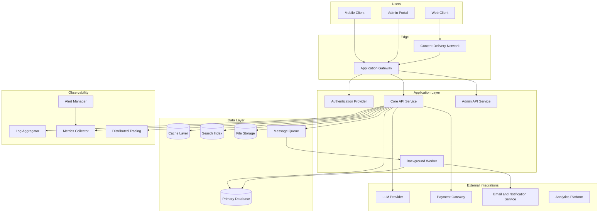
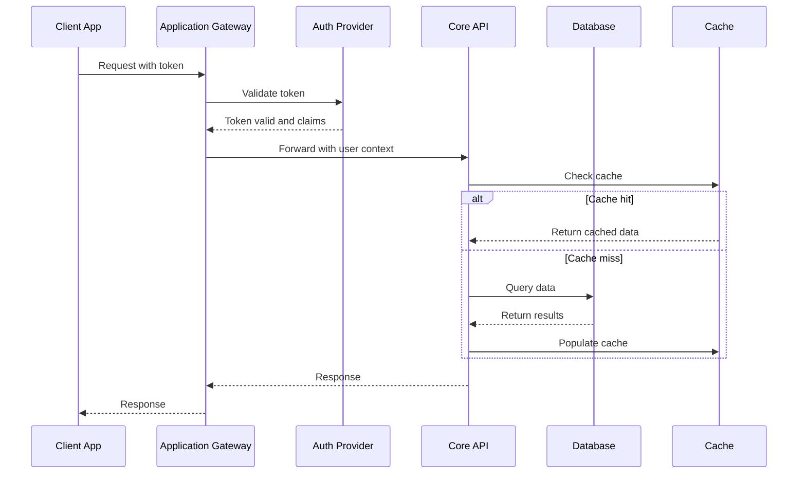
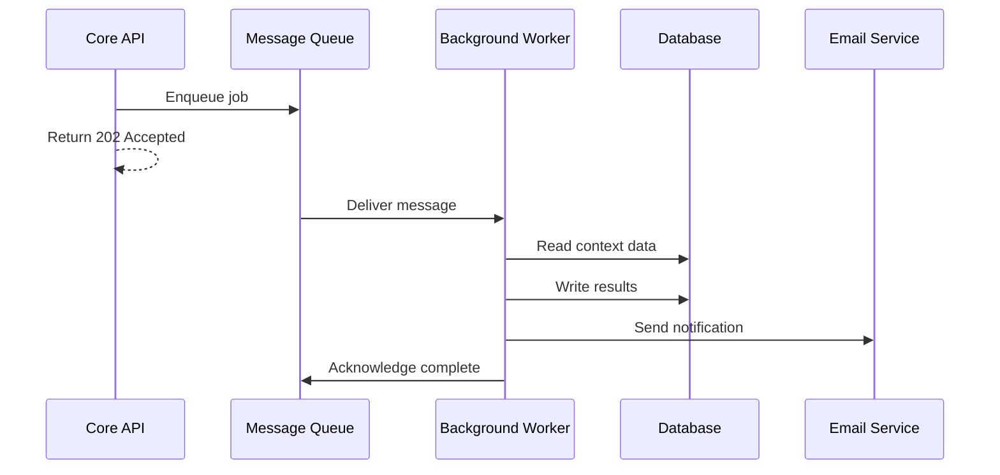
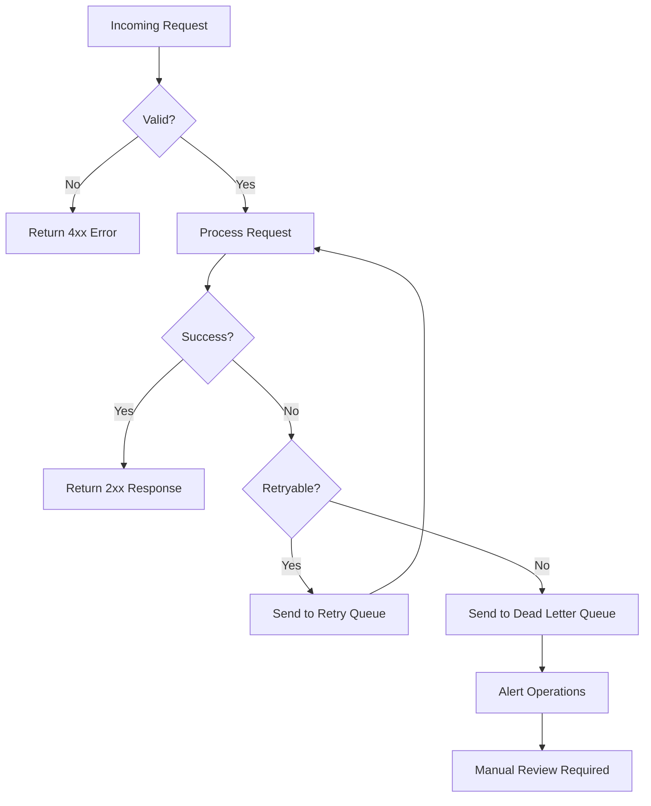
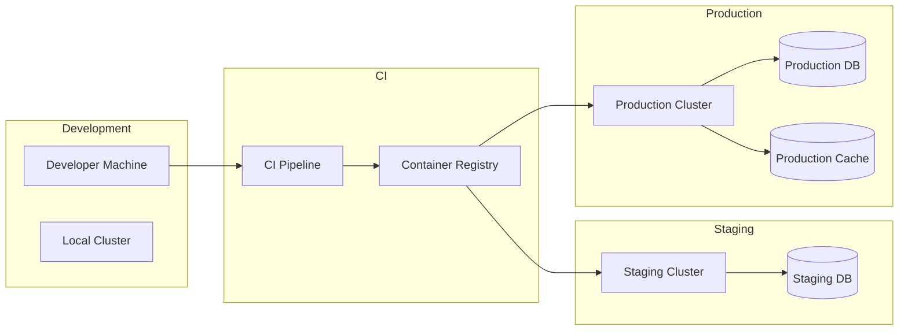

# High-Level Architecture: [Project Name]

**Date:** YYYY-MM-DD | **Author:** [Architect]
**Purpose:** Technology-agnostic logical architecture. No product names — only component roles.

---

## System Context Diagram

---

## Component Responsibilities

| Component | Responsibility | Scale Considerations |
|-----------|---------------|---------------------|
| Content Delivery Network | Static asset serving, edge caching, DDoS absorption | Globally distributed, auto-scaling |
| Application Gateway | Request routing, rate limiting, SSL termination, CORS | Stateless, horizontally scalable |
| Authentication Provider | Token issuance, session management, MFA, RBAC | <!-- concurrent sessions target --> |
| Core API Service | Business logic, request validation, orchestration | Stateless, scales with load |
| Admin API Service | Administrative operations, reporting, user management | Lower traffic, same scaling model |
| Background Worker | Async jobs, scheduled tasks, event processing | Scales independently by queue depth |
| Primary Database | Persistent storage, ACID transactions, relationships | <!-- estimated size, read/write ratio --> |
| Cache Layer | Hot data, session cache, rate limit counters | <!-- eviction policy, hit rate target --> |
| Search Index | Full-text search, faceted filtering, autocomplete | <!-- index size, query latency target --> |
| File Storage | User uploads, generated documents, media | <!-- storage volume, access pattern --> |
| Message Queue | Service decoupling, async processing, event bus | <!-- throughput, delivery guarantee --> |
| LLM Provider | AI/ML inference, text generation, embeddings | <!-- request volume, latency tolerance --> |
| Payment Gateway | Transaction processing, subscription management | <!-- PCI scope implications --> |
| Email/Notification Service | Transactional email, push notifications, SMS | <!-- volume, delivery SLA --> |
| Log Aggregator | Centralized log collection, search, retention | <!-- retention period, volume/day --> |
| Metrics Collector | System and business metrics, dashboards | <!-- cardinality, resolution --> |
| Distributed Tracing | Request path visualization, latency analysis | <!-- sampling rate --> |
| Alert Manager | Threshold monitoring, incident notification, escalation | <!-- alert routing, on-call --> |

---

## Primary User Flow

---

## Async Processing Flow

---

## Error and Recovery Flow

---

## Deployment Topology

---

## Boundaries & Trust Zones

| Zone | Components | Trust Level | Controls |
|------|-----------|-------------|----------|
| Public Internet | CDN, Client Apps | Untrusted | WAF, rate limiting, TLS |
| DMZ / Edge | Gateway, Auth Provider | Semi-trusted | Token validation, IP filtering |
| Internal Network | API Services, Workers | Trusted | Service mesh, mTLS |
| Data Zone | Database, Cache, Queue | Restricted | Network isolation, encryption at rest |
| External | Third-party APIs | Semi-trusted | API keys, circuit breakers, timeouts |

---

## Notes

<!-- 
- Add context about specific decisions that influenced this architecture
- Note any components that may be removed based on scope (e.g., "LLM Provider only if AI features are in V1 scope")
- Reference planning artifacts that drove key decisions
-->
