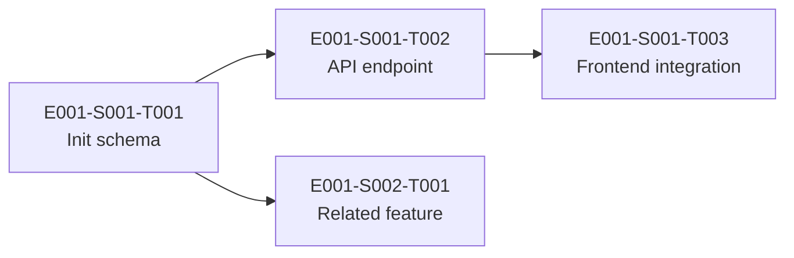

# Sprint Plan: Sprint [X]

**Dates:** YYYY-MM-DD → YYYY-MM-DD
**Sprint Goal:** <!-- One sentence: what's the most important thing we deliver this sprint? -->
**Status:** Planning | Active | Complete

---

## Capacity

| Team Member | Role | Available Days | PTO Days | Effective Hours | Allocated Hours | Utilization |
|-------------|------|---------------|----------|-----------------|-----------------|-------------|
| [Name] | [Role] | <!-- days --> | <!-- days --> | <!-- hours --> | <!-- hours --> | <!-- % --> |
| [Name] | [Role] | | | | | |
| **Total** | | | | **<!-- total -->** | **<!-- total -->** | **<!-- avg % -->** |

**Holidays this sprint:** <!-- list or "none" -->
**Max utilization target:** 80%

---

## Committed Stories

| Story ID | Title | Assignee | Estimate | Epic | Priority | Dependencies |
|----------|-------|----------|----------|------|----------|--------------|
| [E001-S001] | [Title] | [Name] | [X]h | [E001] | [High] | [None / list] |
| [E001-S002] | [Title] | [Name] | [X]h | [E001] | [High] | [E001-S001] |
| | | | | | | |

**Total committed hours:** <!-- sum -->
**Capacity remaining:** <!-- effective - committed -->

---

## Critical Path Items

Items that block other sprints if not completed this sprint:

| Story ID | Blocks | Risk Level | Mitigation |
|----------|--------|-----------|-----------|
| [ID] | [What it blocks] | [High/Med/Low] | [What we do if it slips] |

---

## Risk Assessment

| Risk | Probability | Impact | Mitigation | Owner |
|------|------------|--------|-----------|-------|
| [Risk] | [H/M/L] | [H/M/L] | [Action] | [Name] |
| Overallocation on [person] | | | | |
| Dependency on [external] | | | | |

---

## Dependency Map

---

## Sprint Ceremonies

| Ceremony | Date/Time | Attendees | Notes |
|----------|-----------|-----------|-------|
| Planning | [date, time] | [team] | [agenda link] |
| Daily Standup | [daily, time] | [team] | |
| Review | [date, time] | [team + stakeholders] | [demo prep needed] |
| Retro | [date, time] | [team] | |

---

## End-of-Sprint Review

### Completed

| Story ID | Title | Actual Hours | Notes |
|----------|-------|-------------|-------|
| | | | |

### Carried Over

| Story ID | Title | Remaining Hours | Reason | Next Sprint |
|----------|-------|----------------|--------|-------------|
| | | | | |

### Velocity

| Metric | Planned | Actual | Variance |
|--------|---------|--------|----------|
| Stories completed | <!-- count --> | <!-- count --> | <!-- +/- --> |
| Hours delivered | <!-- hours --> | <!-- hours --> | <!-- +/- --> |
| Accuracy | | | <!-- % --> |

---

## Notes

<!-- Anything noteworthy: blockers encountered, decisions made, scope changes mid-sprint -->
