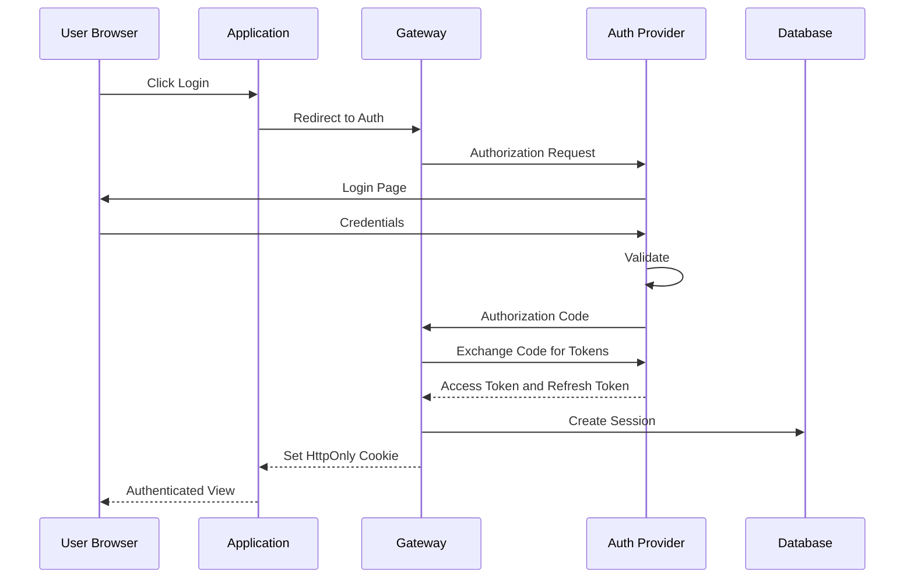
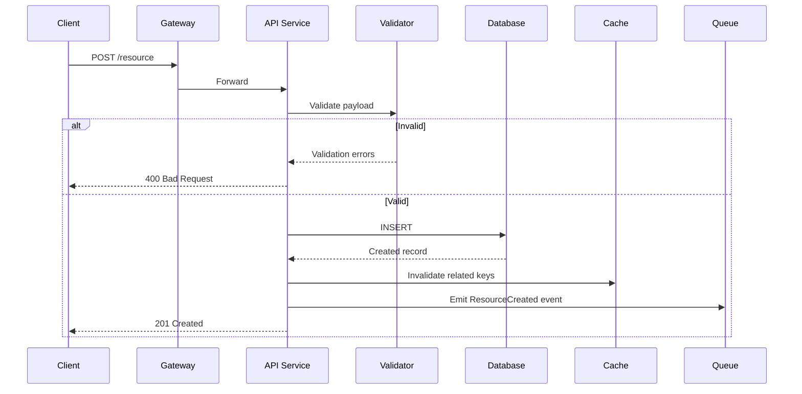
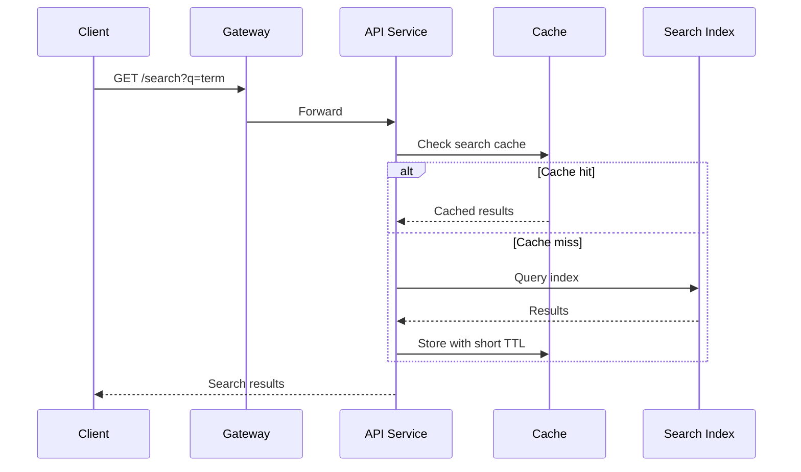
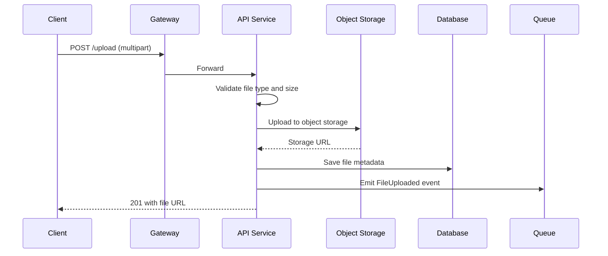
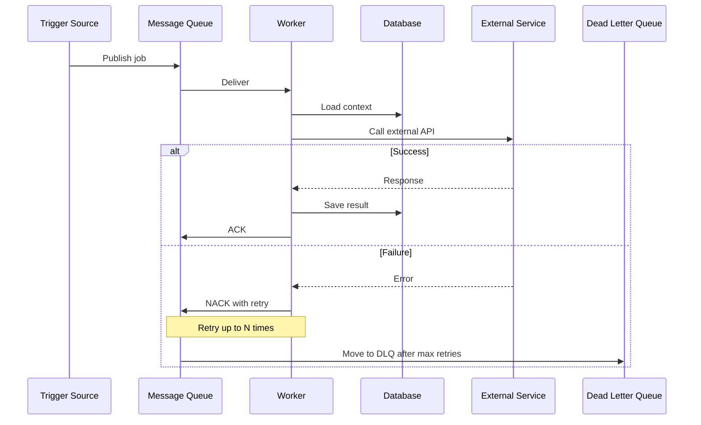
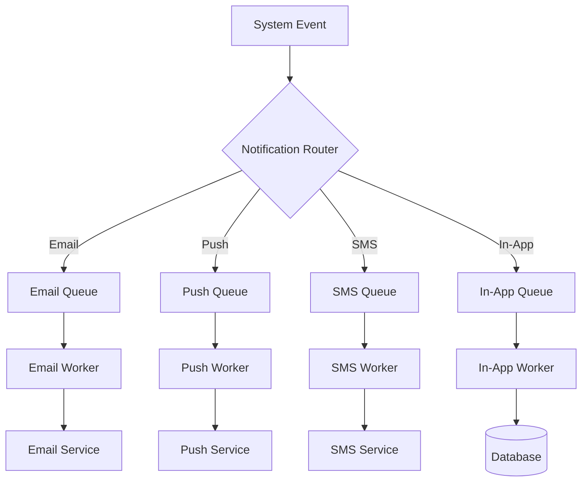
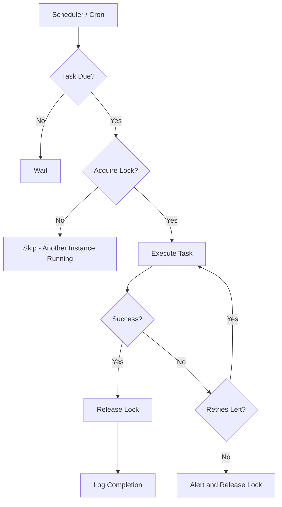
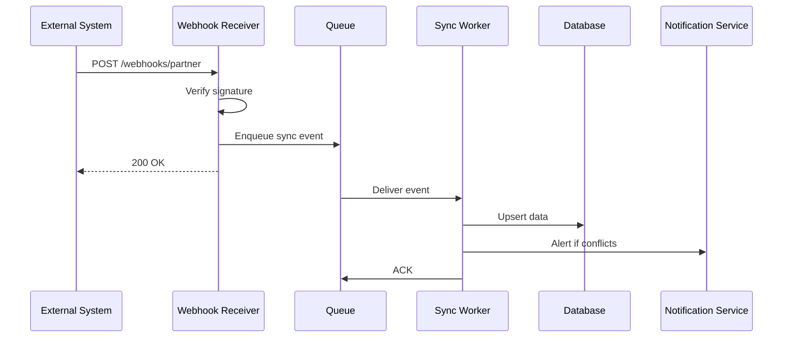
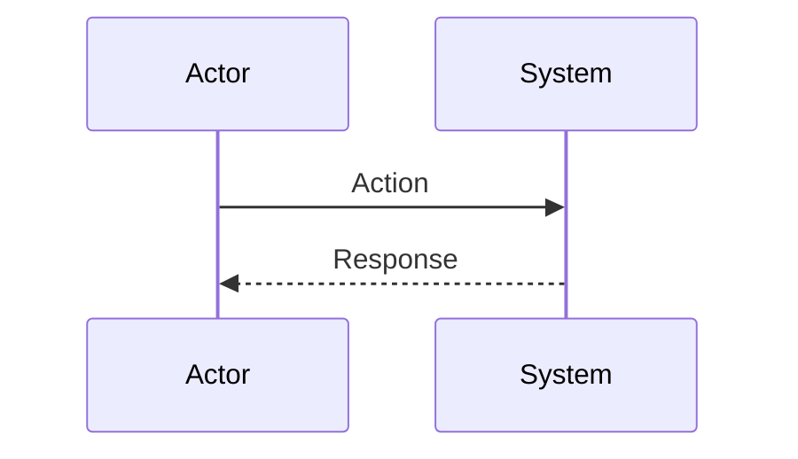

# System Workflow Diagrams: [Project Name]

**Date:** YYYY-MM-DD | **Author:** [Architect]
**Purpose:** Data flow and interaction patterns for key use cases identified in scope.

---

## Authentication Flow

---

## CRUD Operation Flow

---

## Search Flow

---

## File Upload Flow

---

## Background Job Flow

---

## Notification Flow

---

## Scheduled Task Flow

---

## Data Sync / Integration Flow

---

## Custom Flows

<!-- Add project-specific flows below based on key use cases from the scope document -->

### Flow: [Use Case Name]

<!-- Describe the use case this flow represents -->

### Flow: [Use Case Name]

<!-- Describe -->

---

## Flow Summary Table

| Flow | Trigger | Critical Path? | Latency Target | Error Handling |
|------|---------|---------------|----------------|----------------|
| Authentication | User login | Yes | <!-- ms --> | <!-- redirect to error page --> |
| CRUD | User action | Yes | <!-- ms p95 --> | <!-- 4xx/5xx with message --> |
| Search | User query | Yes | <!-- ms p95 --> | <!-- fallback to DB query --> |
| File Upload | User action | No | <!-- seconds --> | <!-- retry with exponential backoff --> |
| Background Job | Event/Schedule | No | <!-- seconds --> | <!-- DLQ after N retries --> |
| Notification | System event | No | <!-- seconds --> | <!-- retry, eventually drop --> |
| Data Sync | External webhook | No | <!-- seconds --> | <!-- DLQ, manual reconciliation --> |
